# 1. Introduction to Event-Driven Architectures

Event-driven architecture (EDA) is the foundational design of an application’s communication of state changes around an asynchronous exchange of messages called events. The architecture allows applications to be developed as a highly distributed and loosely coupled organization of components. Probably predominantly, the most well-known arrangement of components today is the microservices architecture for applications.

Our world is made up of events—they’re happening everywhere around us. A simple act of waking up in the morning becomes an event the instant it occurs. The same goes for the act of purchasing a book. Whether or not it was recorded that way in some database, somewhere, it was considered an event. Since it has occurred, several other operations might have sprung from it.

Just as companies looked at microservices a decade ago to address issues such as web-scale, EDA is gaining in interest and proponents of continuing that journey to help with global-scale.

It is my goal in this chapter to introduce you to the concepts and components of EDA and its applications that we will be using to demonstrate what EDA has to offer. We’ll also be taking a grounded look at the benefits and reasons to use EDA and the challenges you’re likely to encounter when starting a new greenfield project or adding select concepts and components to an existing project.

Whether you’re looking to start a new project with an event-driven approach or looking to break up a monolithic application into modules or further into microservices, this book will give you the information and patterns necessary to implement EDA where you need it.

## In this chapter, we’re going to cover the following main topics:

- An exchange of facts
- The MallBots application
- Benefits of EDA
- Challenges of EDA
- Technical requirements

We will be developing using Go and using Docker to run our application within containers. Visit the following to locate installers for your operating system:

- [Go installers can be found at](https://go.dev/doc/install)
- [Docker installers can be found at](https://docs.docker.com/desktop/)

Go 1.17 or higher is required to run the code from this book.

## An exchange of facts

Three different uses or patterns exist that can be called EDA individually or altogether, as follows:

- Event notifications
- Event-carried state transfer
- Event sourcing

In this book, we will be covering each of these patterns, going over their uses and both when to use them and when you might not.

### Event notifications

Events can be used to notify something has occurred within your application. A notification event typically carries the absolute minimum state, perhaps even just the identifier (ID) of an entity or the exact time of the occurrence of their payload. Components that are notified of these events may take any action they deem necessary. Events might be recorded locally for auditing purposes, or the component may make calls back to the originating component to fetch additional relevant information about the event.

Let’s see an example of `PaymentReceived` as an event notification in Go, as follows:

```go
type PaymentReceived struct {
    PaymentID string
}
```

Here is how that notification might be used:

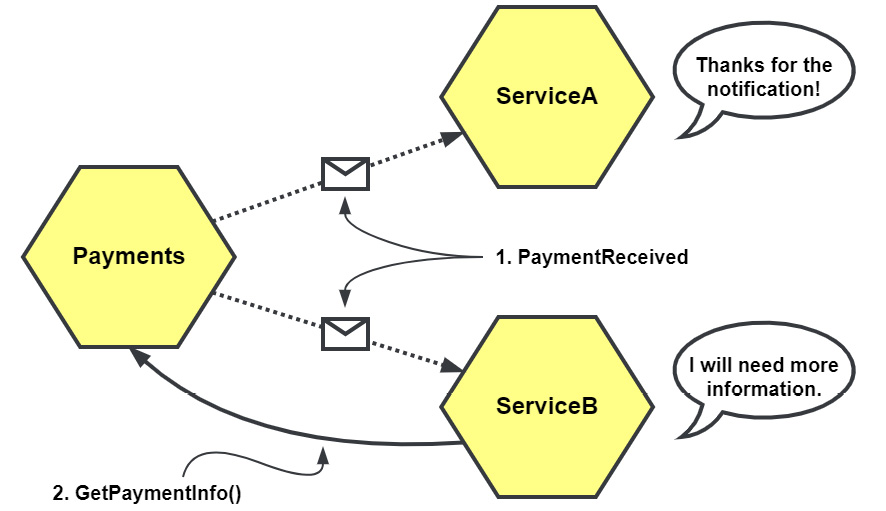

## Figure 1.1 – PaymentReceived as an event notification

Figure 1.1 shows the `PaymentReceived` notification being received by two different services. While ServiceA only needed to be notified of the event, ServiceB will require additional information and must make a call back to the Payments service to fetch it.

### Event-carried state transfer

Event-carried state transfer is an asynchronous cousin to representational state transfer (REST). In contrast with REST’s on-demand pull model, event-carried state transfer is a push model where data changes are sent out to be consumed by any components that might be interested. The components may create their own local cached copies, negating any need to query the originating component to fetch any information to complete their work.

Let’s see an example of `PaymentReceived` as an event-carried state transfer, as follows:

```go
type PaymentReceived struct {
    PaymentID    string
    CustomerID   string
    OrderID      string
    Amount       int
}
```

In this example for event-carried state transfer, we’ve included some additional IDs and an amount collected, but more detail could be added to provide as much detail as possible, as illustrated in the following diagram:

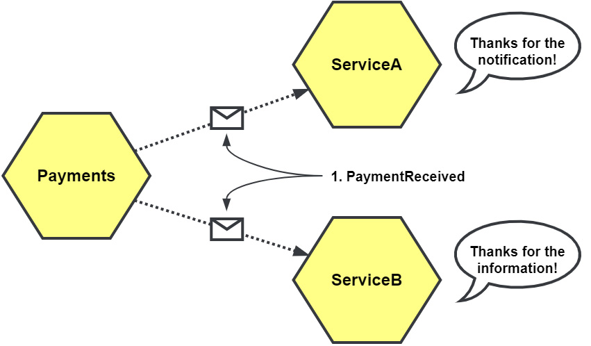

## Figure 1.1 – PaymentReceived as an event notification

Figure 1.1 shows the `PaymentReceived` notification being received by two different services. While **ServiceA** only needed to be notified of the event, **ServiceB** will require additional information and must make a call back to the Payments service to fetch it.

### Event-carried state transfer

Event-carried state transfer is an asynchronous cousin to representational state transfer (REST). In contrast with REST’s on-demand pull model, event-carried state transfer is a push model where data changes are sent out to be consumed by any components that might be interested. The components may create their own local cached copies, negating any need to query the originating component to fetch any information to complete their work.

Let’s see an example of `PaymentReceived` as an event-carried state transfer, as follows:

```go
type PaymentReceived struct {
    PaymentID    string
    CustomerID   string
    OrderID      string
    Amount       int
}
```

In this example for event-carried state transfer, we’ve included some additional IDs and an amount collected, but more detail could be added to provide as much detail as possible, as illustrated in the following diagram:


## Figure 1.2 – PaymentReceived as an Event-Carried State Change

When the `PaymentReceived` event is sent with additional information, it changes how downstream services might react to it. We can see in **Figure 1.2** that ServiceB no longer needs to call the Payments service because the event it has received already contains everything it requires.

### Event Sourcing

Instead of capturing changes as irreversible modifications to a single record, those changes are stored as events. These changes or streams of events can be read and processed to recreate the final state of an entity when it is needed again.

When we use event sourcing, we store the events in an event store rather than communicating them with other services, as illustrated in the following diagram:

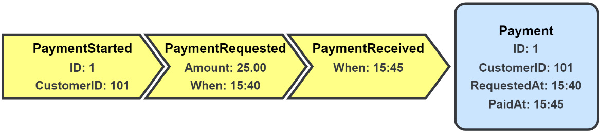

## Figure 1.3 – Payment Data Recorded Using Event Sourcing

In **Figure 1.3**, we see the entire history of our data is kept as individual entries in the event store. When we need to work with a payment in the application, we would read all the entries associated with that record and then perform a left fold of the entries to recreate the final state.

### Core Components

You will observe that four components are found at the center of all event patterns, as illustrated in the following diagram:

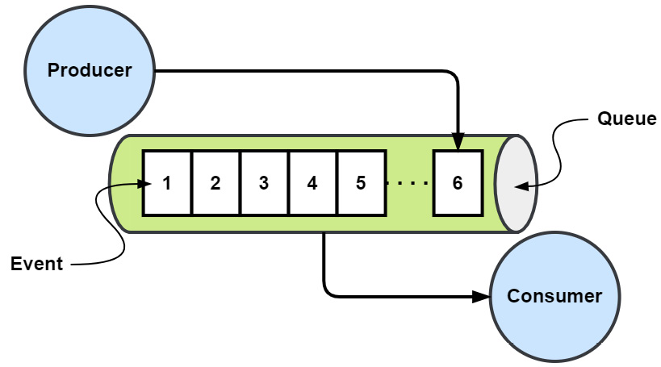

## Figure 1.4 – Event, Queue, Producer, and Consumer

### Event

At the heart of **Event-Driven Architecture (EDA)** is the event. In EDA terms, it is an occurrence that has happened in the application. The event itself is in the past and is an immutable fact. Some examples of events are:

- Customers signing up for your services
- Payments being received for orders
- Failed authentication attempts for an account

With EDA, the consumers of these events may know nothing about what caused the production of these events or have any relationship or connection with them, but only with the event itself.

In most languages, events are simple value objects that contain state. An event is considered equal to another if all the attributes are the same. For example, in Go, we might represent an event with a simple struct, such as this one for `PaymentReceived`:

```go
type PaymentReceived struct {
    PaymentID string
    OrderID   string
    Amount    int
}

```

Events should carry enough data to be useful in capturing the change in the application state they are meant to communicate. In the preceding example, we might expect that this event is associated with some payment, and the specific payment is identified by the queue name or as some metadata passed along with the event—rather than having the `PaymentID` field directly in the body of the event.

The amount of information required to include in an event’s payload matters to all events, whether it’s for event notification, event-carried state transfer, or for the changes recorded with event sourcing.

### Queues

Queues are referred to by a variety of terms, including bus, channel, stream, topic, and others. The exact term given to a queue will depend on its use, purpose, and sometimes the vendor. Because events are frequently—but not always—organized in a first-in, first-out (FIFO) fashion, I will refer to this component as a queue.

### Message Queues

The defining characteristic of a message queue is its lack of event retention. All events put into a message queue have a limited lifetime. After the events have been consumed or have expired, they are discarded.

You can see an example of a message queue in the following diagram:

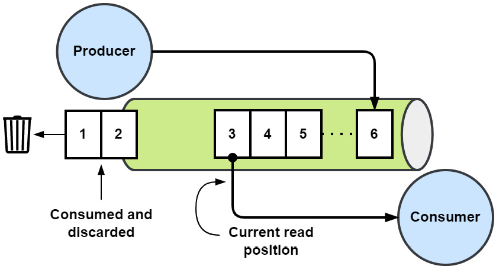

## Figure 1.5 – Message Queue

A message queue is useful for simple publisher/subscriber (pub/sub) scenarios when the subscribers are actively running or can retrieve the events quickly enough.

### Event Streams

When you add event retention to a message queue, you get an event stream. This means consumers may now read event streams starting with the earliest event, from a point in the stream representing their last read position, or they can begin consuming new events as they are added. Unlike message queues, which will eventually return to their default empty state, an event stream will continue to grow indefinitely until events are removed by outside forces, such as being configured with a maximum stream length or archived based on their age.

The following diagram provides an example of an event stream:

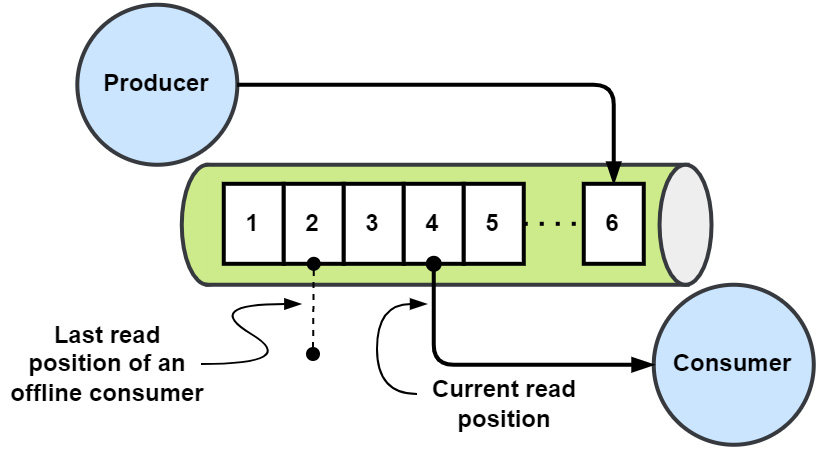

## Figure 1.6 – Event Stream

When you need retention and the ability to replay events, an event stream should be used instead of a message queue.

### Event Stores

As the name implies, an event store is an append-only repository for events. Potentially millions of individual event streams will exist within an event store. Event stores provide optimistic concurrency controls to ensure that each event stream maintains strong consistency. In contrast to the last two queue examples, an event store is typically not used for message communication.

You can see an example of an event store in the following screenshot:

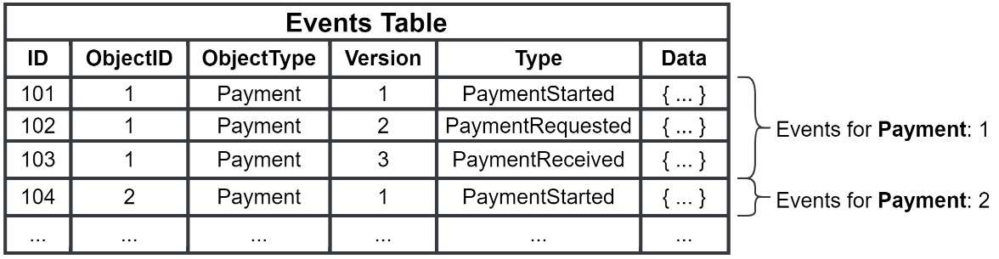

## Figure 1.7 – Event Store

Event stores are used in conjunction with event sourcing to track changes to entities. The top three rows of **Figure 1.7** depict the event-sourcing example events from **Figure 1.3**.

### Producers

When some state in the application has changed, the producer will publish an event representing the change into the appropriate queue. The producer may include additional metadata along with the event that is useful for tracking, performance, or monitoring. The producers of the events will publish it without knowing what the consumers might be listening to. It is essentially a fire-and-forget operation.

### Consumers

Consumers subscribe to and read events from queues. Consumers can be organized into groups to share the load or be individuals reading all events as they are published. Consumers reading from streams may choose to:

- Read from the beginning of a stream
- Read new events from the time they started listening
- Use a cursor to pick up from where they left off in the stream

### Wrap-up

Equipped with the types of events we will be using and the knowledge of the components of the patterns involved, let’s now look at how we’ll be using them to build our application.

### The MallBots Application

We’re going to be building a small application that simulates a retail experience coupled with some futuristic shopping robots. We will be building the backend services that power this application. A high-level view of the components involved is shown here:

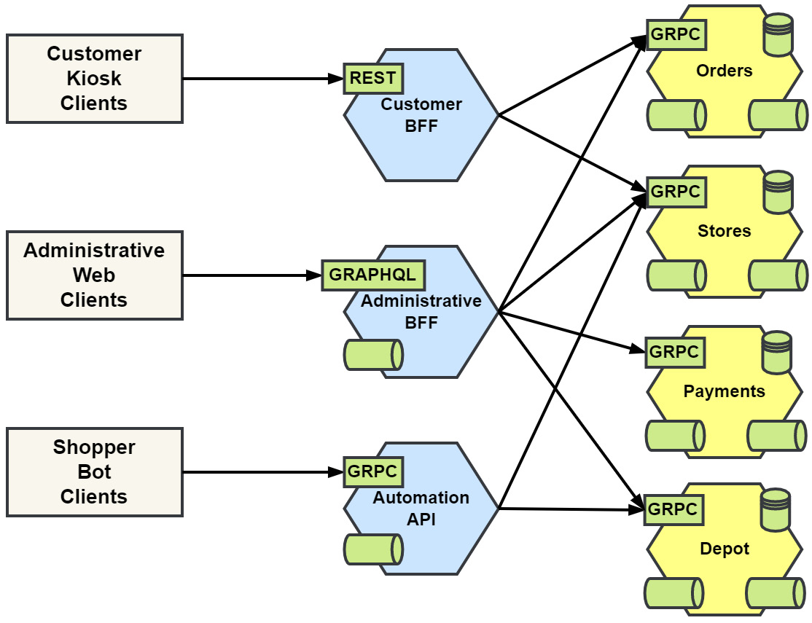

# Figure 1.8 – High-level view of the MallBots application components

## The pitch

“We have developed incredible robots to save the time of people shopping at the mall. Customers will now have access to a kiosk that would facilitate the selection of items from available stores that customers do not wish to visit. After completing their selections, the customer is free to do other shopping or directly visit the depot and wait for their items to be brought in by robots. The customer may pay when they arrive at the depot or may choose to wait for all items to arrive before doing so. After both are done, the transaction is complete, and the customer takes their items and goes on their merry way.”

## Application services

Starting with the four services—**Orders**, **Stores**, **Payments**, and **Depot**—on the right of Figure 1.8, we have the application services. These will all use events to communicate new states for triggers and notifications and will both publish them and subscribe to them. They will also have GRPC application programming interfaces (APIs) to support the API gateway layer.

## API gateway services

The API gateway layer displayed down the center of Figure 1.8 will support:

- A RESTful API for the customer kiosks
- A management user interface (UI) with WebSocket subscriptions for the staff to use
- A gRPC streams API for the robots

The API gateways are implemented as a demonstration of the **Backend for Frontend (BFF)** pattern.

The administrative BFF and the automation API gateways will create subscriptions to application events to allow delivery of state changes to clients. **Note** that we will not be developing API gateway services in this book.

## Clients

Finally, on the left of Figure 1.8 are the expected clients, as outlined in more detail here:

- **Customer kiosks**, placed near or at mall entrances for ease of use
- An **administrative web application** for staff to manage the application data, process customer pickups, and take payment
- **Shopper bot clients** that perform autonomous shopping tasks for the busy customers

## A quick note about hexagons

You’re going to be seeing a lot of hexagons in the diagrams of this book. The services in Figure 1.8 all have some combinations of synchronous and asynchronous communication or connections, and all are drawn as hexagons, as depicted in the following diagram:

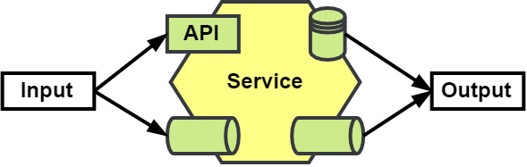

# Figure 1.9 – Hexagonal representation of a service

The API gateway and application services are all represented as hexagons with inputs (such as the API and event subscriptions, shown on the left) and the outputs (the database and event publications, on the right). This is a visual presentation of **hexagonal architecture**, and we will be talking more about that in **Chapter 2, Supporting Patterns in Brief**.

## Benefits of EDA

An **Event-Driven Architecture (EDA)** brings several benefits to your application when compared to an application that uses only synchronous or point-to-point (P2P) communication patterns.

### Resiliency

In a P2P connection, as shown in the following diagram, the calling component, **Orders**, is dependent on the called component, **Depot**, being available. If the called component cannot process the operation in time, or if the called component has a fault, then that error will propagate back to the caller. Worse is a chain or tree of calls that end up with a fault somewhere far away from the original caller, causing the entire operation to fail.

If the **Depot** service is not responding or is failing to respond on time, then the **Orders** service may fail to pass on information regarding new orders:

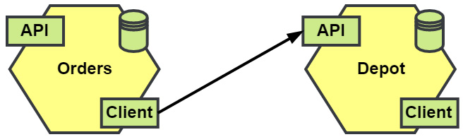

# Figure 1.10 – P2P communication

In an **Event-Driven Architecture (EDA)** application, the components have been loosely coupled and will be set up with an event broker between them, as shown in the following diagram. A crash in an event consumer will have no impact on the event producer. Likewise, other faults (internal to the consumer) that cause it to temporarily be unable to process events again have no impact:

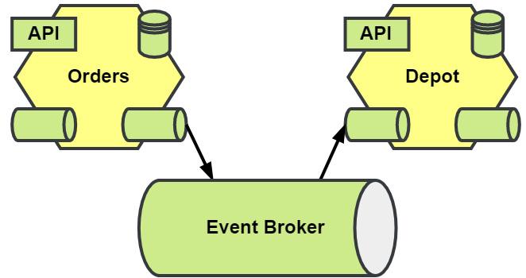

# Figure 1.11 – Brokered event communication

Considering the example case of the **Depot** service becoming overrun with work, causing it to get backed up, orders submitted by the **Orders** service will be processed, just a little slower. The **Orders** service will be unaffected and continue to take orders as they come in. Better still, if the **Depot** service is down entirely, then it may only cause a longer delay until it can be restarted or replaced, and the **Orders** service continues.

## Agility

An **event-driven application** can be more agile in its development. Less coordination between teams is required when introducing new components to an application. The new feature team may drop in the new component without having to socialize any new API with any of the other teams.

The organization can more easily experiment with new features as an aside. A small team can stand up a new component without disrupting the work of other teams or the flow of existing processes. When the experiment is over, the team can just as easily remove the component from the application.

We can imagine that, at some point, an **Analytics** service could be introduced to the application. There are two ways this new service could be added. The first way is with a **synchronous API** (as shown in **Figure 1.12**) and the second is with an **asynchronous event consumer** (as shown in **Figure 1.13**).

When they choose to use the API, the team will need to coordinate with existing teams to potentially add new logic to capture data and new calls to their service. Completing this task will now require scheduling with one or more teams and will become dependent on them, as illustrated in the following diagram:

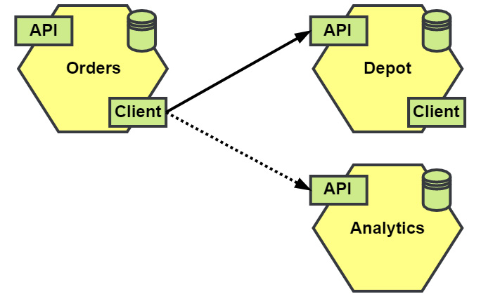

# Figure 1.12 – New P2P service

Components that communicate using **events** make it easier for new components and processes to come online without requiring coordination with the teams in charge of existing components, as shown in the following diagram:

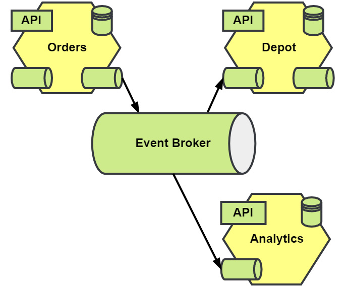

# Figure 1.13 – New brokered event service

Now, when the **Analytics** service team has finished its work of picking which events to consume and capturing the data it needs, it can then add it to the application immediately.

If event streams are part of your **EDA** application, this also has the advantage of providing new components with a complete history of events to spin up with.

## User experience (UX)

With **Internet of Things (IoT)** devices exploding in number and millions of people having phones in their hands, users expect to be notified of the latest news and events the instant they happen. An event-driven application is already sending updates for orders, shipment notifications, and more. The organization may extend this to users more easily than a traditional synchronous-first application might allow.

## Analytics and auditing

Whether you’re using **event notifications**, **event-carried state transfer**, or **event sourcing**, you will have ample opportunity to plug in auditing for the small changes that occur in your system. Likewise, if you’re interested in building on **analytics** to your application to gather **business intelligence (BI)** for your marketing and product teams, often one or both are an afterthought, and in a traditional or non-EDA application, you may not have the data or can only recreate a partial picture.

## Challenges of EDA

Adopting **EDA** patterns for your application brings along some challenges that must be overcome for the application to succeed.

### Eventual consistency

**Eventual consistency** is a challenge for any distributed application. Changes in the application state may not be immediately available. Queries may produce stale results until the change has been fully recorded. An asynchronous application might have to deal with eventual consistency issues, but without a doubt, an event-driven application certainly will.

### Dual writes

Not entirely a challenge of event-driven applications alone, **dual write** refers to any time you’re changing the application state in two or more places during an operation. For an event-driven application, this means we are making a change locally to a database, and then we’re publishing an event either about the event or the event itself. If the events we intend to publish never make it to the event broker, then our state changes cannot be shared, and post-operation operations will never happen.

For this challenge, we have a solution that will have us publish our events into the database alongside the rest of the changes to keep the state change **atomic**.

This allows a second record of to-be-published events to be created, and even adds additional resiliency on top of what we got from using an event broker between components, as illustrated in the following diagram:

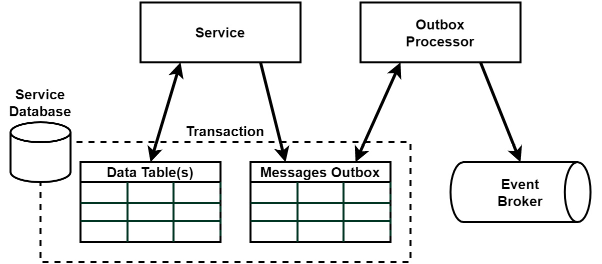

# Figure 1.14 – Outbox pattern

We will learn more about this challenge and solution when I introduce you to the **Outbox pattern** in **Chapter 6, Asynchronous Connections**.

## Distributed and asynchronous workflows

Our third challenge involves performing complex workflows across components using events, making the workflow entirely asynchronous. When each component is coupled this way, we experience **eventual consistency**. Each component may not have the final state of the application when queried, but it will eventually.

This creates an issue for the **UX** and one for the collaboration of the components of the application involved with the operation. Each will need to be evaluated on its own to determine the correct solution for the problem.

### UX

The asynchronous nature of the operation would obviously make it difficult to return a final result to the user, so the choice becomes how to handle this limitation. Solutions include but are not limited to:

- Fetching the result using **polling** on the client
- Delivering the result asynchronously using **WebSockets**
- Creating the expectation that the user should check later for the result

### Component collaboration

There are two patterns we can use to bring components together to manage workflows, as illustrated in the following diagram:

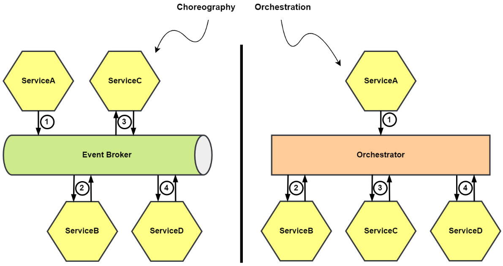

# Figure 1.15 – Workflow choreography and orchestration

- **Choreography**: The components each individually know about the work they must do, and which step comes next.
- **Orchestration**: The components know very little about their role and are called on to do their part by a centralized orchestrator.

We will dive into the differences, some of the details to consider in choosing one over the other, and more in **Chapter 8, Message Workflows**.

## Debuggability

**Synchronous communication** or **P2P** involves a caller and callee. This method of communication has the advantage of always knowing what was called and what made the call. We can include a **request ID** or some other unique ID (**UID**) that is passed on to each callee.

One of the disadvantages of **EDA** is being able to publish an event and not necessarily knowing if anything is consuming that event and if anything is done with it. This creates a challenge in tracing an operation across the application components.

We might see multiple operations unrelated to one another spring up from the same event. The process to trace back to the originating event or request becomes harder as a result. For an event-driven application, the solution is to expand on the solution used for P2P-only applications, and we will see crumbs of this solution throughout the book and discuss it in more detail in **Chapter 12, Monitoring and Observability**.

Testing the application using several forms of tests will be covered in **Chapter 10, Testing**.

## Getting it right

It can be challenging for teams to think in terms of **events** and **asynchronous interactions**. Teams will need to look much more closely and know the application that they’re building better to see the small details that sometimes make up events. In **Chapter 2, Supporting Patterns in Brief**, we will look at some patterns that teams can use to break down the complexities of an application, and how to make managing and maintaining event-driven applications easier in the long run.

In **Chapter 3, Design and Planning**, we will cover tools that teams can use to break down an application into behaviors and the events associated with each one.

## Big Ball of Mud with events

A **Big Ball of Mud (BBoM)** is an anti-pattern, where an application is haphazardly designed or planned. We can end up with one in our event-driven application just as easily with events as without and perhaps even more easily if we do not do a good job identifying behaviors and events.

## Summary

In this chapter, we were introduced to **EDA**, the types of events, and the core components involved with each event pattern you would find in an event-driven application. I covered some of the advantages from which you could benefit with an event-driven approach, and I introduced the challenges that will be encountered with this pattern.

In the next chapter, we will cover a range of patterns that will be used in the development of the demonstration application and why we might find them useful in conjunction with the development of an event-driven application.
