# 2. Supporting Patterns in Brief

There are a lot of software patterns we might use or come across in the development of an event-driven application. Event-driven architecture should not be the first tool you reach for in your toolbox.

We’ve been introduced to event-driven architectures, and now we’ll see the patterns that work together with EDA to support excellent event-driven application design and development. These helpful patterns may not always be successful but using them in the right places and in moderation will improve your production time and reduce your bug rates.

In this chapter, we’re going to cover the following main topics:

- Domain-driven design
- Domain-centric architectures
- Command and Query Responsibility Segregation
- Application architectures

## Domain-driven design

Domain-driven design (DDD) is a very large and complex topic, with entire books devoted to the use and implementation of the many patterns and methodologies that are brought together. I won’t try to fit all of it into this chapter, much less this section, so we’ll be taking a high-level look at the key strategic patterns that are useful to us as we design and develop event-driven applications. As for the tactical patterns, we’ll be seeing examples of their use throughout the rest of the book.

### Going deeper into DDD

For an in-depth look at DDD, I can recommend the following resources:

- **Domain-Driven Design: Tackling Complexity in the Heart of Software** by Eric Evans — an original introduction to the topic.
- **Implementing Domain-Driven Design** by Vaughn Vernon — expands on the topic and provides a deeper dive into the strategic patterns of DDD.
- **Patterns, Principles, and Practices of Domain-Driven Design** by Scott Millett with Nick Tune — a very deep and lengthy look at DDD.

### DDD misconceptions

The philosophies, methodologies, and patterns of DDD are well-suited for the development of event-driven applications. Before getting into DDD, I would like to cover a couple of misconceptions about it that developers might hold.

#### Misconception one – DDD is a set of coding patterns

For most developers, their first exposure to DDD might be seeing an entity, value object, or some other pattern such as the repository that is being used in a code base they’ve worked on, or from some web tutorial covering a pattern or two. Regardless of the number of patterns they see, it is still an incomplete picture of what DDD is. Most DDD is never explicitly shown in the code, and a good amount of DDD comes into the picture before the first line is ever written.

#### Misconception two – DDD is enterprise-level or leads to overengineered applications

DDD prescribes no specific architecture to use, and it neither instructs you how to organize your code for any given programming language nor enforces any rule that you must use in every corner of your application. DDD does not force you or your team to utilize a specific architecture, pattern, or code structure; that is something you are doing. The strategic patterns will actually assist you in identifying areas of the problem domain where you should not need to devote a lot of development time and resources.

Both misconceptions are centered around the use and a perceived overuse of the tactical patterns of DDD. As developers, we’re technically minded people; we will search for a technical solution or a better way to do something when faced with a challenging or novel problem. What we’ve learned or used will find its way into our conversations when we include the names of the patterns. If all we seek out or share with others are the tactical patterns of DDD, then it’s inevitable that we will miss out on the design philosophies and strategic patterns, only to turn around to complain that DDD has doomed another project.

### So, what is it all about then?

DDD is about modeling a complex business idea into software by developing a deep understanding of the problem domain. This understanding is then used to break up the problem into smaller, more manageable pieces. The two key patterns of DDD at play here are the **ubiquitous language** and **bounded contexts**.

### Alignment and agreement on the goals

To find success with DDD, collaboration must exist between domain experts and developers. There should be meetings where business ideas and concepts are sketched and diagrammed to be gone over from top to bottom and thoroughly discussed. The results of these discussions are then modeled and discussed further to weed out any incorrect understanding of implicit details.

This is not a process you do once before writing any code. Complex systems are living entities in a way, and they change and evolve. When new features are being considered, the same people should meet to discuss how these will be added to the domain model.

### Speaking the same language

When domain experts come together with developers, discussions could fall apart if the parties involved cannot come to an understanding of a concept by having different ideas about what is being said or read. The **Ubiquitous Language (UL)** principle requires every domain-specific term to have a single meaning within a bounded context. By using a shared language, a better understanding of the domain can flourish. The domain experts have their jargon and the developers theirs. It is preferable to use the terms spoken by the domain experts, and it is these terms that will be used to name and describe the domain models.

This is a core principle of DDD and a very important one too, but it doesn’t come easy. Words that should be simple and have an obvious meaning may suddenly appear to have lost all meaning during discussions. Words may begin to develop a depth, which should highlight to everyone involved the importance of developing a UL and using it everywhere and always.

To hammer the point home, use the UL everywhere in code. It should drive the names of your function names, the structs, the variables, and the processes that you develop. When you sign off on the completion of some task or are given a bug to fix, the UL should always be used. This keeps the UL aligned across an organization.

When the UL is being spoken but confusion starts to appear, it could be a sign that the domain model is undergoing an evolution, and it might be a good time to have a meeting with the domain experts and developers again.

### Tackling the complexity

The complexity of the problem domain can be reduced by breaking the domain into subdomains so that we’re dealing with more manageable chunks of the problem. Each new domain we identify falls into one of three types:

- **Core domains:** Critical components of the application that are unique or provide a competitive advantage to the business. These get the most focus, the most money, and the best developers. A core domain is not always obvious and can evolve or change with the business.
- **Supporting domains:** The utility components that provide functionality that supports the core business. You might consider using an off-the-shelf solution if what is being provided and developed by a team is not specific enough to the business.
- **Generic domains:** Components that are unrelated to the core business but necessary for it to function. Email, payment processing, reporting, and other common commodity solutions fall into this domain type. It wouldn’t make sense to devote teams to develop this functionality when so many solutions exist.

As a business changes in response to competition or other factors, it is possible over time for the type associated with a domain to change or for the domain to split into two or more new domains.

### Using a core domain chart

To chart the business differentiation and model complexity for each domain in our **MallBots** application, we end up with the following:

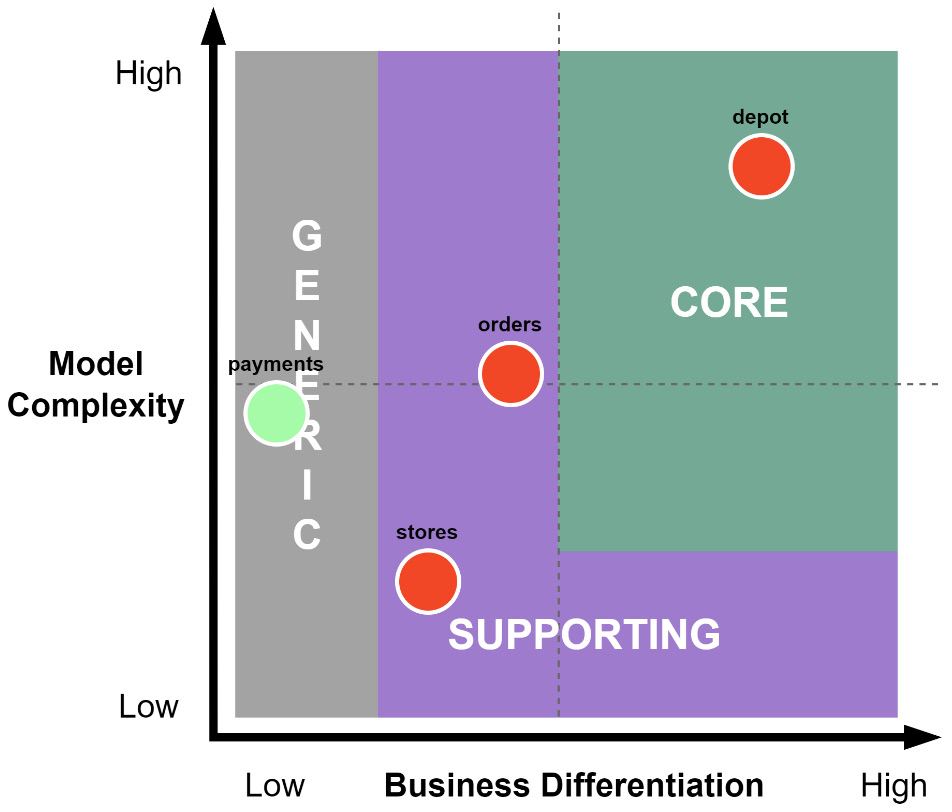

Figure 2.1 – A Core Domain Chart for the MallBots Domains

In **Figure 2.1**, we’ve identified that the depot has the highest value to the business, is going to be rather complex, and is going to be our core domain. Taking orders and managing the store’s inventory is important to the business, but it has no differentiators and provides supporting functionality only. Payments exist simply because they must, so we’ve decided to integrate with a third-party SaaS to handle our money, which makes our last domain generic.

## Modeling

The domain model is a product of the collaboration between domain experts and developers using the **Ubiquitous Language (UL)**. What goes into the model should be limited to the data and behaviors that are relevant to the problem domain, not everything possible in an attempt at modeling reality. The point of a domain model is to solve problems identified in the domain.

Eric Evans suggests experimenting with several models and not getting stuck too long on minutia. You are trying to pull out what is important from the conversation with the domain experts. Listen for connecting words to identify processes and behaviors, titles and positions to identify actors, and, of course, the names of things to identify data. This should be captured on a large surface such as a whiteboard or a large roll of paper or a blank wall if you’re doing **EventStorming**. We will talk more about using EventStorming as a method to develop a domain model in Chapter 3, _Design and Planning_.

The model should be free of any technical complexities or concerns, such as mentioning any databases or inter-process communication methods, and should only be focused on the problem domain.

## Defining Boundaries

Every model belongs to a **bounded context**, which is a component of the application. Because the model belongs to this context, care needs to be taken in keeping it safe from outside influences or enabling external control.

You have broken down the complexity into multiple domains and discovered the models hidden within your software. The boundaries that we see forming from our discovery efforts will be around the business capabilities in our application. Examples of business capabilities for the MallBots application are the following:

- Order management
- Payment processing
- Depot operations
- Store inventory management

All the domains should not have a singular view of any given model; they should be concerned with the parts that are relevant to a particular bounded context.

Every bounded context has its own **Ubiquitous Language (UL)**, which should be taken to mean terms that might have different meanings when contexts change across an application. The products that are picked out by a customer will exist in several domains and, depending on the context, have completely different models, with different purposes and attributes. When the domain experts and developers discuss products, they will need to include the context to which they’re referring. They could be talking about the inventory for a store, the line items in an order, or fulfillment and delivery at the depot.

A bounded context takes on a technical aspect in that its implementations introduce some technical boundaries around the models. For a distributed application, a bounded context typically takes on the implementation of a module or a microservice, but not always. A very distinct boundary exists where the context limits the mutations and queries of the model it has been created to maintain.

### Bounded Contexts Are a Difficult Concept

To do **DDD** well, you must understand bounded contexts. I encourage you to read one of the suggested books or do a search and learn more about them. Finding or determining the right boundaries in an application is not a science and is very much an art.

## Tying It Back Together

It may seem counterintuitive that so much effort is expended breaking down our problem domain into smaller domains and bounded contexts, only to later design how they should all interact again. The bounded contexts and their high walls now need to be made to work together and become integrated again. We use **context mapping** to draw the relationships between our models and contexts that we’ll need for our application to be functional.

The purpose of context mapping is to recognize the relationships the models will have with other models and to also show the relationship between teams. The patterns used in context mapping are of a descriptive value only. They do not give any hints about what technical implementations should exist to connect the models:

### Upstream Patterns:

- **Open host service:** This context provides an exposed contract that downstream contexts may connect to.
- **Event publisher:** This context publishes integration events that downstream contexts may subscribe to.

### Midway Patterns:

- **Shared kernel:** Two teams share a subset of the domain model and maybe the database.
- **Published language:** A good document shared language to translate models between contexts. It is often combined with an open host service.
- **Separate ways:** Contexts that have no connections because integration is too expensive.
- **Partnership:** A cooperative relationship between two contexts with joint management of the integration.

### Downstream Patterns:

- **Customer/supplier:** A relationship where the downstream context may veto or negotiate changes to the upstream context.
- **Conformist:** The downstream service is coupled with the upstream context’s model.
- **Anticorruption layer:** A layer to isolate the downstream context from changes in the upstream context’s model.

## Applying the Preceding Patterns to Our Application

We could end up with the following:

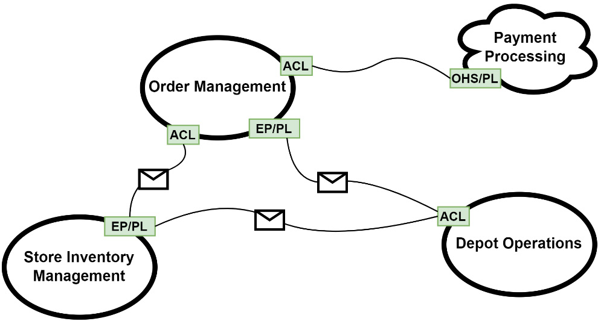

Figure 2.2 – A Context Mapping Example

### How is it useful for EDA?

**DDD** is generally useful for event-driven applications, and you may do just fine without it. However, what it brings to the table — in terms of digging into the business problem with the domain experts and developing a **Ubiquitous Language (UL)** to break down the complexity into **bounded contexts** — cannot be overlooked.

Event-driven applications will benefit from making the effort to create better event names, by determining which events are integration events and will become part of the contract for a bounded context.

## Domain-Centric Architectures

A **domain-centric architecture**, to reiterate, is an architecture with the domain at the center. Around the domain is a layer for **application logic**, and then around that is a layer for **infrastructure** or **external concerns**. The purpose of the architecture is to keep the domain free of any outside influences such as database specifics or framework concerns.

Before we discuss more about domain-centric architectures, let’s first look at some traditional, or enterprise, architectures.

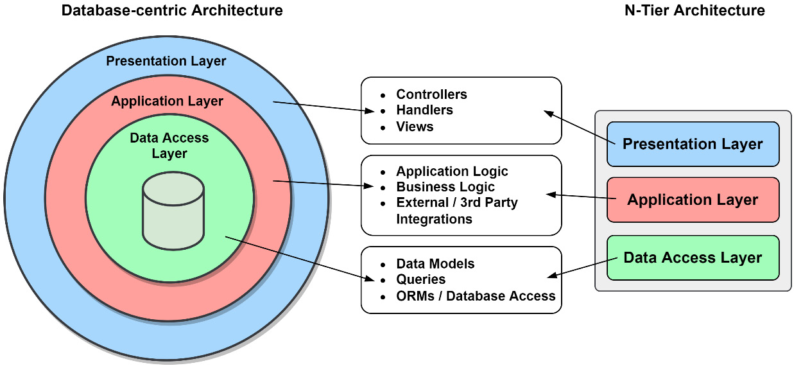

Figure 2.3 – Some Traditional Architectures

The problem teams will notice with traditional architectures is that, over time, the cost to maintain the application increases. These architectures are also hard to update when infrastructure choices or requirements have changed. In both architectures from **Figure 2.3**, the applications are broken into layers and are not much different conceptually. It isn’t the layers that are the cause of the issues; it is how they are tightly coupled together. The **data models** from the data access layer are used in the application layer and the presentation layer. The reverse can also be true; the UI frameworks will have their request models used in the other layers.

As a result, each of the three layers becomes dependent on the models used in the other two layers. Having these dependencies will mean that a change in the presentation layer is likely going to require a change in the data access layer. Dealing with the tangled web of dependencies and the tight coupling will result in an organization’s resource expenditures increasing more rapidly over time.

## An Evolving Solution

Alistair Cockburn invented **hexagonal architecture** in 2005 while explaining the **ports and adapters** pattern applied to application design ([Hexagonal Architecture](https://alistair.cockburn.us/hexagonal-architecture)), as a solution to the tight coupling made between the parts of an application.

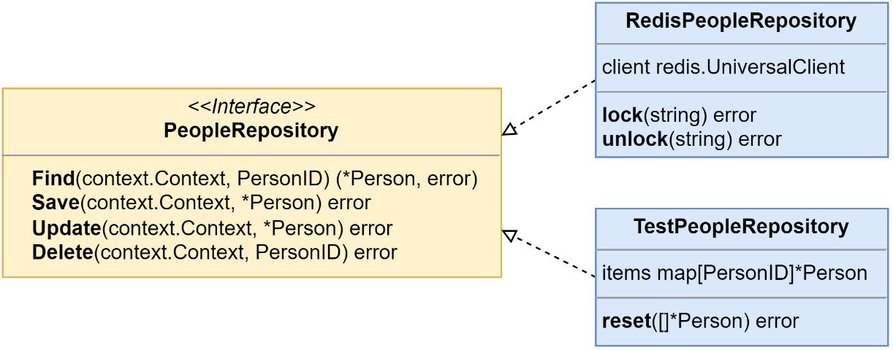

Figure 2.4 – A Port and Two Adapters

In his solution, there were two parts – the inside of the application and the outside. Each outside dependency the application used would be broken up into two parts: a **port** (or interface) and an **adapter** (or implementation). The **PeopleRepository** interface in **Figure 2.4** represents a port, while **RedisPeopleRepository** and **TestPeopleRepository** both represent adapters that implement the interface.

Using this technique, our applications will now be isolated from the changes made to the outside dependencies. By making the application depend only on abstractions (the ports), rather than specific implementations (the adapters), the application becomes more flexible and maintainable. Changes in external dependencies, such as switching databases or integrating with a new service, can be handled by updating or swapping the relevant adapters without affecting the core logic of the application.

## The Onion Architecture

Then, in 2008, **Jeffrey Palermo** introduced us to his **onion architecture** ([Onion Architecture – Part 1](https://jeffreypalermo.com/2008/07/the-onion-architecture-part-1/)). The **dependency inversion principle** (more on that in a later section) would play a large role in this new architecture.

Onion architecture builds upon the ideas of hexagonal architecture by further isolating the core application logic from external concerns, such as data access or UI frameworks. In this model, the core business logic sits at the center, and external dependencies are introduced through layers that surround it. These layers can be thought of as the "onion" surrounding the application's heart. The core logic has no direct dependencies on outer layers, which means that business rules and application workflows remain decoupled from specific frameworks or technologies.

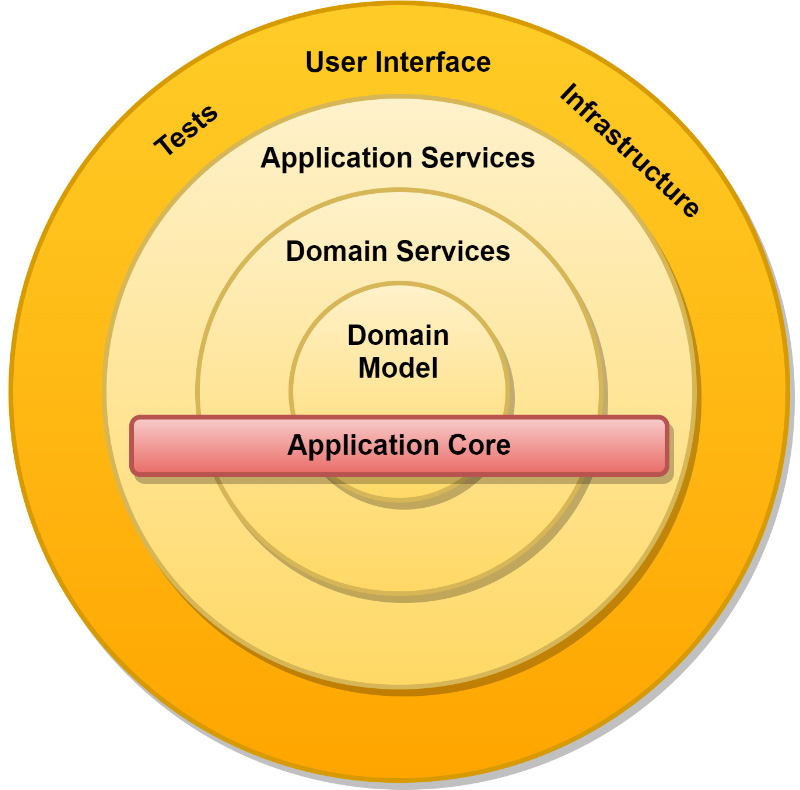

Figure 2.5 – The Onion Architecture

An application using **hexagonal architecture** is now broken up into different layers: the **application services**, the **domain services**, and the **domain model**. The external dependencies create the outermost layer around the application core. Dependencies point inward toward the domain model, and the outer circles contain implementations of the interfaces located in the inner circles.

Palermo also suggested the use of an **inversion of control** container to handle the work of **dependency injection**. **Go** does not have great language support for dependency injection, but we will see some possible solutions in **Chapter 4**, _Event Foundations_.

## Clean Architecture

**Robert C. Martin** (Uncle Bob) made a post in 2012 after studying **hexagonal architecture**, **onion architecture**, and other related models to introduce **clean architecture** ([The Clean Architecture](https://blog.cleancoder.com/uncle-bob/2012/08/13/the-clean-architecture.html)).

Clean architecture builds on the concepts of decoupling business logic from external frameworks and systems. The goal is to make the core application logic independent of technology choices, allowing for easier updates and maintenance. In clean architecture, dependencies flow inward toward the center, and outer layers can contain things like database access, UI, or third-party integrations. This architecture ensures that business rules are not dependent on external factors, fostering long-term scalability and flexibility.

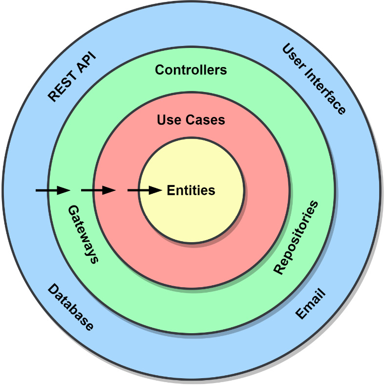

Figure 2.6 – The Clean Architecture

He noted that the architectures had many similarities:

- None relied on any frameworks to scaffold applications on top of
- The designs produced more testable code
- Infrastructure was viewed as a substitutable dependency

### Martin’s Dependency Rule

He declared that **"source code dependencies can only point inwards"** as the most important aspect of domain-centric architectures. Nothing at all can be referenced in an inner circle that existed in an outer circle. The application must resolve references using the **dependency inversion principle**.

This rule ensures that the core business logic (the innermost circle) is completely independent of external dependencies (the outer layers). As a result, the core of the application can be developed, tested, and maintained without worrying about changes in the infrastructure, frameworks, or third-party services. The core remains focused solely on solving the domain problems, while the outer layers handle the technical concerns.

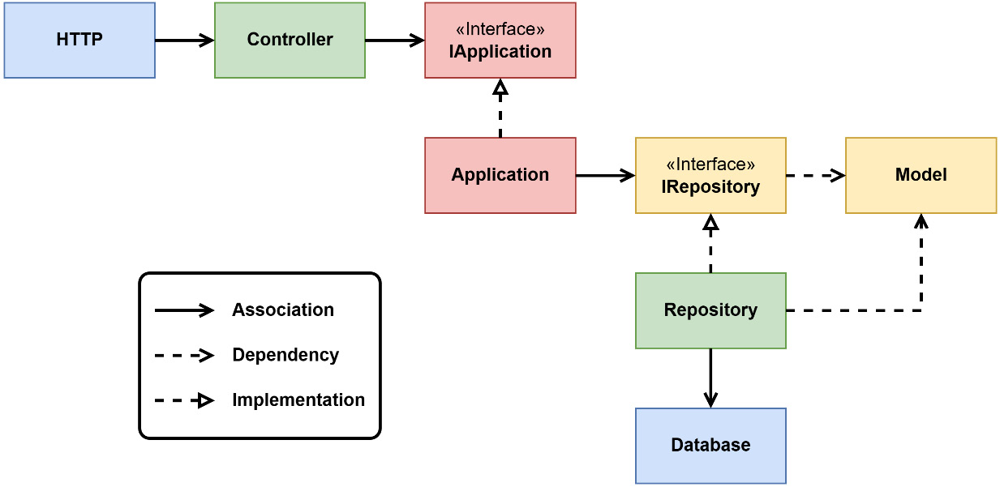

Figure 2.7 – The Dependency Inversion Principle

Starting with the most isolated items and referencing the layers from **Figure 2.6**, we have the **model** and **IRepository** interface. These may not have any references to anything else, only to other entities in the **Entities** layer. Next is the **application** and the **IApplication** interface, which belong to the **Use Cases** layer and may only use items in the **Use Cases** or **Entities** layers. From the **Interface Adapters** layer, we have the controller and repository implementations.

Our last layer might appear to contain an error: the association arrow is pointing to the **database** from the repository when, according to the **Dependency Inversion Principle (DIP)**, it should not. While the concrete implementation will contain a reference to the database to work, the **IRepository** interface will keep the application isolated from any specific database implementation.

### Hexagonal Architecture Applied

**Alistair Cockburn** invented **hexagonal architecture** to address the spread of business logic into other unrelated parts of the software. He laid out three factors of this problem:

- Testing is more difficult when the tests become dependent on the user interface
- Coupling makes it impossible to shift between human-driven use and a machine-driven one
- Switching to new infrastructure is difficult or impossible when the need or opportunity presents itself

The solution was to isolate the application and its core from external concerns by placing **APIs** (the **ports**) on the boundary of the application that used **adapters** to integrate with external components. This pairing of abstraction and concrete implementations would allow external components, such as new UIs, test harnesses with mocks, and new infrastructure, to be swapped in and out much more easily.

By adhering to this structure, developers can ensure that the core application logic remains agnostic of the specific technologies, enabling greater flexibility, easier testing, and more efficient adaptation to change.

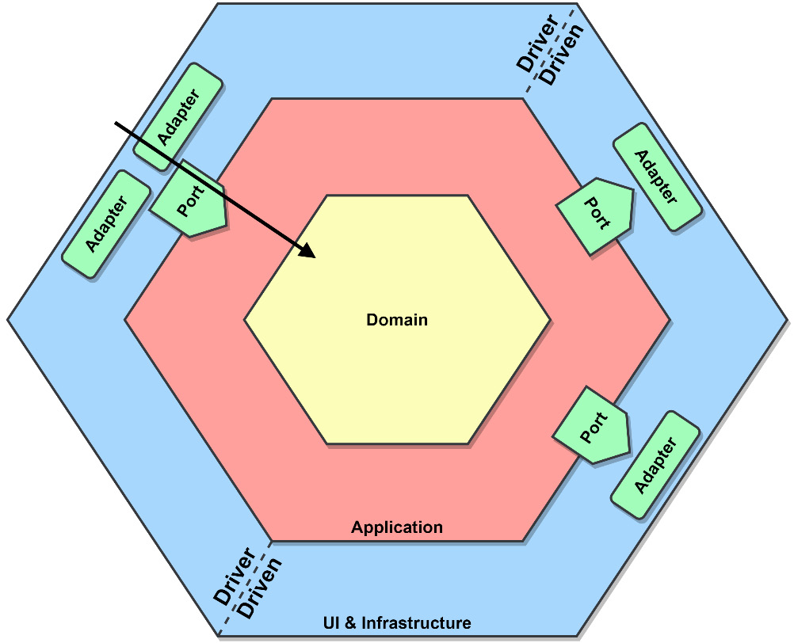

Figure 2.8 – An interpretation of hexagonal architecture with elements of clean architecture

The early diagrams of hexagonal architecture didn’t pay as much attention to the domain that clean architecture did. In Figure 2.8, I’ve added a domain to the application and a UI and infrastructure hexagon to create a blended interpretation of the two architectures.

## Domain

In the center of the diagram, we have our domain. This layer of our application contains our domain model, domain-specific logic, and services. This layer is the least affected when external changes are made.

This layer of the application has no other dependencies and is free of any references to external concerns or application services.

## Application

Surrounding the domain is the application layer that contains our application-specific logic and services. The application layer will also define the interfaces that external concerns will be using to interact with the application.

The application layer may only ever depend on the domain layer and cannot reference external concerns.

## Ports and Adapters

Outside of the application are all external concerns. We’ll find the frameworks, UI implementations, and databases for saving our data. Everything outside of the application interacts with it using a port. The port is an abstraction known to the application that allows it to use and be used by external concerns.

In the other half of the interaction, the adapter is some small piece of code that intimately knows how to communicate with the external dependency.

These pairs of ports and adapters come in two types:

- **Driver or primary adapters**: These are the web UIs, APIs, and event consumers that drive information into our application.
- **Driven or secondary adapters**: These are the database, loggers, and event producers that are driven by the application with some information.

While they are typically paired up, that isn’t always the case, and you might have a situation where more than one adapter is using a port.

Communication between the adapters and the application happens only through the ports and the Data Transfer Objects (DTOs) that they have created to represent the requests and responses.

## Testing

The abstractions we’ve used to isolate our application and domain model from external concerns will also help us in testing. A test harness can take the place of any primary adapter to execute tests of the application. We can also use a mock application to test real database calls for integration testing.

The architecture and the separation of concerns forced on us from the layers have resulted in us writing smaller components. By extension, we’ve written more testable components as a result.

## A rulebook, not a guidebook

Domain-centric architectures provide the rules for writing better code, not a guide for how to do that exactly. I’m talking about how you organize your packages and modules in Go, how you will write your constructor functions, or what method you use for dependency injection.

## Should you use domain-centric architectures?

- **Is testing important to you?** What about maintainability? A domain-centric architecture application will be highly testable and be cheaper to maintain in the long run. A sufficiently large application, and especially one that is using DDD, will see more benefits from using a domain-centric architecture than drawbacks.
- **Portability and Reuse**: Having your application core independent of framework or infrastructure choices, and any vendor lock-in such as cloud provider dependencies, also gives it a high degree of portability and reuse.

## What about those drawbacks?

A domain-centric architecture will require a larger investment upfront and is going to be a challenge for the less experienced developers. In the eyes of some engineers, the requirements or constraints of domain-centric architectures can cause an application to be bloated or over-engineered. To some developers, needing to maintain abstractions for every dependency or using dependency injection adds needless boilerplate code and more work.

Like DDD, an implementation of domain-centric architectures can go south if they are followed rigidly, and worse if the interpretation is wrong and the wrong choices are being made. Developers will become discouraged, and the project may be counted as another victim of overcomplication blamed on the architecture.

## How is it useful for EDA?

Domain-centric architectures are also generally useful, and you might skip using them if you keep your services small enough or never have to deal with migrating cloud providers or switching databases.

## Command and Query Responsibility Segregation (CQRS)

Command and Query Responsibility Segregation (CQRS) is a simple pattern to define. Objects are split into two new objects, with one being responsible for commands and the other responsible for queries.

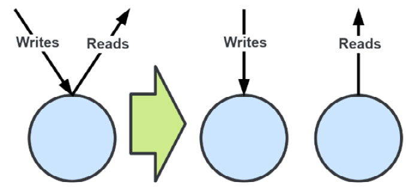

Figure 2.9 – Applying CQRS to an object

Figure 2.9 demonstrates just how simple the concept might be, but the devil is in the implementation details, as they say. The definitions for Command and Query are the same as they are for Command-Query Separation (CQS):

- **Command**: Performs a mutation of the application state.
- **Query**: Returns application state to the caller.

> **Note**:  
> In CQRS, just as it is in CQS, an action can either be a command or a query, but not both.

## The Problem Being Solved

The domain models we’ve developed with the help of domain experts may be very complex and large. These complex models may not be useful or may be too much for our queries. Conversely, we may have complex queries that make us consider modifying our domain models to support them, which may violate our **Use Case Layer** (UL). We may also be unable to serve a query with the domain model we have ended up with.

## Applying CQRS

An analogy I use to describe applying CQRS is to visualize your application like a ribbon:

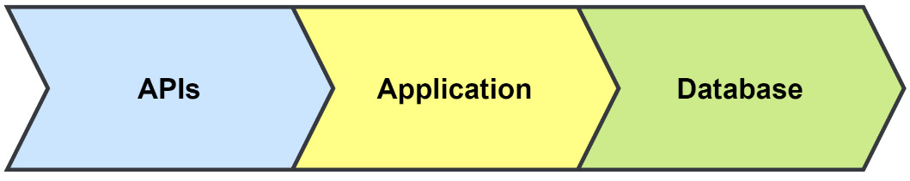

Figure 2.10 – A simple application ribbon

This application, shown as a ribbon in Figure 2.10, can be cut horizontally, creating a top side and a bottom side at any point. Where you make the cut and how far will determine how much of the CQRS pattern you’re applying to your application.

## Applied to the Application

You might want to apply CQRS to the application code only:

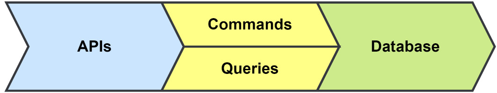

Figure 2.11 – CQRS applied to an application

With an application divided into a command side and a query side, you can apply different security models to each side or decide to reduce the complexity of your service objects. You may continue to use the same database but use an ORM on one side and raw SQL for performance purposes on the other. This would arguably be the least effective use of CQRS that you can apply to your application.

## Applied to the Database

You can extend your use of CQRS to the database:

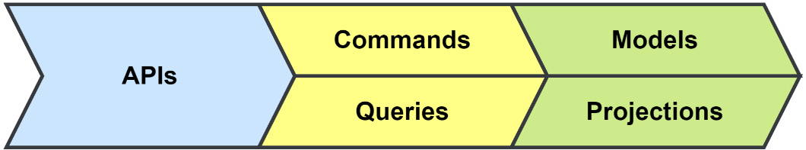

Figure 2.12 – CQRS applied to the database

Fine-tuned SQL queries will only get you so far. Moving your queries over to a new data store such as a NoSQL, key-value, document, or graph database may be necessary to keep up with the load. You can utilize an event-driven approach to populate multiple new projections within multiple services.

## Applied to the Service

Cut all the way through, you split the service into two:

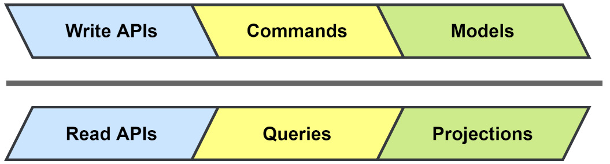

Figure 2.13 – CQRS applied to the service

Applying CQRS to the entire service gets you two services that can be scaled separately; they can be maintained by different teams and have entirely different technology stacks.

## When to Consider CQRS

Let’s explore the points while considering CQRS:

- **Your system experiences a much larger amount of read operations than write operations**. Using CQRS allows you to break the operations into different services, allowing them to be scaled independently.
- **Security is applied differently for writes and reads**; it also limits what data is viewable.
- **You are using event-driven patterns such as event sourcing**. By publishing the events used for your event-sourced models, you can generate as many projections as necessary to handle your queries.
- **You have complex read patterns that bloat or complicate the model**. Moving read models out of the domain model allows you to optimize the read models or the storage used for each access pattern.
- **You want the data to be available when writing is not possible**. Whether by choice or not, having the reads work when the writes are disabled allows the state of the application to still be returned.

## CQRS and Event Sourcing

CQRS is not, in my opinion, an event-driven pattern. It can be used entirely without any kind of events or asynchronous approaches. It is, however, very common to hear it talked about alongside Event Sourcing, and that is because the two work well together.

One of the benefits of splitting your model into two parts is that your write side is reduced to writing to an append-only log, and another benefit is that you are free to have as many read models as you need that are fed by the same events. These read models can be built for very specific needs and spread out across your application.

## Task-Based UI

One of the goals of CQRS is to make the behaviors that drive the commands that your application executes explicit on the write side. That is difficult to do when an application is driven by a Create, Read, Update, and Delete (CRUD) UI. The intended behavior of a user’s action is frequently lost behind the usage of basic commands such as `UpdateUser` in this type of UI. Supposing that call was also used when the user updated their profile, or when they changed their mailing address, it would be difficult to determine which was the intended action.

By using a task-based UI, where each action has a clear intention, we can communicate the user’s intended behavior more clearly. Now, when the profile is being updated, the UI would make a call to the `UpdateProfile` API, and when the mailing address changes (for example, when the customer has moved), it would call the API with `ChangeMailingAddress`.

## Application Architectures

For an event-driven application, there are a few application architectures that we can choose between. They have their pros and cons, and for greenfield projects, there is only one recommendation I’d make.

### Monolithic Architecture

This is an application that is typically built from a single code base and is deployed as a single resource. These kinds of applications have the advantage of being easy to deploy and are relatively simple to manage and operate. Outside of needing to maybe communicate with some third-party APIs, a single user interface and database will be most of the infrastructure concerns. The application shown in Figure 2.14 is easy to scale to handle more users by simply deploying it to more instances that point to the same database:

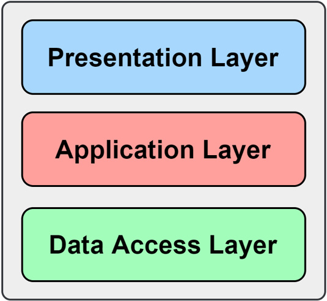

Figure 2.14 – A monolith application

On the other hand, the larger a monolith grows, the harder it is for teams to develop it efficiently, as the development of new features sees them come into conflict and constant deployment becomes a faint memory. The architecture also gets an unfair amount of negativity regarding the messy code that goes into the development of a monolith. That negativity is unfair because that can happen with any code base and has to do with bad design.

## Modular Monolith Architecture

The modular monolith shares a lot of the benefits and drawbacks of a monolithic architecture but also shares a good number of the advantages of a microservices architecture, with only a few of the drawbacks.

If we apply DDD and a domain-centric architecture to our existing monolithic application, we can refactor it toward a modular monolith architecture. By identifying the domains of our application and defining bounded contexts, we can split the core of the monolith into however many modules we need to.

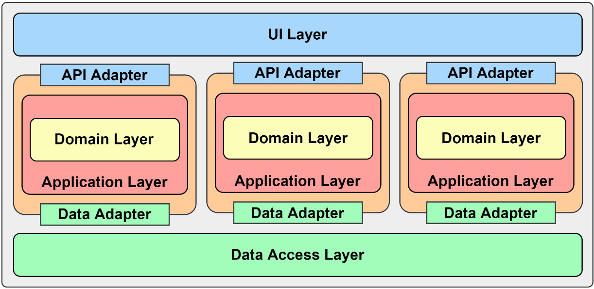

Figure 2.15 – Modular monolith

Our refactored application shown in Figure 2.15 is now built with three modules that can be more independently worked on by different developers or teams.

Any communication between the modules should be treated like any other external concern and used as an interface and concrete implementation to support an enforceable contract.

## Microservices

A microservices architecture involves building individual services that are ideally aligned with a bounded context to create a distributed application. The advantages of microservices over a monolithic application are that they’re independently deployable and can be independently scaled. They also have better application resiliency thanks to fault isolation. The advantages of being loosely coupled might be an advantage over a poorly designed monolith but not over a modular monolith. Individually, the services will be smaller code bases and easier to test.

Microservices have several drawbacks as well. Foremost is the complexity involved with managing many cooperating but independent services. Eventual consistency, which is largely caused by the architecture’s distributed nature, must also always be taken into consideration. Performing larger tests may involve multiple microservices, making the effort more complicated.

## Recommendation for Greenfield Projects

A modular monolith is the recommended architecture to start with for any project of reasonable complexity. A team will be able to better focus on the domain model implementation and not necessarily require additional external support to deploy an application.

After the application has outgrown the modular monolith architecture, the team will be able to very easily extract the modules into microservices when needed to begin taking advantage of the benefits of the microservices architecture.

## Summary

In this chapter, we took a look at some of the key strategic patterns of DDD and how they’re used to develop better applications. We were also introduced to domain-centric applications as ways we might organize our applications after working so hard to develop the right bounded contexts and domain models.

We then looked at CQRS and how its simple pattern can be used alongside event sourcing to create a more performant application. Finally, we covered application architectures that would benefit from the patterns of EDAs.

In the next chapter, we will discuss and use some tools to design and plan the MallBots application.

## Further Reading

- [Domain-Driven Design Reference by Eric Evans](https://www.domainlanguage.com/wp-content/uploads/2016/05/DDD_Reference_2015-03.pdf)
- [CQRS Documents by Greg Young](https://cqrs.files.wordpress.com/2010/11/cqrs_documents.pdf)
- [Modular Monolith: A Primer by Kamil Grzybek](https://www.kamilgrzybek.com/design/modular-monolith-primer/)
