# 3. Design and Planning

It is now time to put into practice what we talked about in the previous two chapters. As the saying goes, before we can run, we must learn to walk, and before we can walk, we must learn to crawl. We were introduced to the MallBots application back in Chapter 1, _Introduction to Event-Driven Architectures_, but before we can create that application, we must have a plan built on a better understanding of the problem the application is intending to solve.

In this chapter, we will cover the following topics:

- What are we building?
- Finding answers with EventStorming
- Understanding the business
- Recording architectural decisions

We will be using Domain-Driven Design (DDD) discovery and strategic patterns as the basis for our initial approach. To facilitate the discovery, a workshop technique called **EventStorming** will be used to organize meetings with domain experts and developers. The knowledge we gain from these meetings about our application will also be used to design specifications that will be used to perform acceptance testing later and throughout the book.

Toward the end of the chapter, we will use the tactical patterns of DDD to design the models and behaviors in more concrete terms that will lead us toward a prototype.

## Technical requirements

You will need to install or have installed the following software to run the application or to try the examples:

- The Go programming language
- Docker

The source code for the version of the application used in this chapter can be found at:  
[https://github.com/PacktPublishing/Event-Driven-Architecture-in-Golang/tree/main/Chapter03](https://github.com/PacktPublishing/Event-Driven-Architecture-in-Golang/tree/main/Chapter03)

## What are we building?

If you recall the MallBots application pitch from Chapter 1, _Introduction to Event-Driven Architectures_, we are building an application that is not a typical e-commerce web application but not too far removed from one either. Just before the pitch, a diagram was also shared that showed a very high-level view of what the final application would be comprised of. Getting from the pitch to a final application can happen in any number of ways. If you were to take those two bits of information and sit down to immediately start writing the code, where would you even start? Let’s see.

We will use the following process to arrive at a design for our application:

1. Use EventStorming to discover the bounded contexts and related ubiquitous languages
2. Capture the capabilities of each bounded context as executable specifications
3. Make architectural design decisions on how we will implement the bounded contexts

## Finding answers with EventStorming

Getting knowledge from domain experts to developers could take several meetings. No one enjoys attending meetings that are either boring or non-conclusive. A sit-down meeting between developers, who will be asking a lot of questions and have some assumptions, and domain experts, who have the answers, could go down a rabbit hole on a single issue that has a small portion of the attendees involved.

Normal meeting etiquette is to avoid side conversations, which would waste the time of all the people not involved in those discussions. We do not want to use a meeting format that forces a group to focus on one issue after another; we should prefer a workshop format that encourages multiple conversations on issues and topics at once, such as EventStorming.

### What is EventStorming?

EventStorming is a fun and engaging workshop that uses colorful sticky notes to quickly visualize the building blocks of the flows that make up your application. It intends to uncover as many of the implicit details locked away in the heads of a few people and share that knowledge with domain experts and developers alike. The workshop is made up of a series of steps that expand on the work that came before to build a visual representation of a domain or problem, as shown in the following figure.

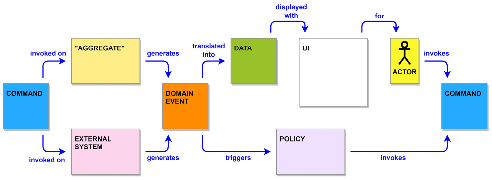

Figure 3.1 – A flow diagram using EventStorming concepts

Let’s look at the EventStorming concepts shown in **Figure 3.1**:

- **A domain event (orange)**: Represents something that has an impact on your system and may occur either inside or outside. It should be written in the past tense.
- **A command (blue)**: An action or decision that is invoked by users or policies.
- **A policy (lilac)**: A business rule that can be identified by listening for the phrase “whenever <x>, then <y>.”
- **An aggregate (tan)**: A group of domain entities acted on as a single unit.
- **An external system (pink)**: A third-party system that is external to an application. It may also represent other departments not involved with the workshop or internal services we do not control or maintain.
- **Data (green)**: Information recorded in the system or the required information for commands and business rules.
- **An actor (yellow)**: A user, role, or persona that creates actions in our system. It includes a drawing of a stick figure or another simple representation of the actor. For persona or role actors, you can include a distinctive hat to help differentiate one actor from another.
- **A UI (white)**: An interface example or screen mockup.

There are more concepts to EventStorming than those presented in the **Figure 3.1** flow diagram:

- Definitions for words and phrases that are part of the ubiquitous language used by the business.
- Hotspots for questions or to point out problems.
- Opportunity stickies can be placed to create a future call to action.
- Happy path and unhappy path stickies are used to label outcomes of branches in a flow.

You are free to deviate from the suggested colors and sizes of sticky notes and come up with additional concepts that help with storming out your particular problem.

You may recognize several names that EventStorming has in common with DDD, and that is not an accident. **Big Picture EventStorming** focuses on the discovery of the bounded contexts and the ubiquitous languages by looking at the entirety of a business problem. Organizations can follow up a Big Picture workshop with design-level EventStorming workshops that dive into different complex or core contexts, in order to model them using tactical DDD patterns.

### Why use sticky notes?

They can be very easily moved around, while drawings on a whiteboard cannot, at least not easily. Additionally, stickies can be stuck on top of other notes to create associations that can then be moved as a group. It also allows more people to stand up and get involved with a workshop because they are only adding a small note to any available space and do not have to fight for a region in which to draw or diagram their ideas.

## Big Picture EventStorming

We do not have a wealth of knowledge to draw on for this application and will need to develop it. The best EventStorming format for us, in this case, will be **Big Picture**. This format of EventStorming uses only the domain event stickies at the beginning and introduces just a few more as the workshop advances through its steps, in order to not overwhelm the participants with too much. The goals of Big Picture are discovery and knowledge transfer.

### A fictitious workshop example

To explain EventStorming, we will run through a fictitious workshop attended by the developers and domain experts working on the MallBots application.

When we meet with the company for the first time to discuss their application, we ask them to bring along key people from across the company. From our side, we also bring key architects and developers to keep the total head count reasonably low. During the sessions with the company, we will be focused on what the application will do and not how it will do it. We are not interested in making any decisions or assumptions on technologies such as the web server, the cloud provider, the databases, or how things are going to be implemented.

**Big Picture EventStorming** is broken up into a series of steps:

1. **Kick-off**: A quick session to introduce everyone to the workshop, its goals, and each other.
2. **Chaotic exploration**: A discovery of all the events that happen in an application.
3. **Enforcing the timeline**: Bringing order to the chaos and identifying the source of our events.
4. **People and systems**: Identifying the people causing events in our timeline and any external systems we interact with.
5. **An explicit walk-through**: Participants taking turns narrating portions of the timeline.
6. **Problems and opportunities**: A call for everyone to share their opinions on issues and ideas.

### Step one – Kick-off

During the kick-off, the facilitator should, if they don’t already know, take a poll to determine how many participants may need or want an introduction to the EventStorming workshop process. Examples for performing a quick introduction include a time-limited EventStorming of popular movies or books. The facilitator will also put forth and explain the goals for the group during the workshop.

Now is as good a time as any to introduce some tips and etiquette for EventStorming:

- **Do not move or replace any sticky notes without first discussing the action with the writer**. There is only so much room on a little sticky note, so try to avoid making assumptions about the meaning behind a few words.
- **There is no harm in guessing**. Put up a sticky note if you think it is important and relevant to the business problem. After it is up, you can then ask any questions to put to rest your doubts. Don’t ask before putting something up on the timeline. Others will be able to give better ideas and feedback if they see the event up on the timeline.
- **Do not get attached to what you have written**. Replace stickies with ones with better wording to avoid ambiguity and adopt the ubiquitous language used by domain experts.
- During chaotic exploration, everything stays. If you find yourself second-guessing something you have placed on the timeline, fight the urge to crumple up and remove the stickies. Your first thought might be going in the right direction, but you got some terminology incorrect, and it just needs to be reworded. You may also find it fits in better elsewhere on the timeline and could be moved. If you cannot decide what to do, just move the sticky note somewhere isolated, such as below the timeline, and it can be discussed during a break or in a later step.
- **Take a couple of steps back to think**. By stepping back, you will be able to get a wider view of the timeline and the opportunity to see what else is being put up. It will also give others a less obstructed view of the timeline when they are also doing their thinking.

### Step two – Chaotic exploration

We’ll start the process by focusing on the domain events that happen across an application. Everyone is given a pad of orange sticky notes and a marker, and somewhere in the room are spares of both. Participants will think of as many events as they can and then make a guess as to where they should be placed on the timeline. The events we’re interested in are going to be relevant to domain experts, not on any implementation or technical details. Domain experts are interested in products being placed into a shopping basket, not records saved into a database.

It may be helpful for a facilitator to get the ball rolling by putting up one or a couple of events as examples. The facilitator is there to support the participants and not to lead them through the session. At most, the session for this step should take 1 to 2 hours.

Each participant will work independently to choose which events should be included on the timeline. Participants should avoid attempting to reach an agreement on the sticky notes that they are placing on the timeline. The purpose of this step is to identify the events that take place in chronological order. If a participant is stuck thinking of new events, the facilitator may suggest they pick an initial event and work on determining the events that come before or after it.

The facilitator should break up the sessions to keep the minds of the participants sharp and focused. We want to keep activity high and the momentum going, and when participants are slowing down in both respects after already taking a break, then as the facilitator, you should call an end to the session. The goal of exploration is to produce output from the discovery of significant events, not to consume everyone’s time.

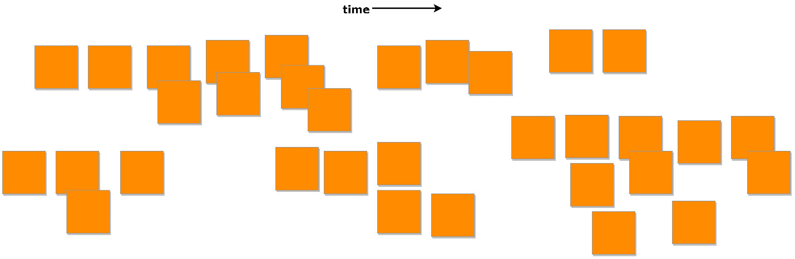

Figure 3.2 – Chaotic exploration results

### Bigger Picture EventStorming

Fitting the entire timelines on the page would result in an illegible representation of sticky notes, so you’ll find full-sized images of the timelines, with text on each sticky note representing each step, in the `ch3/docs/EventStorming/BigPicture` folder in the source code repository.

During this first step, participants are likely to encounter situations where an event that another participant has placed on the timeline does not make sense to them. Not everyone will come into the workshop knowing all of the terminology used by other departments, and the developers might not know the complete business language the domain experts are using. When we encounter confusion regarding words or phrases, a **definition sticky note** can be created and placed somewhere near the timeline. These definitions will help build our ubiquitous language.

Let’s look at definitions in the following points:

- **Store**: A physical store in the same mall as the MallBots service. We track the name and location.
- **Participating store**: A store that has been approved and can be selected for automated shopping.
- **Catalog**: Store items that have been made available for purchase with the service. We track the name, price, and picture of the items.
- **Cart**: A customer’s store and product selections that have not yet been submitted as an order.
- **Order**: A customer-submitted request for items to be automatically shopped for and collected at the depot.

The timeline of the first EventStorming session for the MallBots application is shown in **Figure 3.2**. The results are a mostly disorganized timeline of events with sloppy grouping. This is a reasonable result to see at the end of step one. Other outcomes can include numerous duplicate events, and we could have entire flows modeled more than once from different perspectives. Missing events at this point aren’t going to be the end of the world either, especially given the time-boxed nature of the session.

It is messy, but we can start to see the different parts of the application take shape. The cart flow found at the top left of the timeline appears to be mostly complete, but the bot and depot have received less attention in the bottom-right corner. Store management down at the bottom left of the timeline is an example of how some flows might receive very little attention. This could mean some key people were missing from the workshop, or that part of the application is not considered to be that critical to the success of the business.

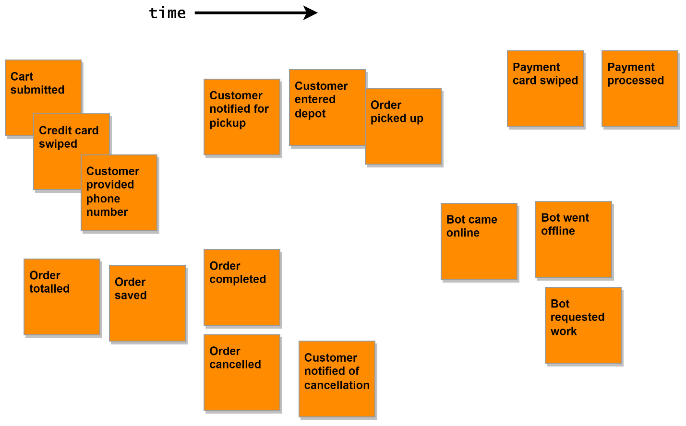

Figure 3.3 – A close-up of the chaotic exploration results

As we can see in **Figure 3.3**, the events associated with the orders are spread out into two groups, with most of them at the bottom left of the close-up view. There are also a couple of notifications added, but they are not grouped; instead, they are put with other events that they seem to be associated with.

Remember that participants should try to place events in chronological order but shouldn’t waste time trying to get groupings accurate.

When the session is over, and everyone has stepped back from the wall, it would be a good opportunity for participants to discuss their observations of the workshop and the timeline results before taking a break before the next step.

### Step three – Enforcing the timeline

The next step in the workshop process is to organize the events into their correct chronological order and to group related events together. Grouped events are called **flows**, and each flow should represent a process belonging to a domain. We will be modeling multiple flows and want to keep the flow of events in any parallel flows in sync.

Organizing the events into flows will start with the expected path, or **happy path**, for a process. After the happy path has been organized, we can begin to add branches for the alternative or unhappy paths that can result from bad user input or errors occurring in the application.

The facilitator will now take charge of the room and will be the one either moving the sticky notes around after some discussion or instructing the participants as groups to organize portions of the timeline. The purpose of this step is to bring order to the chaos we have allowed to happen in the previous step, and individual efforts might be counterproductive for that to occur.

There are multiple strategies we can use here to add structure to the timeline. Example organization methods include, but are not limited to, the following:

- **Pivotal events**: An organizational method that identifies significant events in a timeline to split the timeline vertically. These would be represented with larger sticky notes and a vertical divider, made with tape or a marker, that runs under the event.
- **Swim lanes**: The method of using horizontal dividers along the timeline to split events into flows that belong to specific actors in our application.
- **Temporal milestones**: Like the pivotal events method but uses time instead of events to split the timeline.
- **Chapter sorting**: Useful for organizing timelines with an overwhelming number of events and/or a limited amount of space. Identify the chapters of events, organize those, and then go back and organize the events for each chapter.

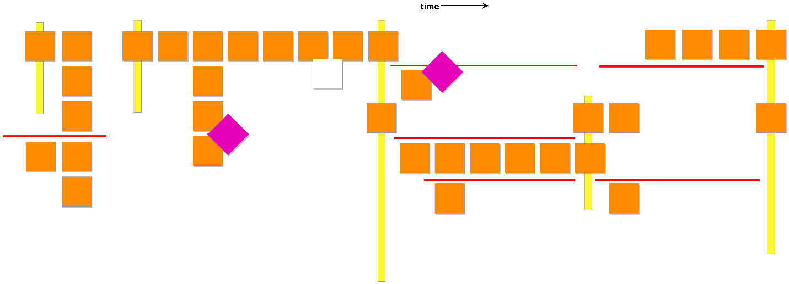

Figure 3.4 – Enforcing the timeline results

In **Figure 3.4**, we have used both **pivotal events** and **swim lanes** to organize the events of our application. The swim lanes between the pivotal events do not necessarily line up, and they do not need to, but we kept all our customer interactions in the top swim lane across the timeline.

Our pivotal events have defined some boundaries, which help us see where a flow might be passed to another system or a new phase of the business. The swim lanes will break up the events for a phase into synchronous flows.

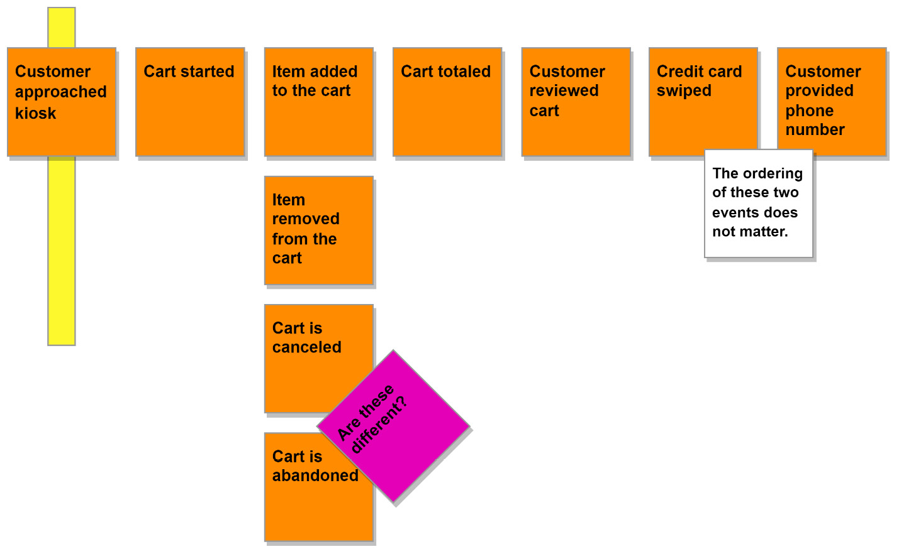

Figure 3.5 – A close-up of the cart flow

The events are organized within the swim lanes into horizontal and vertical flows. The horizontal flows represent the chronological flow of the events, and the vertical flows represent the alternative events that may create branches.

Also shown in **Figure 3.5**, in the top-right corner, are two events that may occur in any order, but both would be expected to happen for the flow to continue. The two-dimensional nature of the timeline sometimes makes the placement of the notes and their relationship to other notes unclear. When you are in a similar situation, use a **comment sticky note** to clear up any potential misunderstandings. There is not any official legend for comment sticky notes, so use what works for your workshop by picking a color and size combination you won’t have any conflicts with.

The two **cart is canceled** and **cart is abandoned** events could be different or the same, with unimportant semantic differences.

We have marked this question with a **hotspot sticky note**, and it can be addressed in the subsequent steps.

The flow for taking an order and then fulfilling it would appear to be the bulk of the application, and it certainly is for our simple application. Managing stores and bringing bots online have been placed on the left of the flow, as shown in **Figure 3.5**, which could happen at any time. At least one available store and one online bot must exist before we can manage taking an order from a customer.

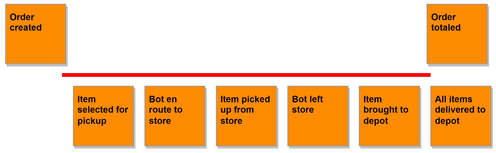

Figure 3.6 – Depot events in sync with order processing events

Additionally, we can see in **Figure 3.6** that a great deal occurs during the collection of order items in the depot, following the creation of an order and before it is touched again.

### Step four – People and systems

Now that the flows are becoming clearer and the sequences of events have been organized, we should add **who** or **what** will be triggering them. We should also add any **external systems** that will be involved in the flows we have created. This simple step is going to bring to the surface a lot of assumptions, and as a result, several new flows and events will be added. Triggering events that lead to other event flows will also be discovered and identified.

During our imaginary workshop, the following **people** and **systems** were identified.

#### People

- **Store owners**: External users that operate stores in the mall where the MallBots service is active. They take care of their store details and the store inventory that is available to the service.
- **Store administrators**: Internal users that curate the participating store in the service.
- **Customers**: External users who are visiting the mall and place orders to have items picked up from stores while they do other shopping.
- **Bots**: The AI processes that are running to control the robots that navigate the mall and pick up the items for an order.
- **Depot administrators**: Internal users that manage the depot operations and monitor the robots.
- **Depot staff**: Internal users working at the depot that are responsible for order fulfillment. This is a role, and the same people that do administration may also be doing fulfillment at the depot.

#### Systems

- **An SMS notification service**: An external system responsible for contacting customers via SMS. We know that we will be sending text messages to users, but the specific service is not mentioned or decided at this time.
- **A payment service**: Also an external service, which will be responsible for processing payments for the invoices associated with each order.

Thinking back to the previous chapter and the description of the types of bounded contexts, we can presume that the flows that use these external systems are going to be **generic contexts**. Neither payments nor notifications offers any competitive advantage to develop them just for our application.

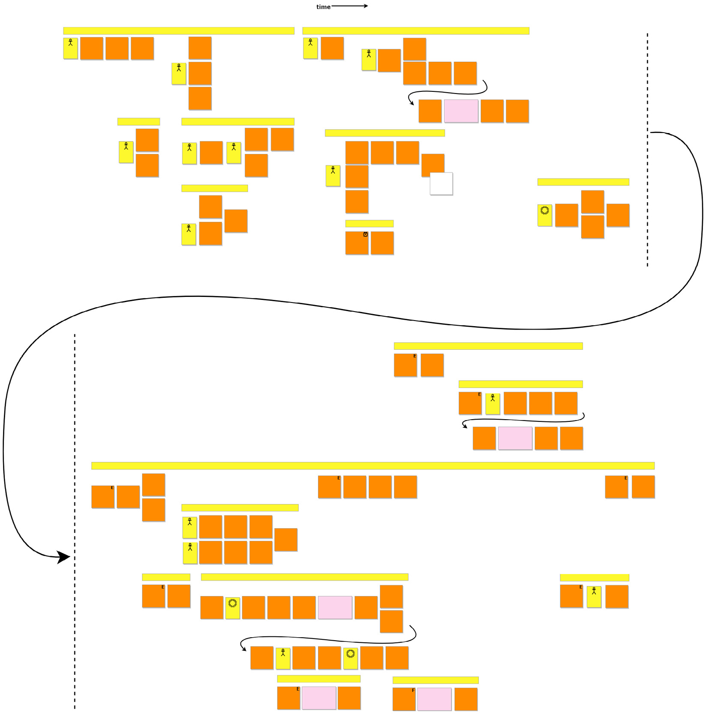

Figure 3.7 – Identifying people and systems results

The timeline is starting to look remarkably busy and wide. The participants have better organized the timeline into individual **flow threads** that visualize very well the number of events that are happening at any one moment.

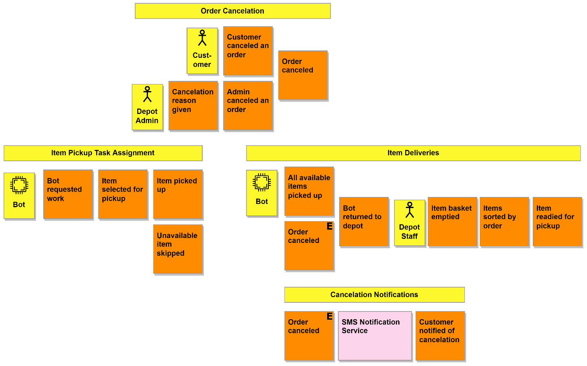

Figure 3.8 – Adding labels above event sequences

Now that the timeline has more events, actors, and services and has spread out to either side, it is a suitable time to **label the flows** we are defining about each group or event sequence, using some labeling tape of the tacky, removable variety. This would be an example of the fuzzy nature of EventStorming. This works for the participants and is not a requirement of this step or the workshop, but labeling the timeline can help participants identify the business departments or operations more easily.

Another customization that the participants can add is **markings** to some of the events that trigger many of the flows.

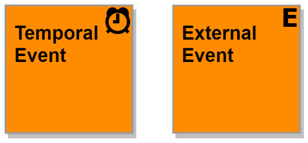

Figure 3.9 – Temporal and external variations of the domain event

These two events follow the same rules as the other events we have been putting up on the timeline in previous steps, but we have chosen to include a small marking in the top-right corner of the sticky note.

- A **temporal event** might use an alarm clock marking, as displayed in **Figure 3.9**. A drawing of an analog clock for events that happen at a specific time of day, as well as using a calendar for events that happen on specific days, weeks, or months, may be more meaningfully accurate than always displaying an alarm.
- **External events** are events that have happened elsewhere in the application that are then used to start up or kick off more work in other parts of it. All the external events are duplicates of their original event and are placed vertically in line with the original, or somewhere after it.

We have answered the question regarding **who cancels orders** from the previous step by showing that two people can act. The flow for item deliveries has a mix of actors and event triggers that might cause it to begin. The event that triggers the flow is an **external event** that comes from the previously mentioned **order cancellation flow**. It will not matter who cancels the order when we want to have the bot stop picking up items for an order and return to the depot. The same is true for the flow of cancellation notification, and if the customer canceled the order, they should still be notified of the fact.

In the previous step, there was an event at the end of the item deliveries flow that we no longer have here. For reference, this is what it looked like in the previous step:

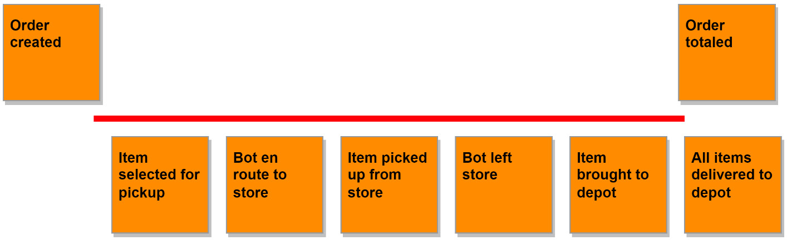

Figure 3.10 – A partial view of the depot and order flows from the enforcing the timeline step

In **Figure 3.10**, we have as part of the depot flow an event for **All items delivered to depot**, and now as shown in **Figure 3.8**, the item deliveries flow ends at **item readied for pickup**. The missing event has been rewritten and moved up into the overarching ordering process. When we applied **context-specific ubiquitous language** to the item deliveries flow, it became apparent that the depot is not responsible for knowing when all of the items have been collected for an order, at least not directly. What we need the depot to be capable of doing is processing the items as they come in and go out. Not to get ahead of ourselves, but it will likely be the responsibility of an **order process manager**.

There is the possibility that an item is not available at a store, so the bot would be unable to collect it. When this happens, the order should be updated so that we do not end up charging the customer for items we are unable to deliver. Overall, the entire flow associated with item pickup and deliveries will involve a substantial amount of thought and rework. There is nothing special about any event or sequence that would prohibit the participants from making corrections and improvements as the workshop advances through the steps.

---

## Step five – explicit walk-through

This is the step where we check our work by **reading aloud the events as a story**. Different participants will take turns walking through portions of the timeline. We do not want to have the events read verbatim from the timeline but to have the participant become a storyteller and narrate a story for the group, using the events as their outline. The point of reading the events as a story is that it will force the storyteller to think about how the events connect. When that becomes impossible or difficult, then we might have discovered a plot hole, or a missing or misplaced event. The audience participates in the process as well by pointing out the problems in the story.

This step will ask a lot from the participant doing the storytelling. Not only will they need to repeat portions of their story when corrections have been made, but they will be interrupted constantly. They will need to add and move events or rewrite them when the **ubiquitous language** or narrative of their story is being lost. The facilitator can help with the events and changing the participant at pivotal events or flows can allow them to rest.

Storytelling will take a large amount of time to get through, and it could become the longest session of the workshop, so it is something to keep in mind when planning your session schedule. The storyteller has two tasks: the first is to tell their story aloud, and the second is to put one of their hands onto an event that becomes relevant to the story as it progresses. Combining these two tasks to reveal problems such as missing, out-of-place, or erroneous events is well worth the effort.

---

### Reverse narrative – storytelling in reverse

We focus on events flowing seamlessly into the next in storytelling, and this perspective may miss significant events. In **reverse storytelling**, the focus shifts to determining the event or events that directly precede an event. To start with using reverse narrative, we need to pick an event toward the end of the timeline and ask for the events that directly precede it. Discover any missing events and then repeat until you are at the earliest or leftmost events. Going over the timeline in reverse is also going to take a long time, so if you are in a rush, you might want to use the pivotal events and work backward from them or take a vote for the flow and event to work backward from.

---

### Storytelling results

As expected, the efforts of storytelling did an excellent job at uncovering and discovering implicit events hidden from us. The entire timeline was modified in one way or another, longer chains of events were discovered, flows were merged, and flows were dropped entirely.


Figure 3.11 – Explicit walk-through storytelling groups

Knowing that this will be a lengthy session in real life, identifying groups in advance will benefit session participants in determining appropriate stopping points for breaks.

Continuing with our imaginary workshop example, we will break up the timeline into several groups and assign a different storyteller to each group.

### Store management stories

Starting from the left side of the timeline, we begin with stories about **managing stores**. From the story about creating a new store, there was no mention of also adding any products. You might be thinking the act of adding the products was implied in the details, but the purpose of this session is to make the implicit explicit, so we should add it.

If the storyteller does not notice an omission or other **plot hole** in their story, the participants should speak up to ask about what they think the problem might be. This process can also discover flows that are not as unique as originally thought when two stories sound too similar to one another.

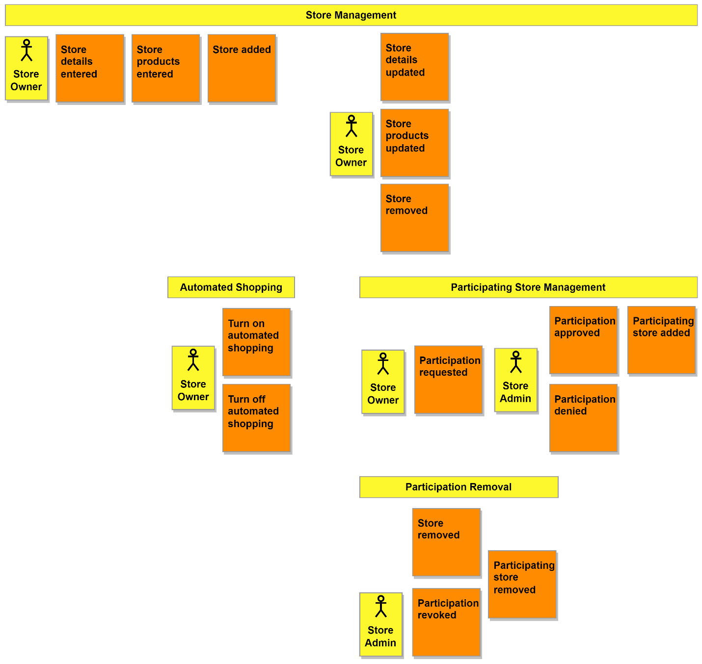

Figure 3.12 – Store management storytelling changes

Another issue was discovered while trying to tell the story about **temporarily closing a store**. Using the existing flows that we had, the stories would include adding a store, removing the store, and then adding the store back again. Any store with many products is not going to want to do that. We are not interested in keeping track of when a store is temporarily closed. It also might not be that the store is closed but that it wants to temporarily opt out of the automated shopping service. The solution was to add the flow for turning on and off the automated shopping feature for stores.

### Kiosk ordering stories

Moving right along into the next set of flows, we pick a new storyteller and begin. While the storyteller was telling the story involving **adding items to the cart**, someone interrupted to point out that the customer wasn’t being given a new total. The same was also happening when the customer would remove items from the cart. To see the new total, they would have to restart the checkout process. To address this, changes to the events were made so that the customer would see the total after making any changes to the items in the cart.

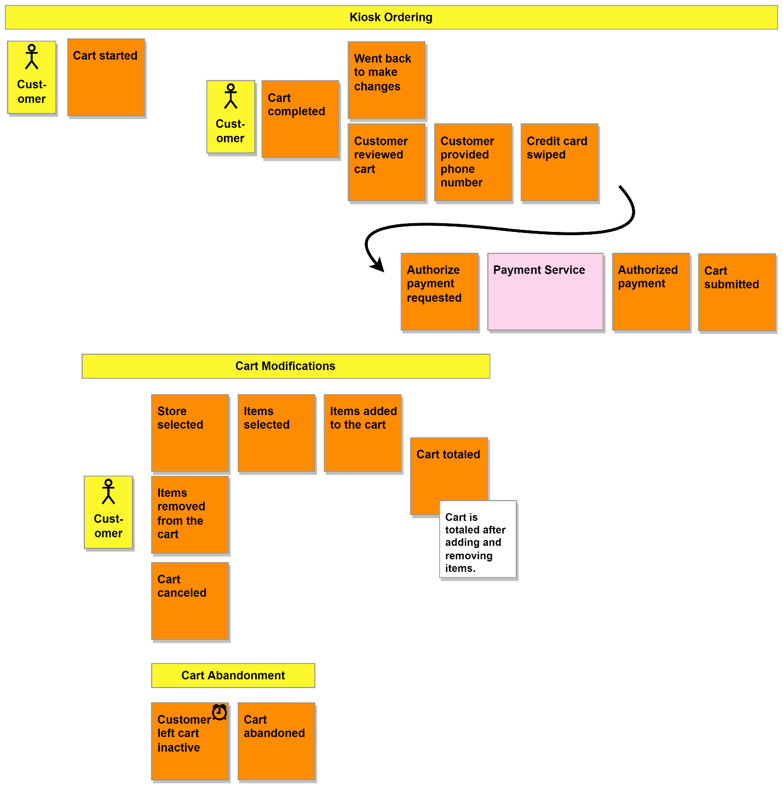

Figure 3.13 – A view of the kiosk ordering flows

### Author notes on arrows

EventStorming should take place in a room that can provide a surface to work on an extremely wide timeline. On a real paper timeline, the use of arrows should absolutely be avoided, primarily because of the permanent nature of the marking. I am using arrows to compact the timeline horizontally and to connect parts of a single flow that I have split. This helps me fit the flows on the page, where I do not have the option to roll out more paper to fit wider timelines.

Of course, workshops working with **digital timelines** should do what they want and relax the arrow rule.

### Discoveries during storytelling

Another **implicit detail** that was discovered was within the story of updating the cart items. To add items, we would need to have selected a store first. The **store selected** flow was expanded to include the adding of items, and a new **items removed from the cart** flow replaced **cart items updated**.

The last set of discoveries was in the **checkout**. There was no escape hatch. Once a customer had completed selecting the items, they were committed to that choice. A **branch** that covered the situation of a customer wanting to make changes was added and positioned where they could decide to proceed with their choices.

The **cart saved** event was removed from the timeline after the definitions of both a cart and an order were discussed. We accepted for a while that the submission was the transitory event between a cart and order, so saving a cart had no purpose. Removing the event helped make that clear to everybody.

Why we were expecting the customer to **swipe the card** wasn’t clear either. It was to associate the card with the order so that it can be looked up later, and that seemed clear enough by looking at the timeline from the previous step, at least for the storyteller. It was also so we could authorize the card to avoid incidents of random passers-by creating orders they have no intention of ever picking up. This time, storytelling helped us discover an additional implicit reason or result for an event.

### Bot availability stories

A quick couple of stories uncovered some more **implicit knowledge** having to do with **bot availability**.

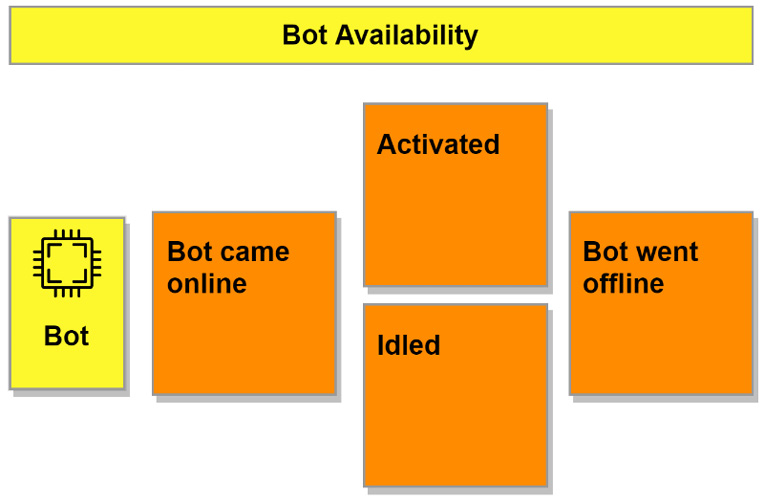

Figure 3.14 – A view of the bot availability flow

Determining whether a bot is available involves more than it being **on** or **off**. A bot is available when it is **on** and **idle**, and it is unavailable any other time. The term **available** in the context of the depot and the bots was also defined and added to the **ubiquitous language**:

### Bot availability

- **Bot availability**: A bot’s readiness to be given work

---

## Order processing stories

Next, we turn to the rather large **ordering process**, and we dive first into the **order creation flow**. There is a change to be made to reflect the **removal of the cart saved** event, and we swap it out for **cart submitted**. In the telling of our stories, we make an immediate jump from receiving the **cart submission** to checking an order for problems. **Checking the order** also happens before we create it later in the flow.

The flow needs to start with events dealing with the **cart** and then transition to events for the **order** only after we are finished with the cart. This is how the updated flow looks:

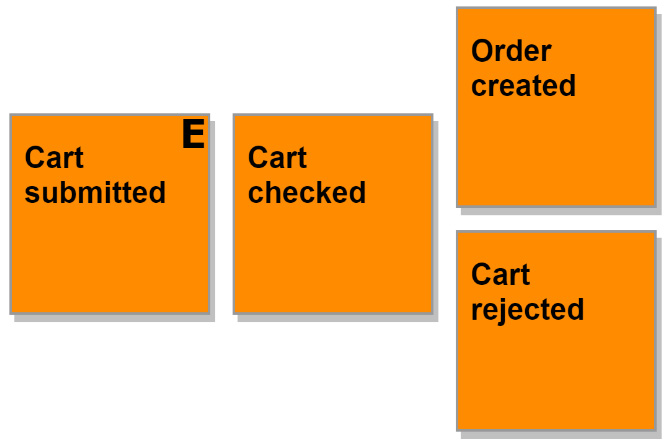

Figure 3.15 – A view of the order creation flow

An audience member interrupts the story of a **customer canceling** their order to point out that the story is missing a **beginning**. The beginning that we were missing needed to answer, **“How does the customer get to the order to be able to cancel it?”**

The **kiosks** are the only interfaces that a customer could use, so they would need to visit one of those. To find their order, they would use the **credit card** associated with the order and swipe it in the card reader. We make the changes to fix the story, and the results are shown in **Figure 3.16**:

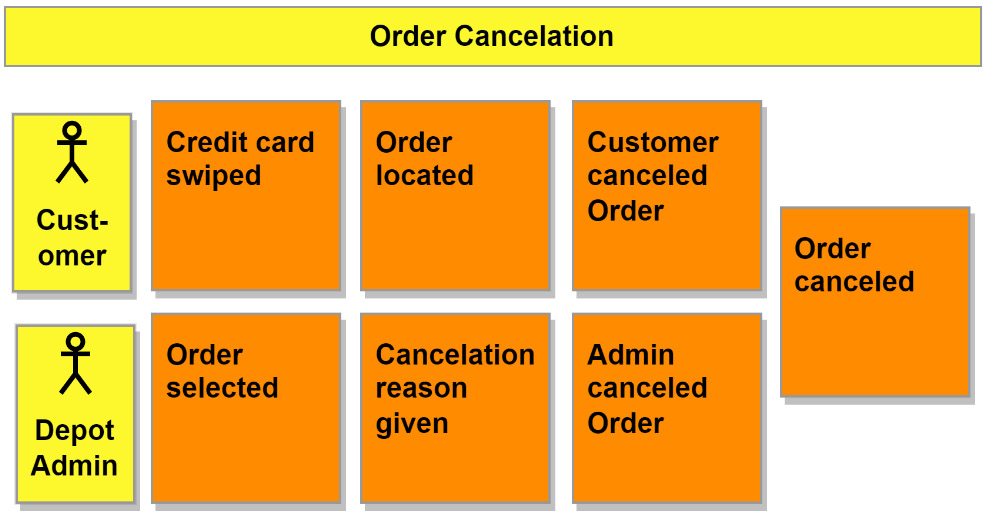

Figure 3.16 – A view of the order cancellation flow

Perfect! We have the beginning to the story, and the customer is no longer magically canceling orders with their mind. It felt right to do a similar update for the **admin cancellation flow**, and the **order selected** event was added to the beginning to make the selection of an order explicit.

The **item pickup task assignment** and **item deliveries** flows ended up being completely removed and replaced as the result of our storytelling. Bots wouldn’t be sent out to pick up individual items and then return to the depot. The singular pickups would be a waste of time with the amount of back-and-forth trips a bot would be making. Instead, they would be sent out to collect all the items for an order and then return after visiting all the stores necessary to complete the shopping list.

A new definition was recorded as well:

- **Shopping list**: A list assigned to bots containing the stores to visit and the items to pick up.

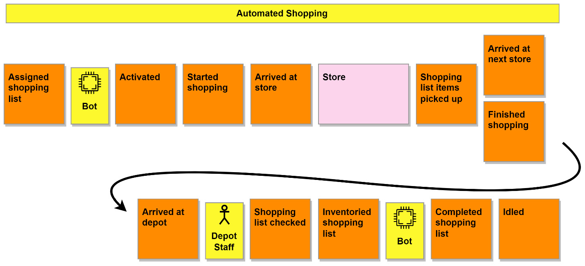

Figure 3.17 – A view of the automated shopping flow

As seen in Figure 3.17, the perspective of how the bots would receive their work has also changed. They would not be in a position where they would poll or request work, but instead, we would rely on their **availability status** to assign them work. A very important external system, the **store**, was included in the new combined flow. Determining if all available items have been picked up was removed as a responsibility of the bot and moved later in the flow, where it was given to the **depot staff**.

### Invoicing stories

The last major changes would be made to the **invoicing flows**. First, we updated the flows to reflect the changes made previously in the **kiosk ordering flow**, specifically the usage of a **pre-authorization** for the customer’s credit card.

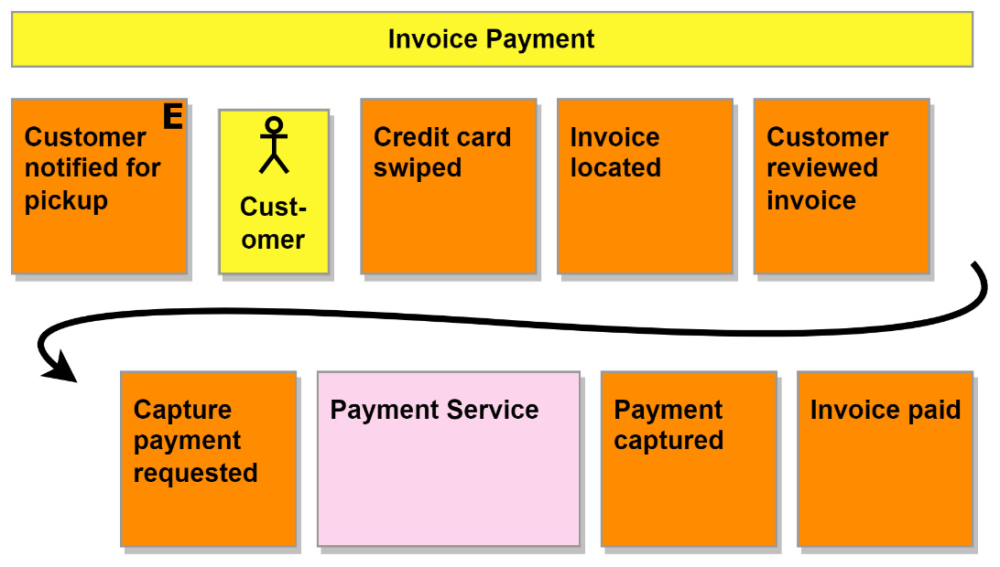

Figure 3.18 – A view of the invoice payment flow

The customer was also allowed to review the invoice they were being expected to pay, and the **customer reviewed invoice event** was added to reflect that.

### Step six – Problems and Opportunities

With any luck, the last session opened the participant’s eyes to what it is we intend to be building, and we have mostly started agreeing on how it will get done. Of course, by going through the whole timeline and, in some cases, specific portions at a deeper level, we are sure to dig up even more questions and ideas.

We close out our Big Picture workshop with a short session, where we ask everyone to place **hotspots** where they think problems still exist and to place **opportunity stickies** up where they have ideas for improvements.

Throughout the workshop, we focused on the current goal or version of the idea, so our problems should focus on issues that would exist for that version. The opportunities will be focused on the next version and beyond.

### Identifying the Contexts

We can place boxes around the various groupings we have on the timeline to identify the **bounded contexts** we’ve discovered.

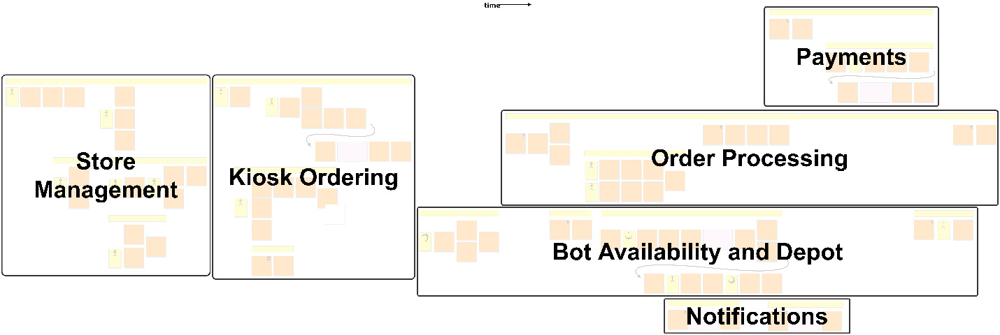

Figure 3.19 – The bounded contexts of MallBots

The sections we identified earlier could also work as our bounded contexts. This won’t always be the case, of course. Determining bounded contexts is an art and not a science, but we shouldn’t base them on how much a storyteller may be willing to narrate.

---

### Wrapping Up

That was a lot to go through. Had this been a real EventStorming workshop, every participant should feel good about the final result. What couldn’t be shown in the previous sections was the amount of movement and rearranging that can take place during any given session. The discovery process will redo portions of the timeline multiple times. It is better to throw away a sticky note that is no longer needed than to get the solution to the business problem wrong in the code, which could be more costly to redevelop.

---

### Design-Level EventStorming

We can now go further with a design-level workshop. This format looks at a single core bounded context, and we won’t need to invite the domain experts and developers that would be relevant to the context in question. We want to add to our Big Picture events the other concepts that turn a flow of events into a process, which follows the EventStorming flow shown in Figure 3.1. The goal of the workshop also changes. In the Big Picture workshop, we were focused on exploration and discovery; now, we want to do design and process building.

---

### Picking the Right Contexts to Focus On and Design

DDD will not be applied to every part of your application. We can tell from our efforts with the Big Picture workshop that there are several parts of our application that we may not want to invest time in to dig into deeply or model the context using tactical DDD patterns. Store management could be a Supporting context that we can use entities with simple Create, Read, Update, and Delete (CRUD) access patterns. The payments and notification contexts are expected to be external services and won’t need any special attention either. That leaves the depot and order processing contexts. These are the contexts that are complex enough to be **Core** contexts and warrant a design-level workshop, giving us the best chance of getting them right from the start.

---

### Understanding the Business

We now arrive at the space between designing our application and planning how that will happen. Leaping over this gap right into planning might mean we lose some of the hard work that a lot of people helped put together. We need something that bridges this divide that can capture the knowledge that has been shared with us and can be used to test us to keep us honest. For this, we turn to executable specifications and **Behavior-Driven Development (BDD)**.

BDD is a form of living documentation that, in most cases, can be formatted in a way that makes it machine-readable, so it can be used as part of a continuous integration and continuous delivery (CI/CD) pipeline to perform acceptance testing – all while still being completely readable by non-developers. The purpose of the documents that we create using BDD is to keep the distance between what the business needs are and what is developed to implement that need as small as possible. Domain experts and developers will share and collaborate on the documents.

If you are already doing EventStorming or using some other DDD tool to develop the ubiquitous languages and the bounded contexts, then you are going to be able to ease into BDD. We will take the capabilities of each bounded context, break those down into features, and then provide example scenarios for each feature.

The scenarios should be written in such a way that they describe what we want the application to do and not how we want it to be done. For example, if you were writing scenarios for an authentication module, the following would be a poor example of a scenario:

```gherkin
Feature: Authenticate Users
  Scenario: Login to the application
    Given a user with username "alice" and password "itsasecret"
    When I enter the username "alice"
    And I enter the password "itsasecret"
    And I click the "Login" button
    Then I see the application dashboard
```

This scenario focuses too much on how a user is authenticated. The user must enter a username, enter a password, and then click a button.

What if authentication uses a fingerprint scanner, or a smartcard authentication method instead? This scenario would not work with alternative forms of authentication; we need a better scenario that focuses on how authentication should work.

```
Feature: Authenticate Users
  Scenario: Login to the application
    Given an active user "alice"
    When "alice" authenticates correctly
    Then "alice" can access the application dashboard
```

We will use Gherkin (https://cucumber.io/docs/gherkin/reference/) to write our features and use the Godog tool (https://github.com/cucumber/godog) to execute them as our acceptance tests. This is what our specifications will look like:

```
Feature: Creating Stores
  As a store owner
  I should be able to create new stores
  Scenario: Creating a store called "Waldorf Books"
    Given a valid store owner is logged in
    And no store called "Waldorf Books" exists
    When I create the store called "Waldorf Books"
    Then a store called "Waldorf Books" exists
```

This is a Gherkin-formatted feature that could be written by a domain expert:

- The first line sets the **Create Store** feature name and is required.
- The next two lines are the **user story**, which sets our expectations but is optional.
- The rest of the file is the **scenario** for creating a store called _Waldorf Books_, which could be followed by more scenarios to provide further examples.

We leave out the details of how creating a store should be done. There are no mentions of saving records, performing search queries, or any references to specific user interface details.

On its own, it is documentation providing a feature story and an example scenario. We can place this into our repository at `/stores/features/create_store.feature` and then implement the feature and scenario using Go in `/stores/stores_test.go` with the following:

```
var storeName = ""
func aStoreExists(name string) error {
    if storeName != name {
        return fmt.Errorf(
            "store does not exist: %s", name,
        )
    }
    return nil
}
func aValidStoreOwner() error {
    return nil
}
func iCreateTheStore(name string) error {
    storeName = name
    return nil
}
func noStoreExists(name string) error {
    if storeName == name {
        return fmt.Errorf("store does exist: %s", name)
    }
    return nil
}
func InitializeScenario(ctx *godog.ScenarioContext) {
    ctx.Step(
        `^a store called "([^"]*)" exists$`,
        aStoreExists,
    )
    ctx.Step(
        `^a valid store owner is logged in$`,
        aValidStoreOwner,
    )
    ctx.Step(
        `^I create the store called "([^"]*)"$`,
        iCreateTheStore,
    )
    ctx.Step(
        `^no store called "([^"]*)" exists$`,
        noStoreExists,
    )
}
```

This test implementation does not do much other than demonstrate the code necessary to turn the feature documentation into executable specifications, which can be executed to validate that the developers have implemented the feature as specified.

We can use the results from the **Big Picture** workshop and the stories to write the features that will be implemented as we develop more and more of the **MallBots** application. The Gherkin feature files will be available in the code repository, and implementations will be added in advance throughout the development of the application.

# Recording Architectural Decisions

Moving to the implementation side, we now face decision-making issues on how this application will be developed. The decisions that we make will have lasting repercussions for a project, and over the life of the project, the motivations for why a decision was made can be lost.

Enter the **architecture decision record**. The most popular format for these records comes from Michael Nygard ([Cognitect Blog - Documenting Architecture Decisions](https://cognitect.com/blog/2011/11/15/documenting-architecture-decisions.html)), who suggested the following format, shown here in Markdown:

```
# {RecordNum}. {Title}
## Context
What is the issue that we're seeing that is motivating this decision or change?
## Decision
What is the change that we're proposing and/or doing?
## Status
Proposed, Accepted, Rejected, Superseded, Deprecated
## Consequences
What becomes easier or more difficult to do because of this change
```

# Architectural Decision Records

An architectural decision record (ADR) should be made each time a significant change is being made to software, the infrastructure, or the service dependencies.

## Examples of Decisions to Record

Here are some examples of decisions you might want to record:

- Choosing to use a cloud provider
- Adding or replacing infrastructure to address performance or availability issues or concerns
- Going with a non-standard solution for a particular reason
- Deciding on a new programming language for new or revised code
- Adopting DDD or other design patterns

The popularity of the preceding format is thanks in part to its simplicity. The small template is quick to fill in, commit, and start the decision conversations. Additional headings may be added to provide even more information when necessary.

Another point in favor of ADRs is that they are kept in the **code repository**, making them very easy to find. They are treated like an immutable log, and when new decisions are made, a new document is written to support them. The exception to that is when an older decision is being replaced, and you will need to update its status to reflect that.

## Our Architecture Decision Log

Our architecture decision log is kicked off with two decisions:

1. **Keep an architecture decision log**: The decision on whether to keep the record of decisions, which will have significant impacts on the application.
2. **Use a modular monolith architecture**: We want to avoid a mess with an unstructured monolith and the deployment complexities involved with developing an application with microservices.

This will be enough to get the ball rolling, and we will see new decisions being made in each new chapter.

## Summary

In this chapter, you read your way through an experience of the Big Picture workshop to dig up all the implicit details and knowledge locked away in the minds of the make-believe domain experts. We also covered executable specifications and will be hearing more about them as we complete each new portion of the application. We were also introduced to ADRs and used them to log our first two decisions. This design and planning chapter concludes the first section of the book.

In the next chapter, **Event Foundations**, we will be developing the application using event-driven architectures. In the next chapter, we will make use of our first architecture decisions and lay the foundation for our modular monolith application.

## Further Reading

- [Introducing EventStorming, by Alberto Brandolini](https://leanpub.com/introducing_eventstorming)
- [Awesome EventStorming](https://github.com/mariuszgil/awesome-eventstorming)
- [Awesome BDD](https://github.com/omergulen/awesome-bdd)
