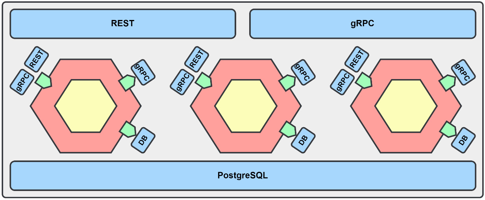
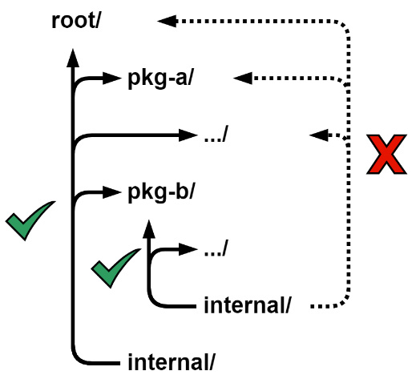
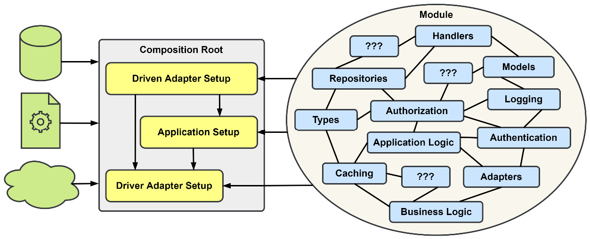
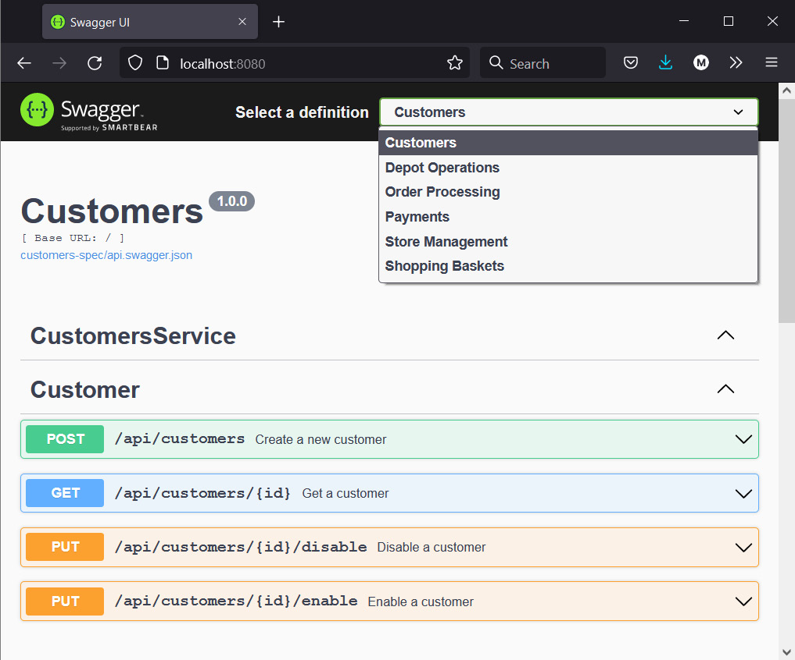
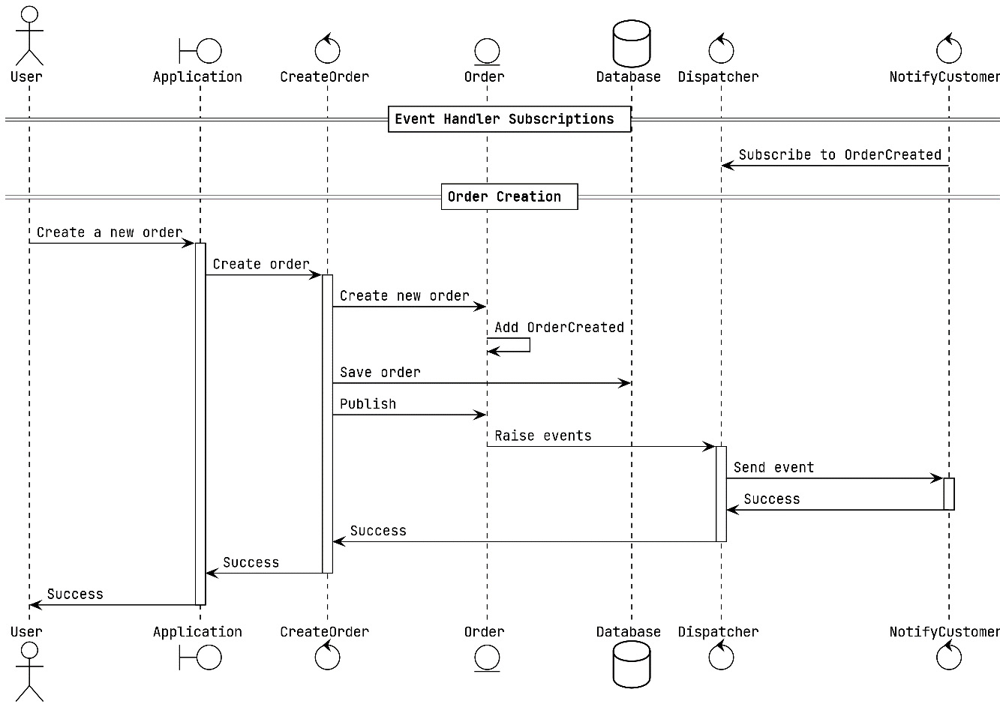
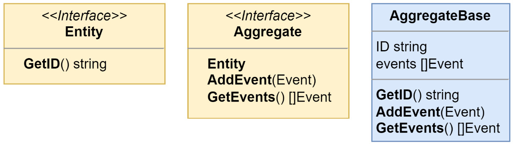
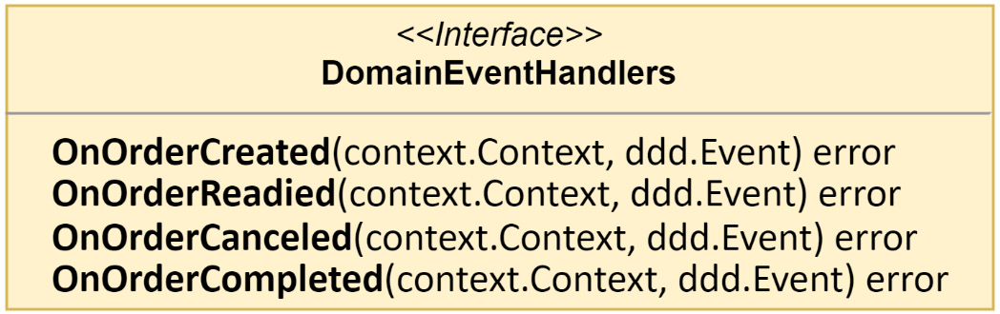
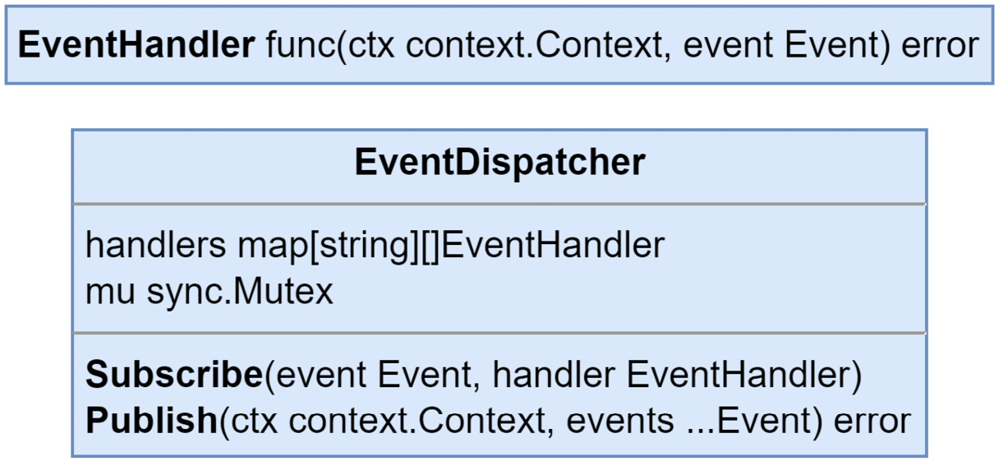

# Chapter 4: Event Foundations

In the first part of this book, we discussed what event-driven architectures are and the other patterns we might use when developing them. We then dove into the design and planning of an application, and we’ll be implementing event-based approaches to the existing synchronous methods it uses now. This next part will introduce you to event usage, tracking, and forms of communication, and will also refactor the **MallBots** application into a fully event-driven application. Each chapter will cover a different pattern and accompanying implementation, which will build on what was learned in the previous chapters.

In this chapter, we will take a look at how the application is being built and how the modules of the application communicate. After a tour of the application, we will refactor portions of the application to use domain events, a **domain-driven design** pattern, to set the stage for our future refactoring efforts.

## We will work with the following main topics:

- An in-depth tour of our monolithic application structure and design
- A look at the synchronous integrations of the application we are working with
- An introduction to the types of events we will be using
- Implementing domain events to refactor how side effects are handled

## Technical Requirements

In this chapter, we will be implementing domain events for our application. You will need to install or have installed the following software to run the application or to try the examples:

- The **Go programming language** – version 1.17+
- **Docker**

The source code for the version of the application used in this chapter can be found at:  
[GitHub - Event-Driven Architecture in Golang (Chapter 4)](https://github.com/PacktPublishing/Event-Driven-Architecture-in-Golang/tree/main/Chapter04).

## A Tour of MallBots

Our **MallBots** application is a modular monolith, which, if you recall from Chapter 2, "Supporting Patterns in Brief," is an application design that sits somewhere between a classic monolith design and a microservices application design. We have most of the benefits of both designs with only a few downsides.

### The Responsibilities of the Monolith

The root directory of our code is kept minimal, and what stands out are the module names. We intentionally avoid the use of generic or general layer names, such as controllers, config, or models, in the root directory. Instead, we use application component names, such as **baskets**, **stores**, **depot**, and **ordering**, so that we end up with a code repository that looks like an application that deals with shopping and not like some generic, no-idea-what-it-does application. Each of these modules is a different **bounded context** in our application.

### Screaming Architecture

The organization we’re using for our root level directory structure is called **screaming architecture**, credited to **Robert C. Martin**. More details can be found in this [2011 post](https://blog.cleancoder.com/uncle-bob/2011/09/30/Screaming-Architecture.html).

It isn’t just modules that we will find in our root. We do have some other directories that are necessary:

- **/cmd**: A typical root-level directory for Go applications. This directory will contain one or more child directories for each eventual application we can generate from the code.
- **/internal**: A special directory for Go code bases that receives special treatment by the compiler. Anything in this directory or its child directories is only accessible to the parent directories or sibling directories of the internal directory. Seeing an **internal** directory is a signal to other developers that the code within is not meant to be imported into any outside applications, and this intention is backed up by the compiler.
- **/docs** and **/docker**: Additional utility directories containing documentation and scripts to aid in the understanding and local development of the application.

### Shared Infrastructure

The monolith creates or connects to all parts of the infrastructure that it and the modules will be using. References to the infrastructure are then passed into each module to be used in whichever way that module needs to use the connections. The modules will not create any connections to the infrastructure themselves.



Figure 4.1 – The Monolith and Module Infrastructure

**Figure 4.1** shows the current state of the application we will be working with. Around the center hexagons, we have the **monolith** and the infrastructure, such as the database and the exposed APIs. Aside from instantiating the modules and supplying them with the dependencies that they need, we can keep the monolith code very simple. The modules, represented by the hexagons in the middle, are each initialized with references or connections to the infrastructure.

## Module Code Organization

Each of the modules that makes up our application exposes a **protocol buffer API** and a small module file that contains the composition root for the module code. The modules also have their **internal packages** to keep unintentional imports from being made between the modules.



Figure 4.2 – Internal Package Import Rules

**Figure 4.2** illustrates how the multiple internal packages help us manage our relationships and control the dependencies between the modules:

- **/root/internal**: This package can be imported by `/root` and any package found in the directory tree under it.
- **/root/pkg-b/internal**: This package may only be imported by `/root/pkg-b` and any package found in the directory tree under it. Both `/root` and `/root/pkg-a` will not be permitted to use any imports from this package.

## Accept Interfaces, Return Structs

The idiom or guideline “**Accept interfaces, return structs**”, first coined by **Jack Lindamood** in his article [Preemptive Interface Anti-Pattern in Go](https://medium.com/@cep21/preemptive-interface-anti-pattern-in-go-54c18ac0668a), works very well with **ports and adapters** or **hexagonal architecture**. This guideline is followed by all modules, even simpler ones such as the **Payments** and **Notifications** modules.

However, this guideline and ports and adapters are not quite the same, as the intentions or goals are slightly different. When you follow the guideline as it is set out in the article, you have the consumer of the concrete value define the interface it requires, as shown in this example:

```
// in db/products.go
type ProductRepository struct {}
func NewProductRepository() *ProductRepository {}
func (r ProductRepository) Find() error {}
func (r ProductRepository) Save() error {}
func (r ProductRepository) Update() error {}
func (r ProductRepository) Delete() error {}
// elsewhere in services.go
type ProductFinder interface {
    Find() error
}
func NewService(finder ProductFinder) *Service { }
```

In the preceding code, `NewService` will accept anything that implements the `ProductFinder` interface. The interface definition is kept close to the consumer, ideally in the same package or file. It is also defined to be as small as possible, only requiring the methods that the consumer would need to use. Smaller interfaces lead to more freedom in what concrete values you may be able to accept. In this situation, both the interface and implementation are loosely coupled, and the maintainer of `ProductRepository` may be unaware that `ProductFinder` exists.

On the other hand, when working with ports and adapters, we want to define contracts for the interactions with our applications. This often means we will be defining larger interfaces that work as the contracts for the application adapter implementations. These interfaces will not sit next to each consumer but will be kept in a central location, such as in the application or domain directory. The reverse is also going to be true for the maintainers of the implementations. The implementations will be written after the interfaces, and will be built to satisfy one or more interfaces.

Using interfaces will result in easier to test code, so teams should use the approach that fits the situation.

### Interface checks

Most implementations written to a contract interface will be used somewhere that has a static conversion and would be caught by the compiler – for example, `*os.File` used in a method accepting `io.Reader`. When there are no static conversions that the compiler can catch, then a change to the implementation may break that contract but won’t keep the application from being compiled. It won’t be until the application is running that you may notice the issue. A solution to this problem is to add an interface check that the compiler can catch but that will then be left out of the built application:

```go
var _ TheContractInterface = (*TheContractImplementation)(nil)
```

Here, we create a TheContractImplementation value that is assigned to \_ with the TheContractInterface type. This adds a static conversion, and we can trust that any issues in our implementation will now be caught at compile time and not left to be discovered by the user after deployment. The assigned value is never used and will be excluded from the compiled output for our application.

Using interface checks, and placing them next to implementations meant to satisfy any given interface, will protect you in the rare occurrence that there isn’t a static conversion elsewhere in the application.

### Composition root

The internal design of each module may differ, but they all use the same pattern to start up. A composition root is the part of an application where you bring the infrastructure, configuration, and application components together.



Figure 4.3 – Using a composition root to build application dependencies

The composition root is also where dependency injection takes place, and an application object graph will be constructed. For our modules, we will undertake the following actions:

1. Construct the Driven adapters
2. Construct the application and inject the Driven adapters
3. Construct the Driver adapters and inject the application and Driven adapters

This snippet from the Notifications module shows these three steps in action:

```go
// setup Driven adapters
conn, err := grpc.Dial(ctx, mono.Config().Rpc.Address())
if err != nil { return err }
customers := grpc.NewCustomerRepository(conn)
// setup application
var app application.App
app = application.New(customers)
app = logging.LogApplicationAccess(app, mono.Logger())
// setup Driver adapters
grpc.RegisterServer(ctx, app, mono.RPC())
```

The Driven adapters implement the ports in the application and only need infrastructure to be constructed.
The application is constructed next and needs the Driven adapters but not the Driver adapters.
Finally, the Driver adapters are constructed using a combination of infrastructure and the application. At this level, we are more concerned with concrete values and try to avoid abstractions. This pattern is simple, predictable, and boring, and all three of those characteristics are positives.
Dependency injection tooling
Composition roots are nothing more than lines of code creating instances that are then used in the construction of more instances, ultimately building a dependency graph. There are tools for Go that can be used to do this task, such as Google Wire, which uses code generation to build the wiring between the dependencies. Another tool, Dig, is a runtime dependency tool that uses reflection.

Deciding to use a tool versus maintaining the code yourself is not without trade-offs. Using some tool to manage the dependencies and build the graph is not worth the effort until the number of dependencies or the complexity of the graph has grown too large to keep straight.

### Protocol buffers and the gRPC API

The communication between the modules is entirely synchronous and uses protocol buffers and gRPC. Each module that has exposed a gRPC service API will share it from a package with the following naming structure: /module/modulepb. For example, /stores/storespb would be where to find the gRPC service API for the Store Management module. The gRPC service APIs are outside of the module’s internal package, and it is all that is exposed for other modules to use.

## Buf

We will be using buf, a tool to compile our protocol buffer files into Go code. The primary advantage of using this tool instead of the protoc compiler directly is the ability to manage the complexity of the compilation rules by using configuration files. We are also able to enforce a coding standard for the gRPC APIs and message structures using the linting features built into the tool.

We could use any other synchronous method to connect the modules that doesn’t result in a cyclic dependency and a compile-time error. With help from our composition root and dependency injection, we avoid this problem and can have two modules depending on each other. This is the case for the Ordering and Payments modules; they each make calls to the other.

A single gRPC server may serve any number of gRPC services if the compiled protocol buffers do not have any namespace conflicts. To avoid this conflict, we make sure to compile the parent directory name as part of each protocol buffer API. We end up with basketspb.Item and orderingpb.Item and avoid all conflicts.

### User interface

There is a REST API for users to use that comes from the modules exposing their gRPC service APIs using grpc-gateway. Most modules expose most of their gRPC services this way; notable exceptions are the Notifications module and most of the Depot module.

The REST APIs are mounted at http://localhost:8080/api/\*.

### Swagger UI

To make things easier to experiment and run examples, the REST APIs can be accessed with the Swagger UI found at the root of the web server: http://localhost:8080/.

### Running the monolith

The monolith and the process it depends on can be started using Docker Compose. Navigate to the root of the chapter and run the following command:

> docker-compose up

After a short time downloading the required containers and compiling the monolith, you’ll be presented with the command prompt again, and you should run the following:

> docker-compose logs -f

You should see the logs from the Postgres and monolith containers, and that output should look something like the following:

postgres | LOG: database system is ready to accept connections
monolith | started mallbots application
monolith | web server started
monolith | rpc server started

The order in which the containers' logs are reported may be different, but if we see that the database is ready for connections and the monolith and its servers have started, then we are good to go.

### Stopping and Rebuilding the Containers

Use Ctrl + C to exit the logs command. Then, use docker-compose down to stop and remove the containers. If you make any changes to the monolith code, you will need to append --build to the compose up command to recompile and rebuild the container.

For more information on using docker-compose, visit docker-compose reference.

Open your browser and visit http://localhost:8080/. What you should see now is the Swagger UI. In the top-right corner will be a dropdown where you can access the REST APIs for the different modules.

### Explanation of Formatting:

- **Code blocks** are formatted using triple backticks (`go for Go code, `bash for shell commands).
- **Inline code** (e.g., `ProductFinder`) is formatted using single backticks.
- **Headings** are formatted using `#`, `##`, `###` for sections, subsections, and sub-subsections.
- **Links** are formatted using `[Link Text](URL)`.
- Lists and steps are organized using `1.` for numbered steps.



Figure 4.4 – The MallBots Swagger UI

You can use this UI to simulate the experience a store manager may have with the Store Management module or to experience creating an order, starting with a basket.

---

## A focus on event-driven integration and communication patterns

When you are taking your own look around the code repository, keep in mind that this application is put together to demonstrate how distributed components integrate and communicate with each other. Business rules and logic will be light, and in some places, there might be some digital handwaving at play, and implementations left unimplemented.

---

## Taking a closer look at module integration

As I previously stated, all interactions between the modules are entirely synchronous and communicate via gRPC. With a distributed system such as our modular monolith application, there are two reasons that bounded contexts will need to integrate:

1. They need data that exists in another bounded context.
2. They need another bounded context to perform an action.

---

## Using external data

When a bounded context needs data belonging to another bounded context, it has three options:

- Share the database where the data is stored
- Push the data from the owner to all interested components
- Pull the data from the owner when it is needed

### The first option

Should be avoided in most situations, especially if changes are being made from more than one location. Rules surrounding invariants may not be implemented correctly or at all in every location.

### The second option

When you push data out, you will be sending it to a list of known interested components. This is a maintenance nightmare. The bigger the number of components grows, the harder it will be to keep these lists correct.

### The third option

Pulling data avoids having to deal with maintaining a list, but the trade-off is there will be more calls and a greater load put on the component that owns the data. Caching the data can help, but that inevitably leads to issues with invalidating stale cache data.

#### Tip

Given the options, pulling data is the better choice in most cases. The local component can be written to be ready for failures with retry logic, circuit breakers, and other mechanisms.

---

## Adding items to a basket

An AddItem request contains a product identifier and a value for the quantity of items to add. To complete the request, the Shopping Baskets module will need additional information for both the product being added and the store it is sold from. This information is pulled from the Store Management module the moment it is needed. The following logs show the calls made during an AddItem request:

```
monolith    | INF --> Baskets.AddItem

monolith    | INF --> Stores.GetProduct

monolith    | INF <-- Stores.GetProduct

monolith    | INF --> Stores.GetStore

monolith    | INF <-- Stores.GetStore

monolith    | INF <-- Baskets.AddItem
```

It is easier to pull data, and that is why it was done this way. Shopping Baskets is also not the only module that uses Store Management data. The modules that need product and store data could use different options. Some modules might have the data pushed to them and others might pull the data down. Deciding which option to use for the external data that a module uses is an "it depends" or a case-by-case situation.

---

## Just the Basics Logging

The arrows in the log messages signify the entering and exiting of application methods. If a method has encountered an error, then a message in red would also appear on the exit rows.

---

## Commanding external components

To get a command to the bounded context that needs it, two options come to mind:

1. Push the command to the commanded component
2. Poll for new commands from the commanding component

### The first option

The first option is going to be the most widely used. It is simple and straightforward and only needs an API endpoint to exist somewhere for the command to be sent to.

### The second option

The second option is more complicated to set up and may result in more calls and loads existing when there are no new commands to begin working through.

---

## Checking out a basket

In the current version of the application, when a customer chooses to check out their basket, the CheckoutBasket handler makes a single call into the Ordering module to create a new order. The CreateOrder handler, however, makes several calls to other modules, as shown in the following logs:

```
monolith    | INF --> Baskets.CheckoutBasket

monolith    | INF --> Ordering.CreateOrder

monolith    | INF --> Customers.AuthorizeCustomer

monolith    | INF <-- Customers.AuthorizeCustomer

monolith    | INF --> Payments.ConfirmPayment

monolith    | INF <-- Payments.ConfirmPayment

monolith    | INF --> Depot.CreateShoppingList

monolith    | INF --> Stores.GetStore

monolith    | INF <-- Stores.GetStore

monolith    | INF --> Stores.GetProduct

monolith    | INF <-- Stores.GetProduct

monolith    | INF <-- Depot.CreateShoppingList

monolith    | INF --> Notifications.NotifyOrderCreated

monolith    | INF <-- Notifications.NotifyOrderCreated

monolith    | INF <-- Ordering.CreateOrder

monolith    | INF <-- Baskets.CheckoutBasket
```

This is the most extensive call in the application and serves as an extreme example of a synchronous call chain. A total of seven modules are involved in the process of checking out a basket. This is, of course, for demonstration purposes, but call chains such as these can develop in real applications that rely on synchronous communication between components.

---

## Types of events

Let’s cover the kinds of events we will be learning about and using along the journey to develop a fully event-driven application by the end of the book.

In an event-driven application and even in an application that is not event-driven, you will encounter several different kinds of events:

- Domain events – synchronous events that come from domain-driven design
- Event sourcing events – serialized events that record state changes for an aggregate
- Integration events – events that exchange state with other components of an application

---

### Domain events

A domain event is a concept that comes from domain-driven design. It is used to inform other parts of a bounded context about state changes. The events can be handled asynchronously but will most often be handled synchronously within the same process that spawned them.

We will be learning about domain events in the next section, **Refactoring side effects with domain events**.

---

### Event sourcing events

An event sourcing event is one that shares a lot in common with a domain event. These events will need to be serialized into a format so that they can be stored in event streams. Whereas domain events are only accessible during the duration of the current process, these events are retained for as long as they are needed. Event sourcing events also belong to an aggregate and will be accompanied by metadata containing the identity of the aggregate and when the event occurred.

We will be learning about and implementing these events in **Chapter 5, Tracking Changes with Event Sourcing**.

---

### Integration events

An integration event is one that is used to communicate state changes across context boundaries. Like the event sourcing event, it too is serialized into a format that allows it to be shared with other modules and applications. Consumers of these events will need access to information on how to deserialize to use the event at their end. Integration events are strictly asynchronous and use an event broker to decouple the event producer from the event consumers.

We will be learning about integration events in **Chapter 6, Asynchronous Connections**, and we will then see the different ways they are used in subsequent chapters.

---

## Refactoring side effects with domain events

We’ve talked about domain events before and spent a great deal of time thinking about them in the EventStorming exercise in the previous chapter. To refresh your memory, a domain event is a domain-driven design pattern that encapsulates a change in the system that is important to the domain experts. When important events happen in our system, they are often accompanied by rules or side effects. We may have a rule that when the OrderCreated event happens in our system, we send a notification to the customer.

If we put this rule into the handler for `CreateOrder` so that the notification happens implicitly, it might look something like this:

```go
// orderCreation
if err = h.orders.Save(ctx, order); err != nil {
    return errors.Wrap(err, "order creation")
}
// notifyCustomer
if err = h.notifications.NotifyOrderCreated(
    ctx, order.ID, order.CustomerID,
); err != nil {
    return errors.Wrap(err, "customer notification")
}
```

# Adding Domain Events to the Application

If it were to remain as just one rule, we may be fine doing it this way. However, real-world applications rarely stay simple or have simple rules. Later, in the life of the application, we want to add a Rewards module to our application, we add the code for the rule to the same handler, and later, still, we want more side effects to occur.

What we had before, `CreateOrder`, should now be renamed `CreateOrderAndNotifyAndReward`…; otherwise, it won’t properly reflect its responsibility. Also, consider there will be other rules and other handlers that may be implemented, so finding the implementations for a rule may become a problem.

## Introducing Domain Events

Domain events will allow us to explicitly handle system changes, decoupling the work of handling the event from the point it was raised. Continuing with the previous example, our system would raise an `OrderCreated` event, and other parts may react to it to handle each rule that should follow it.

The system I am speaking of is going to be a single bounded context, and the raising and handling of the event will be entirely synchronous and in-process.

## New Features to Implement Domain Events

To add domain events to the application, we will be implementing the following new features:

- **Aggregates** to raise the domain events
- **Domain events** to share state changes
- **Dispatchers** to handle the publishing of events that our rule handlers are subscribed to
- The **plumbing** to bring it all together

## Example of Handling a Side Effect

Here is a look at what the process to handle the side effect of sending a notification to a customer will be like after we are finished:



Figure 4.5 – Order Creation with Domain Events

This is what the `Order` aggregate in the Ordering module looks like right now:

```go
type Order struct {
    ID         string
    CustomerID string
    PaymentID  string
    InvoiceID  string
    ShoppingID string
    Items      []*Item
    Status     OrderStatus
}

```

We could add a slice for events with []Event and the methods to manage them, but we know better, and there are going to be other aggregates and handlers we will be updating. To add the necessary event handling bits, we will make use of composition, and we’ll end up with the following:

```
type Order struct {
    ddd.AggregateBase
    CustomerID string
    PaymentID  string
    InvoiceID  string
    ShoppingID string
    Items      []*Item
    Status     OrderStatus
}
```

We added AggregateBase from the **internal/ddd** package and removed the ID field because that field now comes provided by **AggregateBase**. A small change to the couple of places we instantiate a new Order will also be necessary:

```
order := &Order{
    AggregateBase: ddd.AggregateBase{
        ID: id,
    },
    // ...
}

```

### A Word on Field Visibility in Go

A quick word on the topic of field visibility in this application. You may have noticed in the recent code snippets that all the fields of our Order domain aggregate are public. I have chosen to use public fields, even though I know that means someone could make a change to the aggregate without using a method or domain function.

Go does not have getters or setters, so you would need to create them yourself with something like the following:

```
type Order struct {
    id string
    // ...
}

func (o Order) ID() string       { return o.id }
func (o *Order) SetID(id string) { o.id = id }
…

```

This may not seem like a great deal for a single field example, but with a lot of models and even more fields, it does add up. If you decide to be very strict, then you would not implement any of the getters and would instead need to use builders and factories to construct the aggregates.

In this application, I am choosing not to use private fields, but I am also not making the suggestion that this is the correct choice. Give both a go and decide for yourself.

### The New AggregateBase and Its Interfaces

The new **AggregateBase** and the interfaces it implements are straightforward:



Figure 4.6 – AggregateBase and its interfaces

The `Aggregate` interface also includes the `Entity` interface, which has a single `GetID` method defined. We will need this getter when we are working in methods that accept either `Aggregate` or `Entity`, to avoid having to determine the type of object we are working with to access the ID field.

Also straightforward is the first event we are working with, the `OrderCreated` event:

```
type OrderCreated struct {
    Order *Order
}
func (OrderCreated) EventName() string {
    return "ordering.OrderCreated"
}
```

Normally, we would want to have only the information we deem important in an event and take efforts to trim that down even further, but this is a **domain event**. Domain events will not be shared outside of the bounded context, module, or microservice they belong to. This means several things:

- We can put whatever we want into them so long as we are still treating them as immutable carriers of state.
- We will not need to be concerned with anyone subscribing to them without knowing; therefore, there is no risk of making changes to them and breaking things unintentionally.
- They live a very short amount of time and do not need to be serialized or versioned to be stored in any database or stream.

The `OrderCreated` event has an `EventName` method that serves two purposes. The first is to satisfy the `Event` interface, which has only that method defined, and the second is to provide a unique event name to our application. For the domain events, they need to be unique within the bounded context in which they reside, but there is no harm in giving them a unique name that is also unique across an entire application.

Turning our attention to the Ordering module and the `CreateOrder` domain function, we will add a few lines just before `return` to add the event to the slice of aggregate domain events:

```
// … the rest of domain.CreateOrder()
    order.AddEvent(&OrderCreated{
        Order: order,
    })
    return order, nil
}
```

Defining the events and updating the domain methods is easy enough, so we will go ahead and replicate how we just did it for `CreateOrder` and `OrderCreated`, and then do the same for `OrderCanceled`, `OrderReadied`, and `OrderCompleted`.

An interface is defined in the application package with methods for each of the preceding events:



Figure 4.7 – The DomainEventHandlers interface

When this interface is implemented by `NotificationHandlers`, only three methods will be used. We can add an unused method to our implementation, but there is a slightly better alternative.

Consider for a moment a larger application with multiple handlers and a greater number of events, with an equal number of methods defined in `DomainEventHandlers`. Keeping each handler up to date would be tedious. We need a solution that will help us avoid creating empty and unused methods when new domain events have been added:

```go
type ignoreUnimplementedDomainEvents struct{}
var _ DomainEventHandlers = (*ignoreUnimplementedDomainEvents)(nil)

func (ignoreUnimplementedDomainEvents) OnOrderCreated( … ) error { … }
func (ignoreUnimplementedDomainEvents) OnOrderReadied( … ) error { … }
func (ignoreUnimplementedDomainEvents) OnOrderCanceled( … ) error { … }
func (ignoreUnimplementedDomainEvents) OnOrderCompleted( … ) error { … }
```

Because of the interface check, if `DomainEventHandlers` is changed when a new event is added, we will be alerted that `ignoreUnimplementedDomainEvents` is no longer in sync with those changes when we try to compile. We will avoid writing unused methods to keep up with the changes to `DomainEventHandlers` by including `ignoreUnimplementedDomainEvents` as an embedded field in our handlers:

```
type NotificationHandlers struct {
    notifications domain.NotificationRepository
    ignoreUnimplementedDomainEvents
}

```

The last new component to build is EventDispatcher:



Figure 4.8 – EventDispatcher and EventHandler

`EventDispatcher` is nothing more than a simple implementation of the Observer pattern with its `Subscribe` and `Publish` methods:

```go
func (h *EventDispatcher) Subscribe(
    event, handler EventHandler,
) {
    h.mu.Lock()
    defer h.mu.Unlock()
    h.handlers[event.EventName()] = append(
        h.handlers[event.EventName()],
        handler,
    )
}

func (h *EventDispatcher) Publish(
    ctx context.Context, events ...Event,
) error {
    for _, event := range events {
        for _, handler := range h.handlers[event.EventName()] {
            err := handler(ctx, event)
            if err != nil {
                return err
            }
        }
    }
    return nil
}
```

This new dispatcher and `NotificationHandlers` are brought together in a new `RegisterNotificationHandlers` function to create a driver adapter:

```go
func RegisterNotificationHandlers(
    notificationHandlers application.DomainEventHandlers,
    domainSubscriber ddd.EventSubscriber,
) {
    domainSubscriber.Subscribe(
        domain.OrderCreated{},
        notificationHandlers.OnOrderCreated,
    )
    domainSubscriber.Subscribe(
        domain.OrderReadied{},
        notificationHandlers.OnOrderReadied,
    )
    domainSubscriber.Subscribe(
        domain.OrderCanceled{},
        notificationHandlers.OnOrderCanceled,
    )
}

```

The function accepts `EventDispatcher` with the `EventSubscriber` interface because we won’t be needing the publication functionality here – at least not right now. When `EventSubscriber` is brought together with `NotificationHandlers`, subscriptions are made to the three events that the handlers are concerned with. With our `ignoreUnimplementedDomainEvents` solution, we can ignore making any subscriptions for events that we are not concerned with.

With all our components created and in place comes the time to add that plumbing I mentioned. To bring everything together, we head over to our composition root. Here is the modified composition root:

```go
func (Module) Startup( … ) error {
    // setup Driven adapters
    domainDispatcher := ddd.NewEventDispatcher()
    …
    // setup application
    app = application.New(…, domainDispatcher)
    …
    // setup application handlers
    var notificationHandlers application.DomainEventHandlers
    notificationHandlers = application.NewNotificationHandlers(notifications)
    …
    // setup Driver adapters
    …
    handlers.RegisterNotificationHandlers(
        notificationHandlers, domainDispatcher,
    )
    return nil
}
```

I’ll break down what is happening in the preceding code:

1. **EventDispatcher** is instantiated as `domainDispatcher` in the Driven section.
2. We remove notifications from the parameter list for the application constructor and replace it with `domainDispatcher`. The application will not need to use the value any longer now that every use was moved into `NotificationHandlers`.
3. We create an instance of `DomainEventHandlers` as `notificationHandlers`.
4. The `notificationHandlers` instance is registered with `domainDispatcher` to create the subscriptions in the Driver section.

The final change that will be made is to each command handler that deals with the creation, readiness, and cancellation of the order:

```go
// ...
// publish domain events
if err = h.domainPublisher.Publish(
    ctx, order.GetEvents()...,
); err != nil {
    return err
}
```

Instead of using notifications, which are no longer available, we will publish the domain events generated within the `Order` aggregate. The preceding code snippet can be copied to each command handler without any modifications. The handlers are no longer responsible for or required to be aware of any potential side effects associated with the changes they end up making.

The additions made to the `ddd` package will make it easier to add domain event handling to other modules, and for the Ordering module, adding a second set of handlers to take care of the invoice side effects is also considerably easier.

### What about the modules not using DDD?

Not every module will need to use domain events. Forcing DDD onto a simple domain would be a counterproductive effort. When modules grow in complexity, they can be evaluated to determine whether refactoring and using DDD makes sense, but not before.

## Summary

In this chapter, you were shown around a monolith application and should now be familiar with the modules and the structure. You should also be able to run the application and use the UI to run experiments of your own. We also looked at how synchronous communication between components can work and the choices you might face when fetching data or sending commands. Then, in the last section, we implemented domain events in one of the modules. While this didn’t change much or add any new asynchronous communication methods, it does set a foundation for us to build on to make not just our modules more reactive but the entire application.

In the next chapter, we will learn about event sourcing and implement it in the Ordering module. We will also cover event stores and CQRS.
