# 5. Tracking Changes with Event Sourcing

In the previous chapter, our MallBots application was updated to use events to communicate the side effects of changes to other parts of a module. These domain events are transient and disappear once the process ends. This chapter will build on the previous chapter’s efforts by recording these events in the database to maintain a history of the modifications made to the aggregate.

In this chapter, we will be updating our domain events to support event sourcing, add an event sourcing package with new types, and create and use **Command and Query Responsibility Segregation (CQRS)** read models projected from our domain events. Finally, we will learn how to implement aggregate snapshots. Here is a quick rundown of the topics that we will be covering:

- What is event sourcing?
- Adding event sourcing to the monolith
- Using just enough CQRS
- Aggregate event stream lifetimes

By the end of this chapter, you will understand how to implement event sourcing along with CQRS read models in Go. You will also know how to implement aggregate snapshots and when to use them.

## Technical requirements

You will need to install or have installed the following software to run the application or try the examples:

- The Go programming language version 1.18+
- Docker

The code for this chapter can be found at [https://github.com/PacktPublishing/Event-Driven-Architecture-in-Golang/tree/main/Chapter05](https://github.com/PacktPublishing/Event-Driven-Architecture-in-Golang/tree/main/Chapter05). Several modules in addition to the Ordering module used in the previous chapter have been updated to use domain events. In this chapter, we will be working in the **Store Management module**, namely `/stores`.

## What is event sourcing?

Event sourcing is a pattern of recording each change to an aggregate into an append-only stream. To reconstruct an aggregate’s final state, we must read events sequentially and apply them to the aggregate. This contrasts with the direct updates made by a **create, read, update, and delete (CRUD)** system. In that system, the changed state of the record is stored in a database that overwrites the prior version of the same aggregate.

If we increase the price of a product, the following two tables show how that change might be recorded:


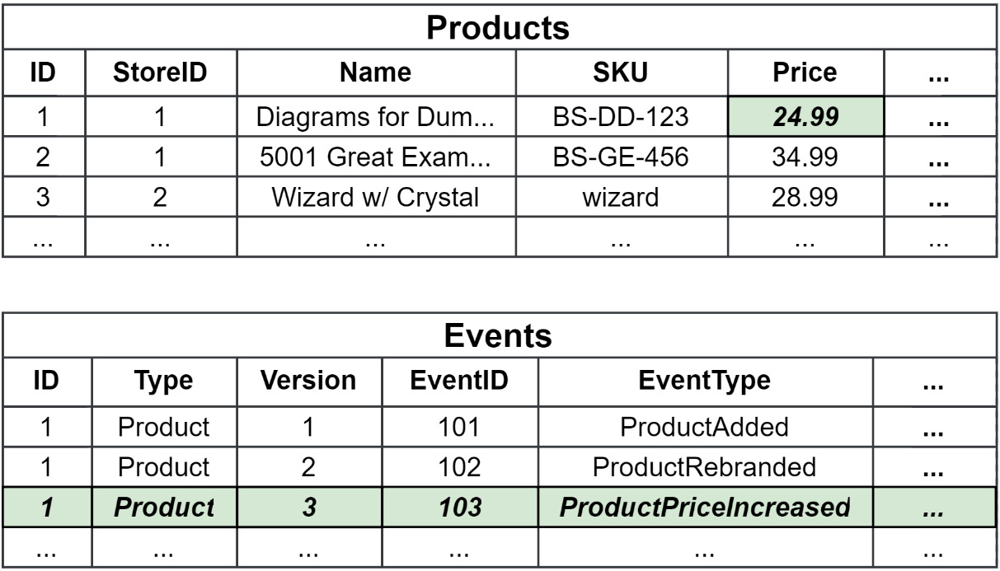

Figure 5.1 – A CRUD table (Products) and an event store table (Events)

When the price change has been saved to the `Products` table, only the price needs to change, leaving the rest of the row as is. We see in **Figure 5.1** that this is the case; however, we have lost both the previous price and the intent of the change.

The new price, as well as pertinent and valuable metadata, such as the purpose of the change, is saved when the change is recorded as an event in the `Events` table. The old price still exists in a prior event and can be retrieved if necessary.

Event sourcing implementations should use **event stores** that provide strong consistency guarantees and optimistic concurrency control. That is, when two or more modifications are made concurrently, only the first modification can add events to the stream. The rest of the modifications can be retried or would simply fail.

The event sourcing patterns can be used without any other event-driven patterns. It works very well with domain models (which use domain events) and event-driven architectures.

## Understanding the difference between event streaming and event sourcing

**Event streaming** is when events are used to communicate state changes with other bounded contexts of an application. **Event sourcing**, on the other hand, is when events are used to keep a history of the changes in a single context and can be considered an implementation detail rather than an architectural choice with application-wide ramifications. These two uses of events are often thought to be the same, and some speakers, books, and blogs conflate the two or use the terms interchangeably.

While event sourcing does use streams, as I mentioned at the start of Chapter 1, **Introduction to Event-Driven Architectures**, these streams are collections of events that are stored in a database that belongs to specific entities. **Event streaming** uses message brokers that have messages published to them and can be configured in a number of ways to then distribute those messages to consumers.

Additionally, the boundaries of the two are different. **Event sourcing** is implemented and contained within a single context boundary, whereas **event streaming** is typically used to integrate multiple context boundaries.

In terms of consistency models:

- An event streaming system is always going to be eventually consistent.
- An event-sourced system will have the same level of consistency as the database it is used with. With an **ACID-compliant database**, this would be strongly consistent. With non-relational databases, this is typically only eventually consistent.

Even if event streaming is implemented within the same system as a strongly consistent event sourcing system, the former will not compromise the latter’s level of consistency.

Event sourcing will require non-traditional thinking about your data. You will not be able to search for your data with complex queries, and you will need to build other ways to access your data besides simple identity lookups.

Most of all, **event sourcing is no silver bullet** (a magical solution to a complicated problem). Event sourcing adds complexity to a system, and unlike a CRUD table, you will not be able to throw object-relational mapping (ORM) on top of it and call it a day.

## The importance of event sourcing in EDA

It is important to know that **event streaming** and **event sourcing** are different, but we should also know that they can work together and benefit from each other. They both benefit from the broader usage of events. The work that goes into breaking down the interactions on a domain or aggregate can be translated into events for event sourcing or as events that are going to be distributed to multiple systems in the application.

My intention is to explain **event sourcing** to you so that it is understood just as well as the event-driven patterns we will also cover. It is also useful to start with event sourcing since we will introduce a lot of concepts that will be reused throughout the book.

## Adding event sourcing to the monolith

In the previous chapter, we added a **domain-driven design** package for the monolith to use called `ddd`. We will need to make some updates to this package and add a new one for our event sourcing needs.

### Beyond basic events

The event code we used before was just what we needed. Those needs were to have them be easy to instantiate, be easy to reference as dependencies, and finally, easy to work with in our handlers.

This is what we had before from **Chapter 4** in the _Refactoring side effects with domain events_ section:

```go
type EventHandler func(ctx context.Context, event Event) error

type Event interface {
    EventName() string
}

```

## Refactoring toward richer events

The old `Event` interface required that the plain-old Go structs (POGSs) we are using implement the `EventName()` method to be seen by the application as an `Event`.

### New Needs for Events

We have the following new needs:

1. **We need to know the details of which aggregate the event originates from.**
2. **Events need to be serialized and deserialized** so they can be written and read back out of the database.

With these new needs in mind, we need to revisit the events code in the `ddd` package and make some updates. The new interface for our event is shown in the following figure:

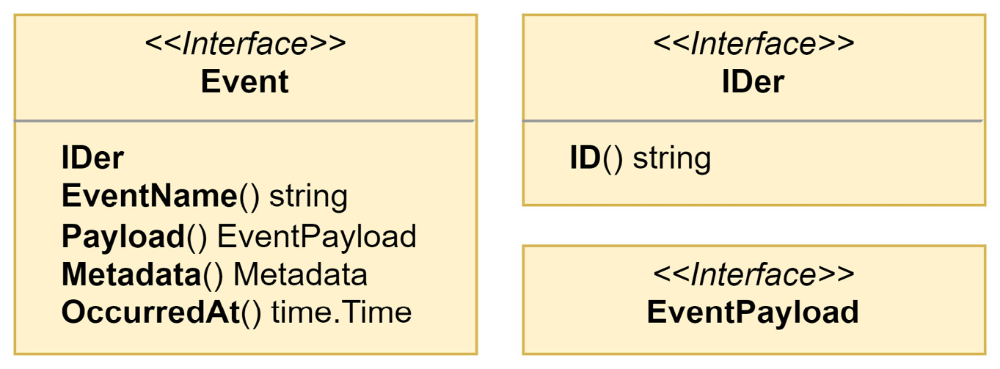

Figure 5.2 – The new Event and related interfaces

Looking at the new `Event` interface, some thoughts should spring to your mind. You might be thinking, for example, that there is no way you could add and manage all these methods to the events defined in the previous chapter (and you would be right).

What we used before as events will now be used as **event payloads**. The interface for `EventPayload` has no defined methods, which allows us to use it more easily. We might use an `EventPayload` of types `bool` or `[]int` if that is what fits best with our needs.

To create new events, we will use the following constructor:

```go
type EventOption interface {
    configureEvent(*event)
}

func newEvent(
    name string, payload EventPayload,
    options ...EventOption,
) event {
    evt := event{
        Entity:     NewEntity(uuid.New().String(), name),
        payload:    payload,
        metadata:   make(Metadata),
        occurredAt: time.Now(),
    }
    for _, option := range options {
        option.configureEvent(&evt)
    }
    return evt
}
```

I will share what the new event struct looks like in a moment in **Figure 5.3**, but first, I want to take a quick moment to talk about the options `...EventOption` parameter.

This **variadic parameter** will be used to modify the event prior to it being returned by the constructor as an `Event`. We will be using this to add in the details about the aggregate that creates the event. Variadic parameters must be the last parameter for a method or function and can be considered optional. The constructor could be called with an event name and a payload and nothing else. This technique is preferred over creating different variations of a constructor to handle combinations of parameters that might be used together.

### Go 1.18 Tip

We are beginning to use additions to the Go language that were added in the **Go 1.18** release. In that release, the `any` alias was added for `interface{}`. Now, anywhere that we would have used a bare `interface{}`, we can replace it with the `any` alias. An example of `any` being used can be found in **Figure 5.3**. See [https://tip.golang.org/doc/go1.18](https://tip.golang.org/doc/go1.18) for more information on the changes that arrived in Go 1.18.

Now, back to the event struct. Here is what it looks like:

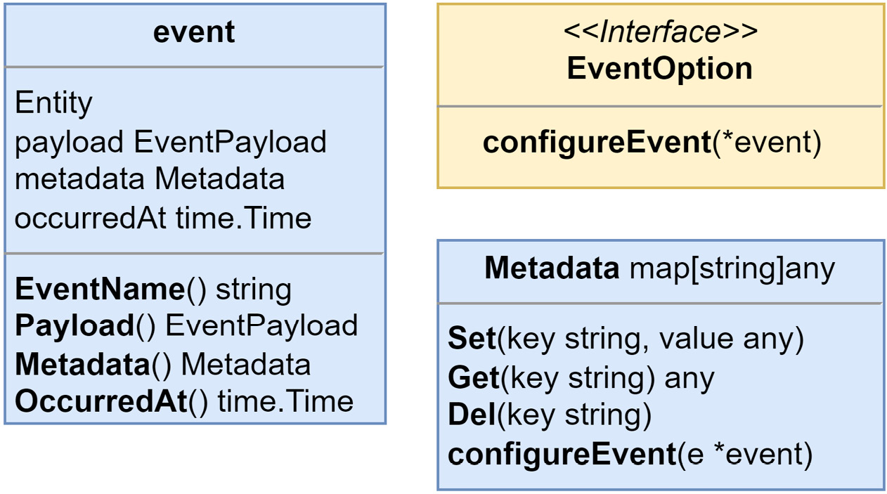

Figure 5.3 – The event and related types and interfaces

The `event` is a private struct that embeds `Entity` and contains only private fields. The use of `EventOption` will be the only way to modify these values outside of the `ddd` package.

### Privacy in Go

Go does not have a private scope for types. The only kind of privacy scoping in Go is at the **package level**. To make something visible outside of the package, you export it by starting its name with an uppercase letter. Everything else that begins with a lowercase letter will be unexported. Types, constants, variables, fields, and functions can be made visible to other packages by being exported, but within a package, everything is always visible and accessible.

### Event Capabilities

Events will now be capable of the following:

- **Being created with additional metadata**, such as the type and identity of the entity the event originated from.
- **Capturing the time** when they occurred.
- **Performing equality checking** based on their ID.

That covers the updates made to the events themselves. While the change made may seem substantial, the work required to begin using them will be easy and mundane thanks to the foundation we created by adding domain events.

## Refactoring the aggregates to use the new rich events

Next up is the aggregate, and it needs to be updated to use the new events constructor, among other small updates.

Here is our aggregate from the previous chapter:

```go
type Aggregate interface {
    Entity
    AddEvent(event Event)
    GetEvents() []Event
}

type AggregateBase struct {
    ID     string
    events []Event
}

```

By applying both an update and a bit of refactoring, we end up with this for **Entity** and **Aggregate**:

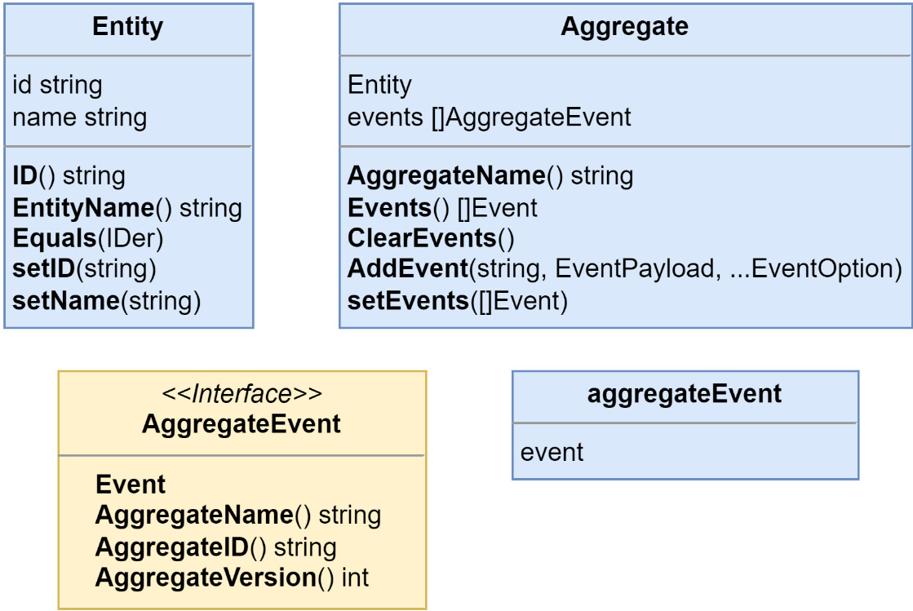

Figure 5.4 – The updated Entity and Aggregate and new AggregateEvent

In **Figure 5.4**, you might have noticed that the `AddEvent()` method signature looks much different from the previous version. This is the body of the updated `AddEvent()` method:

```go
func (a *Aggregate) AddEvent(
    name string, payload EventPayload,
    options ...EventOption,
) {
    options = append(
        options,
        Metadata{
            AggregateNameKey: a.name,
            AggregateIDKey:   a.id,
        },
    )
    a.events = append(
        a.events,
        aggregateEvent{
            event: newEvent(name, payload, options...),
        },
    )
}
```

The `AddEvent()` method is not simply appending events to a slice any longer. We need to address the requirement to include the details about which aggregate the event originated from. To add the aggregate details, we use the `Metadata` type, which implements the `EventOption` interface. The method signature was also updated to accept the event name as the first parameter because the payloads no longer require an `EventName()` method, or methods for that matter.

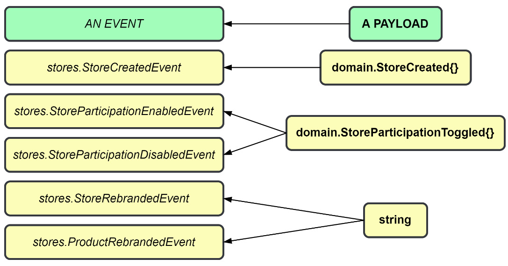

Figure 5.5 – Payloads may be used by multiple events

As **Figure 5.5** shows, the event name and the payload being separate means we can create a single payload definition, a struct, or a slice of integers, whatever we need, and use it with multiple events.

The updated `Aggregate` uses a new type of event, `AggregateEvent`, and the current `EventDispatcher` that we have only works with the `Event` type. Prior to Go 1.18, we had two choices:

1. Create a new `AggregateEventDispatcher` to work with the new `AggregateEvent` type and keep type safety.
2. Use a single `EventDispatcher` and cast `Event` into `AggregateEvent` but lose type safety in the process.

With **Go 1.18** or greater, we can have both by updating `EventDispatcher` to accept a **generic** `Event` type:

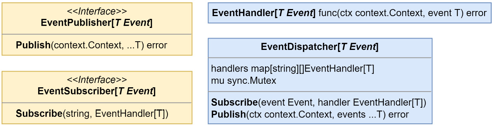

Figure 5.6 – EventDispatcher and related types updated to use generic Event types

Now, let us see how we can update the monolith modules.

### Updating the monolith modules

I will be using the **Store Management** module to demonstrate the code updates that each module will receive. The rest I will leave for you or your compiler to explore on your own.

### Updating the aggregates

All of the locations in the monolith modules where new aggregates were instantiated will need to be modified to utilize the new `NewAggregate()` constructor. This modification is done in a few parts. We will create a constant to contain the aggregate name, create a constructor for the aggregate, and finally, replace each occurrence of aggregate instantiation.

For the **Store** aggregate, the following constructor is added:

```go
const StoreAggregate = "stores.Store"

func NewStore(id string) *Store {
    return &Store{
        Aggregate: ddd.NewAggregate(id, StoreAggregate),
    }
}
```

Then, in **CreateStore()**, and in the PostgreSQL **StoreRepository** adapter, we update each place in the code where a new store is being created, for example, in **CreateStore()**:

```go
store := NewStore(id)
store.Name = name
store.Location = location

```

Using the `NewStore()` constructor when creating **Store** aggregates in the future will ensure that the embedded `Aggregate` type is not left uninitialized.

### Updating the events

Starting with the **store events**, with matching changes for the **products events**, we move the return values from the `EventName()` methods for each store event to global constants:

```go
const (
    StoreCreatedEvent               = "stores.StoreCreated"
    StoreParticipationEnabledEvent  = "stores.StoreParticipationEnabled"
    StoreParticipationDisabledEvent = "stores.StoreParticipationDisabled"
)

```

We add an `Event` suffix to each new constant, so we do not need to be bothered with renaming our payloads. When we are done creating the constants, the `EventName()` methods can all be removed. Next, we need to use these new constants as the first parameter in our calls to `AddEvent()`:

```go
store.AddEvent(StoreCreatedEvent, &StoreCreated{
    Store: store,
})

```

After we make the changes to each `AddEvent()`, we have one final change to make before we can run the application again. There are no dramatic pauses in print, so if you want to take a guess, stop reading now before I reveal the change.

### Updating the event handlers

The handlers need to be updated to perform a type assertion on the value returned from the `Payload()` method on the event, and not on the event itself. A quick example from the notification handlers in the **Ordering** module is as follows:

```go
func (h NotificationHandlers[T]) OnOrderCreated(
    ctx context.Context, event ddd.Event,
) error {
    orderCreated := event.Payload().(*domain.OrderCreated)
    return h.notifications.NotifyOrderCreated(
        ctx,
        orderCreated.Order.ID(),
        orderCreated.Order.CustomerID,
    )
}
```

After the updates to the handlers are complete, the monolith will compile again and run in the same manner. Here is an itemized list of the changes we made for updated events:

- Updated the `Event` interface and declared a new `EventPayload` interface
- Added an `event` struct and a new `Event` constructor
- Replaced the `Aggregate` interface with a struct and added a constructor for it
- Embedded an updated `Entity` into `Aggregate` and added a constructor for it as well
- Updated the `AddEvent()` method to track `Aggregate` information on the events
- Updated `EventDispatcher` to use generics to avoid losing type safety or creating many new versions
- Updated the modules to correctly build new `Aggregate` instances with new constructors
- Moved the event names into constants and used them in calls to `AddEvent()`
- Updated the handlers to perform type assertions on the event `Payload()`

The downside of updating the `ddd` package and making these changes is that the preceding changes affect any module that uses domain events and will need to be visited and updated.

### Next up is adding the code to support event sourcing our aggregates.

#### Adding the event sourcing package

The updates made to enhance the events did not add any new code to support event sourcing. Because we do not want to turn every aggregate in the application into an event-sourced aggregate, the bits necessary to support event sourcing will go into a new `internal/es` package.

#### Creating the event-sourced aggregate

To avoid having to build the aggregate from scratch, this new aggregate will contain an embedded `ddd.Aggregate` and provide a new constructor. Here is what we are starting with, the event-sourced `Aggregate` definition:

```go
// EventSourcedAggregate embeds Aggregate and adds support for event sourcing
type EventSourcedAggregate struct {
    ddd.Aggregate
    eventStream []ddd.Event
}

// NewEventSourcedAggregate creates a new event-sourced aggregate with an empty event stream
func NewEventSourcedAggregate(id, name string) *EventSourcedAggregate {
    return &EventSourcedAggregate{
        Aggregate:   ddd.NewAggregate(id, name),
        eventStream: []ddd.Event{},
    }
}
```

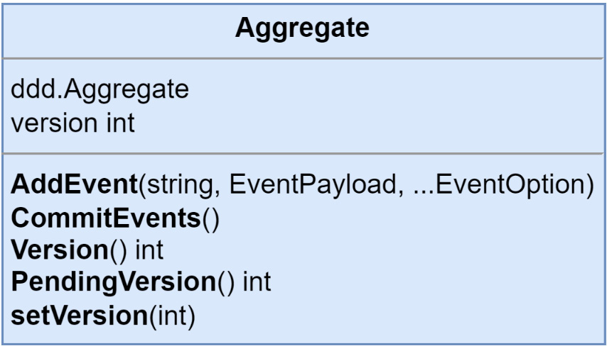

Figure 5.7 – The event-sourced Aggregate

This new Aggregate will also need a constructor:

```go
func NewAggregate(id, name string) Aggregate {
    return Aggregate{
        Aggregate: ddd.NewAggregate(id, name),
        version:   0,
    }
}
```

The purpose of `es.Aggregate` struct is to layer on the versioning controls required to work with the event-sourced aggregates. It accomplishes this by embedding `ddd.Aggregate`. The `AddEvent()` method for the event-sourced Aggregate is defined as follows:

```go
func (a *Aggregate) AddEvent(
    name string,
    payload ddd.EventPayload,
    options ...ddd.EventOption,
) {
    options = append(
        options,
        ddd.Metadata{
            ddd.AggregateVersionKey: a.PendingVersion()+1,
        },
    )
    a.Aggregate.AddEvent(name, payload, options...)
}

```

We redefine the `AddEvent()` method so that it may decorate the options before they are passed into the same method from `ddd.Aggregate`. So that the events can be constructed with the correct version value, the `ddd.Metadata` option is appended to the slice of `EventOption`.

The constructors we added from the previous section for the aggregates, for example, `Store` and `Product` from the Store Management module, should switch from the `ddd` package to the `es` package so that the correct Aggregate constructor is called:

```go
func NewStore(id string) *Store {
    return &Store{
        Aggregate: es.NewAggregate(id, StoreAggregate),
    }
}

```

Then, after being updated to event-sourced aggregates, both Store and Product now have the lineage shown here:

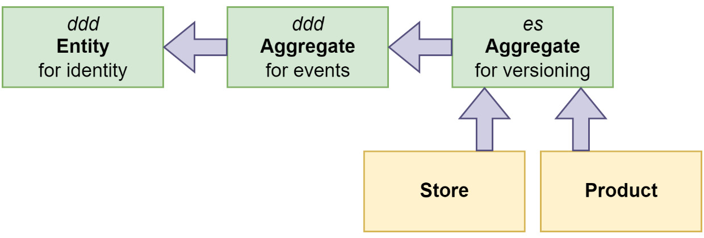

Figure 5.8 – The lineage of event-sourced aggregates

There is also an interface that needs to be implemented by each aggregate that is going to be event sourced:

```go
type EventApplier interface {
    ApplyEvent(ddd.Event) error
}
```

This is how `ApplyEvent()` is implemented for Product:

```go
func (p *Product) ApplyEvent(event ddd.Event) error {
    switch payload := event.Payload().(type) {
    case *ProductAdded:
        p.StoreID = payload.StoreID
        p.Name = payload.Name
        p.Description = payload.Description
        p.SKU = payload.SKU
        p.Price = payload.Price
    case *ProductRemoved:
        // noop
    default:
        return errors.ErrInternal.Msgf("%T received the event
        %s with unexpected payload %T", p, event.EventName(),
        payload)
    }
    return nil
}

```

I have chosen to keep the payloads aligned with the event names and can then use a switch statement that operates on the concrete types of the `EventPayload`. Another way would be using a switch statement and operating on the event names instead.

## Events are our source of truth

When an aggregate is event-sourced, the events are the source of truth. Put simply, what this means is that changes to the values within the aggregate should come from the events. Here is what `CreateStore()` should look like at this point:

```go
func CreateStore(id, name, location string) (*Store, error) {
    if name == "" {
        return nil, ErrStoreNameIsBlank
    }
    if location == "" {
        return nil, ErrStoreLocationIsBlank
    }
    store := NewStore(id)
    store.Name = name
    store.Location = location
    store.AddEvent(StoreCreatedEvent, &StoreCreated{
        Store: store
    })
    return store, nil
}

```

I have chosen to keep the payloads aligned with the event names and can then use a switch statement that operates on the concrete types of the `EventPayload`. Another way would be using a switch statement and operating on the event names instead.

## Events are our source of truth

When an aggregate is event-sourced, the events are the source of truth. Put simply, what this means is that changes to the values within the aggregate should come from the events. Here is what `CreateStore()` should look like at this point:

```go
func CreateStore(id, name, location string) (*Store, error) {
    if name == "" {
        return nil, ErrStoreNameIsBlank
    }
    if location == "" {
        return nil, ErrStoreLocationIsBlank
    }
    store := NewStore(id)
    store.Name = name
    store.Location = location
    store.AddEvent(StoreCreatedEvent, &StoreCreated{
        Store: store
    })
    return store, nil
}

```

There will not be any need to add in the store ID because that is added by the `AddEvent()` method when it constructs the event with the information about the aggregate. The other store events, `StoreParticipationEnabled` and `StoreParticipationDisabled`, can be updated to be empty structs. Here is what the `ApplyEvent()` method looks like for the store:

```go
func (s *Store) ApplyEvent(event ddd.Event) error {
    switch payload := event.Payload().(type) {
    case *StoreCreated:
        s.Name = payload.Name
        s.Location = payload.Location
    case *StoreParticipationEnabled:
        s.Participating = true
    case *StoreParticipationDisabled:
        s.Participating = false
    default:
        return errors.ErrInternal.Msgf("%T received the event
        %s with unexpected payload %T", s, event.EventName(),
        payload)
    }
    return nil
}

```

We will not be able to run the application now, and at this point, it should not even compile. There are some missing changes, such as accessing the now private entity ID value. Most of these issues will be within our repository adapters, which will be replaced shortly.

## Events need to be versioned

When what needs to be emitted from an aggregate needs to be changed, we cannot do it by changing the event. We could change the contents of an event when we were dealing with domain events because they are never persisted anywhere.

A new event (and maybe a new payload) needs to be created and that needs to be emitted from that point onward. The `ApplyEvent()` method will also need to keep handling the old event. When you use event sourcing, the application cannot forget the history of aggregates either.

## Aggregate repositories and event stores

Because we will be dealing with aggregates that regardless of their structure will be decomposed down to a stream of events, we can create and reuse a single repository and store.

Let us look at `AggregateRepository` and the interfaces involved in the following figure:

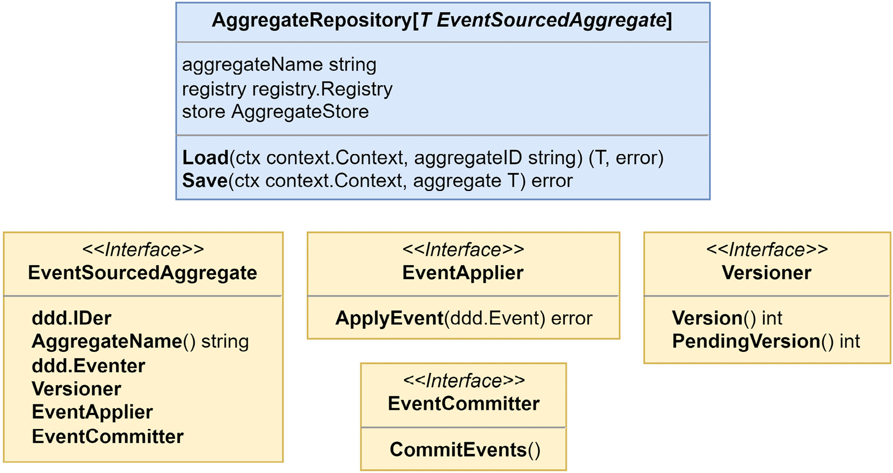

Figure 5.9 – AggregateRepository and related interfaces

`Load()` and `Save()` are the only methods we will use with event-sourced aggregates and their event streams. There are occasions when you would need to delete or alter events in the event store for reasons related to privacy or security concerns. This repository is not going to be capable of that and is not meant for that work. You would have some other specialized implementation you would use to gain access to the additional functions necessary. When working with event stores, securing them, and ensuring that they are in accordance with relevant legislation, such as the General Data Protection Regulation (GDPR), can be challenging tasks.

For MallBots version 1.0, this repository is plenty sufficient.

It is important to understand what each method in `AggregateRepository` does.

The `Load()` method will do the following:

- Create a new concrete instance of the aggregate using the `registry.Build()` method
- Pass the new instance into the `store.Load()` method so it can receive deserialized data
- Return the aggregate if everything was successful

The `Save()` method will do the following:

- Apply any new events the aggregate has created onto itself
- Pass the updated aggregate into the `store.Save()` method so that it can be serialized into the database
- Update the aggregate version and clear the recently applied events using the `aggregate.CommitEvents()` method
- Return `nil` if everything was successful

## The data types registry

Looking into the `Load` method, we see the `registry` field in action:

```go
func (r AggregateRepository[T]) Load(
    ctx context.Context, aggregateID, aggregateName string,
) (agg T, err error) {
    var v any
    v, err = r.registry.Build(
        r.aggregateName,
        ddd.SetID(aggregateID),
        ddd.SetName(r.aggregateName),
    )
    if err != nil { return agg, err }
    var ok bool
    if agg, ok = v.(T); !ok {
        return agg, fmt.Errorf("%T is not the expected type
        %T", v, agg)
    }
    if err = r.store.Load(ctx, agg); err != nil {
        return agg, err
    }
    return agg, nil
}
```

This code uses a type of registry to build a new instance of an aggregate and accepts two optional `BuildOption` parameters to set the ID and Name values of the aggregate that it builds.

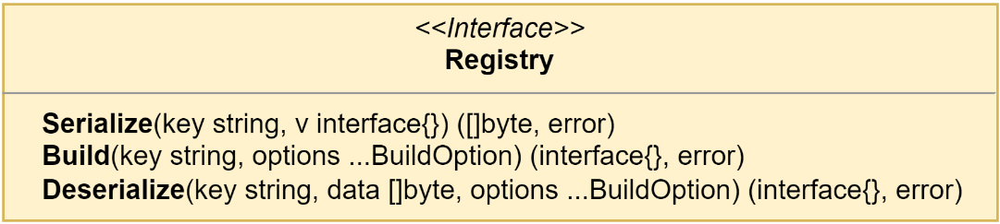

Figure 5.10 – The registry interface

This registry is useful for any event-sourced aggregate we need to deal with that happens to use the same event store as some others. To make that possible, we need a way to retrieve not just an interface but also the actual concrete type so that when `Load` returns, the caller is able to receive the correct type safely. The registry is very much like a prototype registry except it does not return clones of the original object.

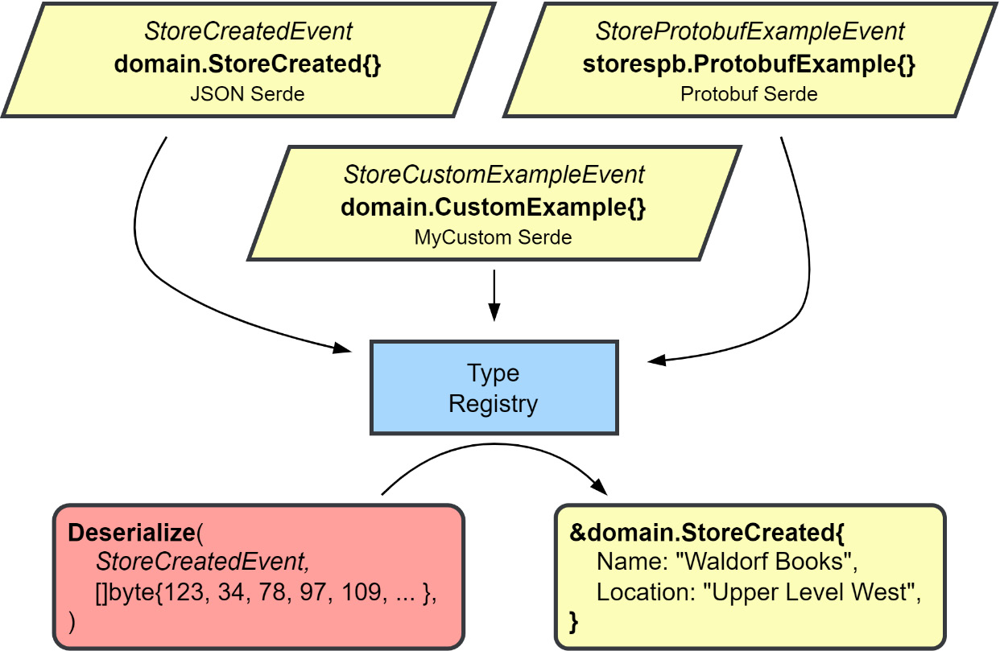

Figure 5.11 – Using the data types registry

The first step in using the registry is to register the types – zero values work best – that we want to retrieve later. The registry is very helpful in dealing with the serialization and deserialization of the data when we interact with a database or message broker. Each object that is registered is registered along with a serializer/deserializer, or serde for short. Different serdes can be used for different groups of objects. Later, when you interact with the registry to serialize an object, the registered serde for that type will perform the right kind of serialization. The same goes for `Build()` and `Deserialize()`; you will not need to know what kind of deserialization is at work to get your data turned into the right types again.

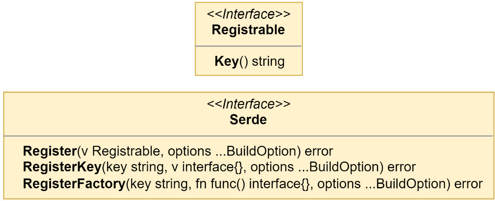

Figure 5.12 – The Registrable and Serde interfaces

Code that uses the instances created by the registry from serialized data will not need any modifications to work with the returned instances. The results from the registry are indistinguishable from instances that have never been serialized into a byte slice. This is the reason why the registry is used. The alternatives are managing mappers for each type or giving into the unknown and using the worst data structure in Go to work with: the dreaded `map[string]interface{}`.

When the registry is expected to work with more complex results that contain private fields, we need to reach for a `BuildOption` that has been defined in the same package as the type of the result we expect. That was the case in the example listing for the `Load` method. The private fields in the aggregate type were being set with `ddd.SetID()` and `ddd.SetName()`.

## Implementing the event store

`AggregateRepository` sits on top of an `AggregateStore`, which exists only as an interface.

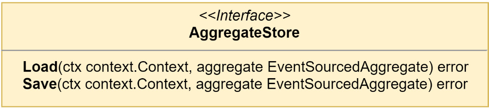

# Figure 5.13 – The AggregateStore interface

`AggregateStore` would be what finally makes the connection with the infrastructure on the other side. We will use this interface to create an event store that works with PostgreSQL.

## Why have both AggregateRepository and AggregateStore?

It is reasonable to wonder at this point why both exist when it appears they both do the same thing. The repository has a few housekeeping actions, such as building the aggregate by left folding over the events or marking new events committed after a successful save, that must be taken care of for event sourcing to work, and the stores need to be implemented for specific infrastructure, such as an adapter. Instead of expecting each store implementation to do the tasks the repository does, the separate concerns are split into two parts.

## The events table DDL

The SQL is not complicated and can be easily modified to work with just about any relational database:

```sql
CREATE TABLE events (
  stream_id      text        NOT NULL,
  stream_name    text        NOT NULL,
  stream_version int         NOT NULL,
  event_id       text        NOT NULL,
  event_name     text        NOT NULL,
  event_data     bytea       NOT NULL,
  occurred_at    timestamptz NOT NULL DEFAULT NOW(),
  PRIMARY KEY (stream_id, stream_name, stream_version)
);
```

This table should be added to the store's schema in the database. The CRUD tables, stores and products, should remain. We will have use for them in the next section.

In the events table, we use a compound primary key for optimistic concurrency control. Should two events come in at the same time for the same stream (id and name) and version, the second would encounter a conflict. As mentioned earlier, the application could try to redo the command and try saving again or give up and return an error to the user.

## Updating the monolith modules

We can start to plan out the changes we need to make to the composition root of our modules with event-sourced aggregates:

- We need an instance of the registry
- We need an instance of the event store
- We need new Store and Product repositories

## Adding the registry

The aggregate store and new Store and Product aggregate repositories will all need a registry. To be useful, that registry must contain the aggregates and events that we will be using. We can use a JSON serde because none of the domain types are complicated:

```go
reg := registry.New()
err := registrations(reg)

func registrations(reg registry.Registry) error {
    serde := serdes.NewJsonSerde(reg)
    serde.Register(domain.Store{})
    serde.Register(domain.StoreCreated{})
}
```

## Adding the event store

There is nothing complicated about creating the event store instance:

```go
eventStore := pg.NewEventStore("events", db, reg)
```

## Replacing the aggregate repositories

We will need to update the repository interfaces for the Store and Product aggregates. The following is the updated interface for `StoreRepository` and the new repository for `Product` will be very similar:

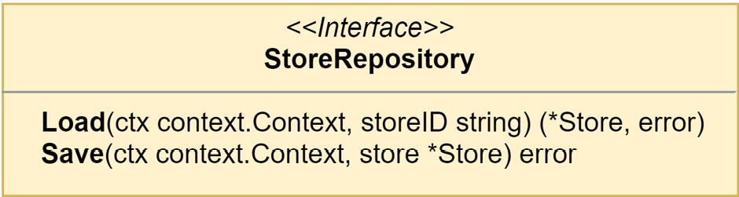

Figure 5.14 – The event-sourced StoreRepository interface

There will not be any need to write any new implementations for the two new interfaces. `AggregateRepository` uses generics, and we can again have type safety and save a little on typing. To create a new instance of `StoreRepository`, we replace the previous stores instantiation with the following line in the composition root:

```go
stores := es.NewAggregateRepository[*domain.Store](
    domain.StoreAggregate,
    reg,
    eventStore,
)
```

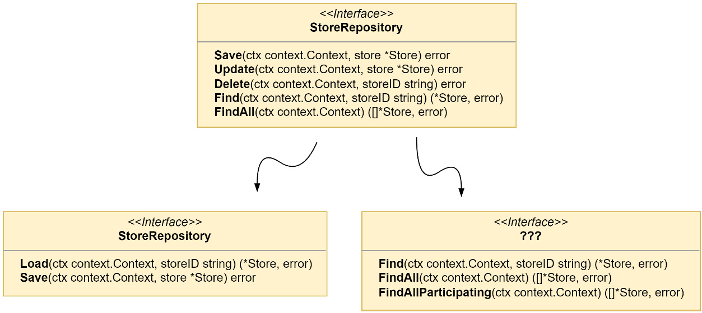

Figure 5.15 – Breaking up the old StoreRepository interface

If we update the `StoreRepository` interface, as shown in Figure 5.15, there will still be several methods we need to implement with an unknown interface and data source that the event store is incapable of doing. This limitation is the reason why CQRS is introduced in most systems that use event sourcing. CQRS can be implemented without event sourcing, but it is difficult to implement event sourcing without CQRS. We will need to create some read models for the queries that the event store will be unable to handle. It will mean some more work, but we are prepared. The foundation we made in the previous chapter with domain events is going to make that work much easier.

## Using just enough CQRS

The Store Management module has a number of existing queries in the application. Some we may be able to serve from the event store, such as `GetProduct()` and `GetStore()`, but the others, such as `GetParticipatingStores()` or `GetCatalog()`, would require scanning the entire table to rebuild every stream, and then we would filter a percentage out.

When we created the events table in the previous section, we left the existing tables alone. This was a tiny bit of cheating on my end. Although I knew the tables would be used again for our read models, it might not always be practical to reuse old tables. In most cases, the tables that support your read models should be specifically designed to fulfill requests as efficiently as possible. The tables that are left over after a refactoring might not be suitable for that task.

We could also use entirely new tables, use a new database, and even do more beyond using different read models. Right now, our only need is to get the queries working again and the discarded stores and products tables will do the job and already exist. There is also some discarded code we can repurpose to make the job of creating our read models go quicker.

## A group of stores is called a mall

A new interface, `MallRepository`, needs to be created to house all the queries that `StoreRepository` will be unable to handle. To create the read model, we will need to project the domain events into it with an event handler.

This is the `MallRepository` interface that will require a PostgreSQL implementation:

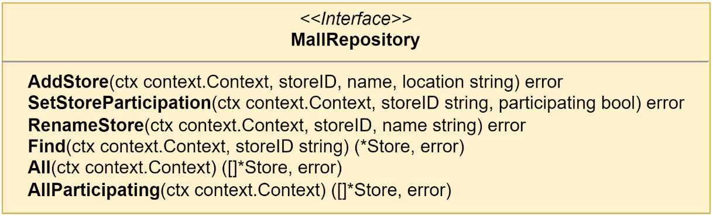

# Figure 5.16 – The MallRepository interface

This repository is concerned with projecting events related to stores into the read model and performing those queries that cannot be handled by the event store. Much of the code from the previous iteration of the `StoreRepository` PostgreSQL implementation can be migrated to the PostgreSQL implementation of `MallRepository`.

The new repository needs to be created in the composition root so that it can be passed into the application and used in place of `StoreRepository` and `ParticipatingStoreRepository` in the queries:

```go
mall := postgres.NewMallRepository("stores.stores", mono.DB())
// ...
application.New(stores, products, domainDispatcher, mall)
```

The new `MallRepository` is also used in the application in place of `StoreRepository`:

```go
// ...
appQueries: appQueries{
    GetStoreHandler:
        queries.NewGetStoreHandler(mall),
    GetStoresHandler:
        queries.NewGetStoresHandler(mall),
    GetParticipatingStoresHandler:
        queries.NewGetParticipatingStoresHandler(mall),
    GetCatalogHandler:
        queries.NewGetCatalogHandler(products),
    GetProductHandler:
        queries.NewGetProductHandler(products),
},
// ...
```

The query handlers will all also need to be updated so that they accept `MallRepository` instead of either `StoreRepository` or `ParticipatingStoreRepository` and also update any method calls to the correct ones; for example, this is the `GetStores` handler:

```go
type GetStores struct{}

type GetStoresHandler struct {
    mall domain.MallRepository
}

func NewGetStoresHandler(mall domain.MallRepository) GetStoresHandler {
    return GetStoresHandler{mall: mall}
}

func (h GetStoresHandler) GetStores(
    ctx context.Context, _ GetStores,
) ([]*domain.Store, error) {
    return h.mall.All(ctx)
}
```

The query handlers will all also need to be updated so that they accept `MallRepository` instead of either `StoreRepository` or `ParticipatingStoreRepository` and also update any method calls to the correct ones; for example, this is the `GetStores` handler:

```go
type GetStores struct{}

type GetStoresHandler struct {
    mall domain.MallRepository
}

func NewGetStoresHandler(mall domain.MallRepository) GetStoresHandler {
    return GetStoresHandler{mall: mall}
}

func (h GetStoresHandler) GetStores(
    ctx context.Context, _ GetStores,
) ([]*domain.Store, error) {
    return h.mall.All(ctx)
}
```

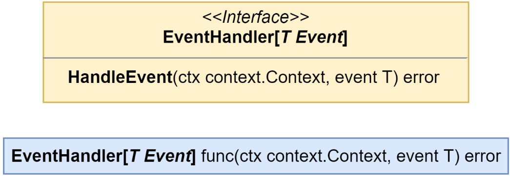

Figure 5.17 – The new EventHandler and EventHandlerFunc types

The old `EventHandler` from before still exists but as `EventHandlerFunc`. Now, either a value that implements `EventHandler` can be passed into `EventDispatcher.Subscribe()` or a `func` that has the correct signature can be passed in, as in this example:

```go
func myHandler(ctx context.Context, ddd.Event) error {
    // ...
    return nil
}

dispatcher.Subscribe(
    MyEventName,
    ddd.EventHandlerFunc(myHandlerFn),
)
```

This may seem familiar; the technique is rather common, and you might have even encountered it from the `http` package in the standard library where it is used to allow the creation of router handlers with implementations of `http.Handler` or by wrapping any `func(http.ResponseWriter, *http.Request)` with `http.HandlerFunc`.

The `EventHandler` interface update makes the logging for the event handlers much less of a chore with only one method that needs to exist to log all accesses:

```go
type EventHandlers struct {
    ddd.EventHandler
    label  string
    logger zerolog.Logger
}

var _ ddd.EventHandler = (*EventHandlers)(nil)

func (h EventHandlers) HandleEvent(
    ctx context.Context, event ddd.Event,
) (err error) {
    h.logger.Info().Msgf(
        "--> Stores.%s.On(%s)",
        h.label,
        event.EventName(),
    )
    defer func() {
        h.logger.Info().Err(err).Msgf(
            "<-- Stores.%s.On(%s)",
            h.label,
            event.EventName(),
        )
    }()
    return h.EventHandler.HandleEvent(ctx, event)
}

```

The `application.DomainEventHandlers` in each module was also removed. The handlers provided protection from panics when we encountered an event without a designated handler. In the future, unhandled events will not result in any panics, and we do not require this protection.

## Adding the mall event handlers

After the `EventHandler` refactoring, the handlers have just one method to implement and just like `ApplyEvent()`, we are free to choose how to implement it. Opposite to the way I am doing it in the aggregates, because event payloads can be shared by different events, I find it is easiest to use a switch that operates on the event names in these handlers:

```go
type MallHandlers struct {
    mall domain.MallRepository
}

var _ ddd.EventHandler = (*MallHandlers)(nil)

func (h MallHandlers) HandleEvent(
    ctx context.Context, event ddd.Event,
) error {
    switch event.EventName() {
    case domain.StoreCreatedEvent:
        return h.onStoreCreated(ctx, event)
    case domain.StoreParticipationEnabledEvent:
        return h.onStoreParticipationEnabled(ctx, event)
    case domain.StoreParticipationDisabledEvent:
        return h.onStoreParticipationDisabled(ctx, event)
    case domain.StoreRebrandedEvent:
        return h.onStoreRebranded(ctx, event)
    }
    return nil
}
// ...

```

The `HandleEvent()` method simply proxies the event into different methods based on the event name. I made the decision to call out the unexported methods in order to isolate the handling of each event from the others. By structuring it this way, I could more easily reuse the methods, but `HandleEvent()` could have any structure or style that gets the job done.

Post-refactoring, setting up the handler subscriptions is also a smidge easier. We need to create four subscriptions for the events in the preceding listing:

```go
func RegisterMallHandlers(
    mallHandlers ddd.EventHandler,
    domainSubscriber ddd.EventSubscriber,
) {
    domainSubscriber.Subscribe(
        domain.StoreCreatedEvent, mallHandlers,
    )
    domainSubscriber.Subscribe(
        domain.StoreParticipationEnabledEvent,
        mallHandlers,
    )
    domainSubscriber.Subscribe(
        domain.StoreParticipationDisabledEvent,
        mallHandlers,
    )
    domainSubscriber.Subscribe(
        domain.StoreRebrandedEvent, mallHandlers,
    )
}

```

A last update to the composition root is to wire the preceding up like we have with handlers in the past and we are done adding the mall read model.

## A group of products is called a catalog

Adding the read model for the catalog will be handled in a very similar fashion to the mall read model. I will not be going over each part in the same detail but will instead provide `CatalogRepository`, the list of interesting events, some of which are new, and an itemized list of the changes.

This is the `CatalogRepository` interface:

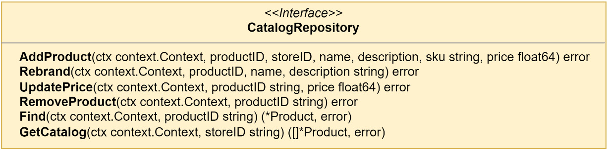

Figure 5.18 – The CatalogRepository interface

The events, existing and new ones, mean we have ended up with more modification-making methods than ones performing queries. We are focused on projecting the events into the read model and so the interface is designed to handle the data from each event we are interested in.

The interesting Product events that should be handled in the `CatalogHandlers` are as follows:

- **ProductAddedEvent**: An event that contains fields for each value set on a new product
- **ProductRebrandedEvent**: A new event that contains a new name and description for an existing product
- **ProductPriceIncreasedEvent**: A new event that contains a higher price for an existing product in the form of a price change delta
- **ProductPriceDecreasedEvent**: A new event that contains a new lower price for an existing product in the form of a price change delta
- **ProductRemovedEvent**: An empty event signaling the deletion of an existing product

### The steps to connect the domain events with the catalog read model are as follows:

1. Implement `CatalogRepository` as a PostgreSQL adapter
2. Create an instance of the adapter in the composition root
3. Pass the instance into the application and replace the products event store with the catalog instance in each query handler
4. Create `CatalogHandlers` in the application package with a dependency on `CatalogRepository`
5. Create an instance of the handlers and repository in the composition root
6. Pass them into the subscription handlers and subscribe for each event

### Taking note of the little things

There are still some little things that need addressing because of the CQRS read model changes. The application command handlers need a once-over to fix any calls to methods on the repositories that no longer exist. The `RemoveProduct` command handler, for example, needs to not call `Remove()` on the repository but it should instead be calling `Save()`, as weird as that may sound. This is because we will not be performing a DELETE operation in the database when we remove a product. Instead, a new `ProductRemovedEvent` will be appended to the event stream for the removed Product aggregate.

Another small issue is that the aggregate repository and the stores will not return an error if the stream does not exist. Most of the time, this will be alright; however, if what was returned was an empty aggregate and we are not expecting a fresh aggregate, then we need validations in place to keep events from being added and applied when they should not be.

### Connecting the domain events with the read model

Running the application now with all the changes in place for the Store Management module, we will see the following appear in the logs when we add a new product:

```
started mallbots application

web server started; listening at http://localhost:8080

rpc server started

INF --> Stores.GetStores

INF <-- Stores.GetStores

INF --> Stores.AddProduct

INF <-- Stores.AddProduct
```

Assuming everything is wired up correctly and the handler access logging is set to log all HandleEvent() calls, this may seem a little confusing. There should be some additional lines in there that show the HandleEvent() method on CatalogHandlers was accessed. What we should be seeing is this:

```
started mallbots application

web server started; listening at http://localhost:8080

rpc server started

INF --> Stores.GetStores

INF <-- Stores.GetStores

INF --> Stores.AddProduct

INF --> Stores.Catalog.On(stores.ProductAdded)

INF <-- Stores.Catalog.On(stores.ProductAdded)

INF <-- Stores.AddProduct
```

There is a simple explanation for why we do not see the event being handled. The reason we do not see the extra lines showing us that the CatalogHandlers implementation received the stores.ProductAdded event is that by the time the domain event publisher gets a hold of the product aggregate, the events have already been committed and cleared from it. Here are the important lines from the AddProduct command handler:

```go
// ...
if err = h.products.Save(ctx, product); err != nil {
    return err
}
if err = h.domainPublisher.Publish(
    ctx, product.GetEvents()...,
); err != nil {
    return err
}
// ...
```

Recall that the third step for the Save() method on AggregateRepository is update the aggregate version and clear the events using the aggregate.CommitEvents() method.

Moving the Publish() call before the Save() call would seem to be the answer if the issue is that the events are cleared within Save(). This can work as long as the following apply:

1. Everyone remembers that Publish() must always precede Save()
2. There are never any issues in applying the events causing Save() to fail

Another answer would be to make the publishing action part of the saving action. No one would need to remember which action needed to be first and the errors from the Save() method can be automatically handled. Another bonus to having it as part of the saving action is the command handlers would no longer need the publisher (or be concerned with the publishing action).

We could modify AggregateRepository to depend on the EventPublisher interface and have it take care of the publishing before it commits the events. We could then have Publish() before or after Save(). This would be coupling the repository and publisher together. If we wanted to not do any publishing and did not want to provide the publisher, we would need to pass in nil to the constructor and check for a nil publisher before calling methods on it.

We could use a variadic parameter to pass in the publisher and other options if we had any. This would improve the situation with passing in a nil parameter, but we would still need to perform a check on the publisher before using it.

Either option would be straightforward enough to implement quickly but they both suffer from having to make modifications to AggregateRepository that create a dependency on a publisher.

## Doing more with middleware

The better solution I see for this situation is to use the Chain of Responsibility pattern (https://en.wikipedia.org/wiki/Chain-of-responsibility_pattern) to chain AggregateStore calls together. You may know this pattern by its more common term, middleware. With this solution, there will be no modifications made to AggregateRepository; likewise, no changes are made to the AggregateStore interface or the EventStore implementation.

This is actually not very different than what we are doing right now with `logging.LogApplicationAccess` to wrap each application call to add some simple logging.

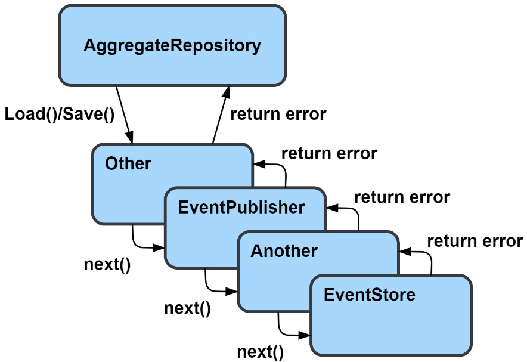

Figure 5.19 – Using middleware with AggregateRepository

Each middleware in the preceding example, Other, EventPublisher, and Another, returns some handler that implements the same AggregateStore interface that EventStore does.

To build the chain, each middleware constructor returns an AggregateStoreMiddleware function that has the following signature:

```go
func(store AggregateStore) AggregateStore
```

To build our chain, we need a function that takes an AggregateStore interface and then accepts a variable number of AggregateStoreMiddleware functions. What it will do is execute a loop over each middleware, in reverse order, passing in the result from the previous loop:

```go
func AggregateStoreWithMiddleware(
    store AggregateStore, mws ...AggregateStoreMiddleware,
) AggregateStore {
    s := store
    for i := len(mws) - 1; i >= 0; i-- {
        s = mws[i](s)
    }
    return s
}
```

If we were to call the preceding function with store, A, B, C, the result we could get back would be A(B(C(store))). Most of the time, the order we add middleware is not much of a concern because the middleware are not able to work together, or it is strongly suggested they do not, but there are some kinds of middleware that we do want to be closer to either the end of the chain or the beginning. An example might be middleware that recovers from panics in the code. We would want to have that middleware at the very start of the chain so that any panic generated anywhere in the chain is caught and recovered from.

The only middleware we have right now is the one for EventPublisher. It will need to publish the events in the Save() call either before or after it makes its call to the next store in the chain. We will not need to take any action on a call to Load(), so it makes sense to use an embedded AggregateStore so we can avoid having to write a proxy method we will not be doing anything with:

```go
type EventPublisher struct {
    AggregateStore
    publisher ddd.EventPublisher
}

func NewEventPublisher(publisher ddd.EventPublisher) AggregateStoreMiddleware {
    eventPublisher := EventPublisher{
        publisher: publisher,
    }
    return func(store AggregateStore) AggregateStore {
        eventPublisher.AggregateStore = store
        return eventPublisher
    }
}

func (p EventPublisher) Save(
    ctx context.Context, aggregate EventSourcedAggregate,
) error {
    if err := p.AggregateStore.Save(ctx, aggregate); err != nil {
        return err
    }
    return p.publisher.Publish(ctx, aggregate.Events()...)
}
```

The middleware and the constructor for it are shown in the previous code block. Highlighted is the actual middleware function that will be used by the chain builder `AggregateStoreWithMiddleware()` function.

To use the middleware, we need to update the composition root for the Store Management module by surrounding the creation of the store with the chain builder:

```go
aggregateStore := es.AggregateStoreWithMiddleware(
    pg.NewEventStore("events", db, reg),
    es.NewEventPublisher(domainDispatcher),
)
```

Domain events will always be published after the events have been successfully persisted into the database.

## This is still not event streaming

We only have an AggregateStore middleware that helps us with the issue of publishing domain events when we make a change to an event-sourced aggregate. Everything is still very much contained within our bounded context and is still synchronous. In later chapters, when we add asynchronous integrations; the aggregate repositories or stores will not be involved.

Now that EventDispatcher has been added using middleware to the store used by the aggregate repositories, the application command handlers no longer need to depend on it. Any places in the application and commands packages that reference `ddd.EventPublisher` should be updated to remove the reference. Under normal circumstances, they will not be doing anything because the events will be cleared, but when things go wrong, they may still publish events we would not want to be published.

## Recapping the CQRS changes

We added, updated, or implemented the following things:

- Read models called MallRepository and CatalogRepository were created
- The application was updated to use the read models in the query handlers
- The event handler signature was refactored to reduce boilerplate
- We added support for adding middleware to AggregateStore
- We used middleware to publish domain events
- The decision to use event sourcing on a module that has existing queries forced our hand and we had to implement read models. We took a shortcut and reused the tables we had just discarded and that ended up saving a lot of effort.

## Aggregate event stream lifetimes

In an event-sourced system, there are two kinds of aggregates:

1. **Short-lived aggregates**, which will not see many events in their short lifetime
2. **Long-lived aggregates**, which will see many events over their very long lifetime

Examples of a short-lived aggregate would be Order from the Ordering module and Basket from the Shopping Baskets module. Both exist for a short amount of time, and we do not expect them to see many events. Examples of long-lived aggregates are Store from the Store Management module and Customer from the Customers module. These entities will be around for a long time and can end up seeing many events.

The performance of short-lived aggregates, and streams with few events in general, is not going to be a problem. The small number of events can be read and processed quickly. Larger streams would take longer to read and process; the larger it is, the longer it would take.

## Taking periodic snapshots of the event stream

When we know that we will be dealing with a larger stream, we can use snapshots to improve performance by reducing the number of events we will load and process. In Figure 5.20, the state of the stream is saved along with the aggregate version.

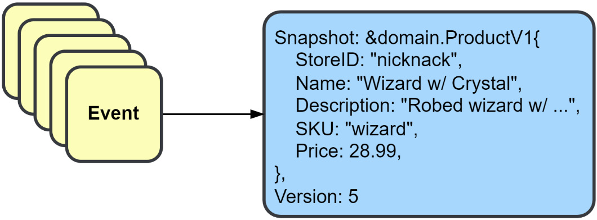

Figure 5.20 – Capturing the current state of the event stream as a snapshot

A snapshot is a serialization of the aggregate and the version of the aggregate it came from. When we create the serialization, we do not want to create it from the aggregate because that would limit the flexibility to change the structure of the aggregate in the future. Instead, we should use versioned representations, that is, `ProductV1`, which is then serialized and saved.

An aggregate that is going to use snapshots will need to implement the `ApplySnapshot()` and `ToSnapshot()` methods from the Snapshotter interface.

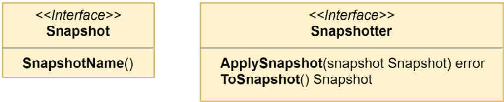

Figure 5.21 – The Snapshotter and Snapshot interfaces

Adding snapshots to an aggregate does not require making any other changes to the aggregate or to the constructor that builds it outside of the two new methods to satisfy the `Snapshotter` interface.

A snapshot should have everything to recreate the aggregate exactly as it was. In most cases, this means the same structure is duplicated as a `Snapshot` struct. The aggregate can continue to evolve, and older snapshots can still be loaded in `ApplySnapshot()` by using a switch that operates on either the type or name. For example, this is the switch statement used for the Product aggregate:

```go
switch ss := snapshot.(type) {
case *ProductV1:
    p.StoreID = ss.StoreID
    p.Name = ss.Name
    p.Description = ss.Description
    p.SKU = ss.SKU
    p.Price = ss.Price
default:
    return errors.ErrInternal.Msgf("%T received the unexpected snapshot %T", p, snapshot)
}
```

If Product were modified tomorrow and a new field, `Weight int`, was added, then a new Snapshot should be created and called `ProductV2`. It should contain all the fields from `ProductV1` and a new one for `Weight`. `ToSnapshot()` would be updated to return a `ProductV2` snapshot going forward, and `ApplySnapshot()` should be updated to handle the new snapshot as well. The code to handle the older snapshot version(s) may or may not need to be modified. In this example case, there would be no modification needed. If there is never any event that modifies the `Weight` value of a `Product`, then the zero value, in this case, literally zero, will be used as the value for `Weight`. When `Weight` is finally given a non-zero value, it should not be assumed that the old snapshot will be replaced as well. An older snapshot may continue to exist in the database if the snapshot strategy did not signal that a new one should be taken, causing it to be replaced.

## Strategies for snapshot frequencies

How often you take a snapshot is subject to the strategy you use. Some strategy examples are as follows:

- **Every N events** strategies create new snapshots when the length of loaded or saved events has reached some limit, such as every 50 events.
- **Every period** strategies create new snapshots every new period, such as once a day or every hour.
- **Every pivotal event** strategies create a snapshot when a specific event is appended to the stream, such as when a store is rebranded.

Your choice of strategy should be guided by the business needs of the aggregate and domain.

## Hardcoded strategy used in the book’s code

The code shared for this book uses a strategy that will create a snapshot every three events. Every three events is not a good strategy outside of demonstration purposes.

## Using snapshots

There is not going to be a special interface for snapshots; a PostgreSQL `SnapshotStore` that satisfies the `AggregateStore` interface is used. To make easy work of both applying and taking snapshots, we turn to `AggregateStoreMiddleware` again.

## The snapshots table DDL

Another simple `CREATE TABLE` statement that could work with other relational databases is as follows:

```sql
CREATE TABLE baskets.snapshots (
  stream_id        text        NOT NULL,
  stream_name      text        NOT NULL,
  stream_version   int         NOT NULL,
  snapshot_name    text        NOT NULL,
  snapshot_data    bytea       NOT NULL,
  updated_at       timestamptz NOT NULL DEFAULT NOW(),
  PRIMARY KEY (stream_id, stream_name)
);

```

The primary key of the snapshots table is not like the one in events. New versions of a snapshot will overwrite older ones using an `UPDATE` statement. It does not have to work this way and the primary key could be changed to keep a history of snapshots if desired.

## Plugging into the aggregate store middleware

`SnapshotStore` could be coded to stand alone but the implementation that is being used in this application is coded up to work as `AggregateStoreMiddleware`. Here is the store middleware statement from the Store Management module with the new snapshot middleware added:

```go
aggregateStore := es.AggregateStoreWithMiddleware(
    pg.NewEventStore("stores.events", mono.DB(), reg),
    es.NewEventPublisher(domainDispatcher),
    pg.NewSnapshotStore("stores.snapshots", mono.DB(), reg),
)
```

## Loading aggregates from snapshots

When `AggregateRepository` is executing `Load()` for an aggregate, the middleware will check for a snapshot, and if one is found, it will apply it using the `ApplySnapshot()` method. The modified aggregate is then passed to the next `Load()` handler.

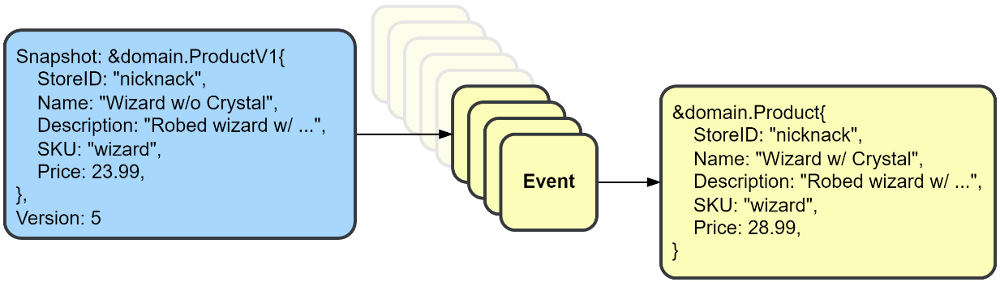

Figure 5.22 – Using a snapshot to load fewer events

The event store will then load the events from the aggregate’s current version, which skips all events that have a version equal to or lower than what the snapshot has for its version.

If you rush over to test the application and try a `GetProduct()` query, you have forgotten that those use a read model. To test that aggregate snapshot functionality is working, you will need to look into the snapshots table after making some changes to a `Product` or `Store` aggregate. If you see rows appearing and repeated modifications continue, then everything is working as intended.

## Snapshots are not without their downsides

A snapshot is a type of cache, and like other caches, it has various downsides, such as the duplication and invalidation of data. Snapshots are a performance optimization that should only be used when absolutely necessary. Otherwise, you would be making a premature optimization. Your snapshots would also be subject to the same security, legal, and privacy considerations that you might have to make for the events.

## Summary

We covered a lot about event sourcing and went into a lot of the interfaces, structs, and types used to create an event sourcing implementation in Go. We started off by making a pretty big change to the simple events model used in the last chapter. This was followed by updates to the aggregate model and an entirely new package.

We also learned about a type of registry for recallable data structures and how it is implemented and used. Refactoring for event handlers was introduced, which shaved a good number of lines from the repository, which is always a good thing.

Introducing CQRS and implementing read models could not be avoided, but working through it and implementing it revealed it to not be such a confusing or complicated pattern, thanks in part to the work from the previous chapter, of course.

We closed out the chapter by implementing snapshots in the application and covered why and when you would use them in your own applications.

I did mention twice, and this makes the third time, that what we were doing with event sourcing is not considered by some to be event-driven architecture because event sourcing is not a tool for integrating domains. Regardless, the pattern involved events, and it allowed me to introduce richer event models before also introducing messages, brokers, and asynchronous communication.

In the next chapter, **Chapter 6: Asynchronous Connections**, we will learn about messages, brokers, and, of course, finally adding asynchronous communication to the application.
