# 6. Asynchronous Connections

The events we have worked with so far in this book have been synchronously handled. The domain events in Chapter 4, _Event Foundations_, were used to move the side effects of domain-model changes into external handlers.

External handlers were called after the change was made successfully and within the same process. In Chapter 5, _Tracking Changes with Event Sourcing_, we used events to record each change made to our domain aggregates. When we want to use an aggregate, we read all of the events in sequence to rebuild the current state of the aggregate. With both kinds of events, our system is immediately or strongly consistent because events are always created or read within a single process.

We will be covering the following topics in this chapter:

- Asynchronous integration with messages
- Implementing messaging with NATS JetStream
- Making the Store Management module asynchronous

The events we will be working with in this chapter and for the remainder of the book will be asynchronous. The umbrella term for these events is **integration events**. Both notification and event-carried state transfer events are types of integration events.

## Technical requirements

In this chapter, we will be adding asynchronous messaging to some modules using Neural Autonomic Transport System (NATS) JetStream. You will need to install the following software to run the application and to try the examples specified in the chapter:

- The Go programming language version 1.18+
- Docker

The source code for the version of the application used in this chapter can be found at [GitHub - Chapter 6](https://github.com/PacktPublishing/Event-Driven-Architecture-in-Golang/tree/main/Chapter06).

## Asynchronous integration with messages

So far in this book, we have only talked about events, so what exactly is a message? An event is a message, but a message is not always an event. A message is a container with a payload, which can also be an event and can have some additional information in the form of key-value pairs.

A message may be used to communicate an event, but it may also be used to communicate an instruction or information to another component.

The kinds of payloads we will be using in this book include the following:

- **Integration event**: A state change that is communicated outside of its bounded context
- **Command**: A request to perform work
- **Query**: A request for some information
- **Reply**: An informational response to either a command or query

The first kind of message we will be introduced to and will implement is an **integration event**. The term integration event comes from how it is used to integrate domains and bounded contexts. This is how an integration event compares with the domain and event-sourced events we have already worked with:

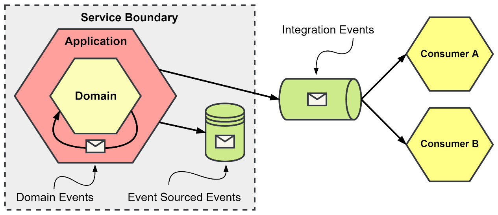

Figure 6.1 – Event types and their scopes

An application uses different kinds of events to accomplish a variety of activities:

- **Domain events**: Exist for the shortest time, never leave the application, do not require versioning, and are typically handled synchronously. These events are used to inform other application components about changes made to or by an aggregate.
- **Event-sourced events**: Exist for the longest time, never leave the service boundary, require versioning, and are handled synchronously. These events keep a record of every change in state that is made to an aggregate.
- **Integration events**: Exist for an unknown amount of time, are used by an unknown number of consumers, require versioning, and are typically handled asynchronously. These events are used to supply other components of the system with information regarding significant decisions or changes.

Both notification and event-carried state transfer events are integration events, as mentioned before.

## Integration with notification events

A notification event is going to be the smallest event you can send. You might send a notification because the volume of the event is very high, or you might send one because the size of the data related to the change is too large.

Some examples of when to use a notification are presented here:

- New media has been uploaded or has become available. Serializing the file content into an event is not likely to be practical or performant.
- With events related to time-series data or other tracking events that have a very high volume or rate.
- Following edits to a large create, read, update, delete (CRUD) resource. Instead of sending the entire updated resource, you might send a list of updated fields only.

When you use notifications, you are expecting the interested consumers to eventually make a call back to you to retrieve more information, as depicted in the following diagram:

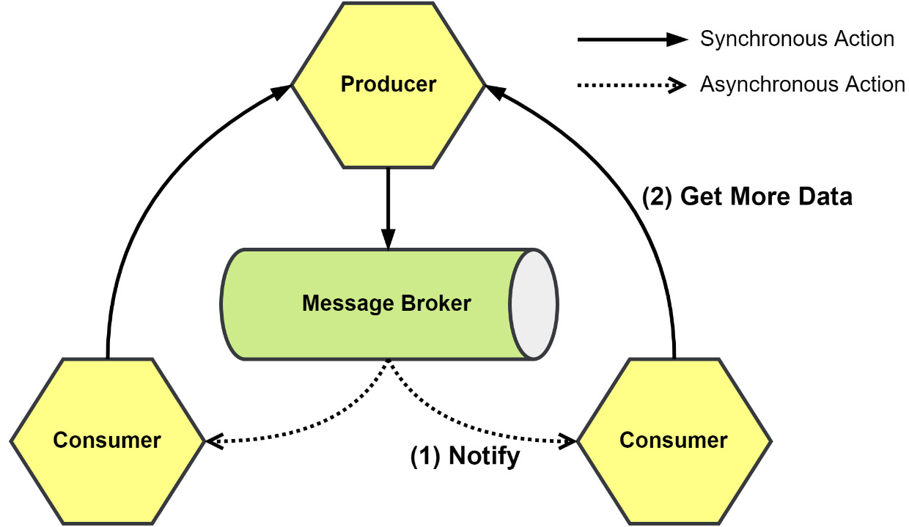

Figure 6.2 – Notifications and the resulting callbacks

The Producer in the preceding diagram will need to be scalable to handle the extra load from the callbacks—callbacks that are from potentially an unknown number of interested consumers. Compared to event-carried state transfer, notifications do not completely decouple the components.

The Consumer will need to also know where to find the Producer and should have implemented the application programming interface (API) to make a callback. Likewise, the Producer needs to have an API so that additional data can be retrieved. The Consumer is also temporally coupled to the Producer, so availability is still a risk, meaning if the Producer is down or not responding, then it is on the Consumer to handle the error and have the logic to retry fetching the data later when it is again available.

Between the Producer and Consumer sits the Message Broker, which contains the queues that the messages are published to and consumed from. The Message Broker does provide a level of decoupling between the Producer and Consumer, but because the Consumer makes calls back to the Producer for more information, the decoupling is not very strong.

Using notifications and callbacks to optimize network traffic may not always work out as planned. If a resource changes more rapidly than a consumer can consume an event and request information, data loss may result, as depicted in the following diagram:

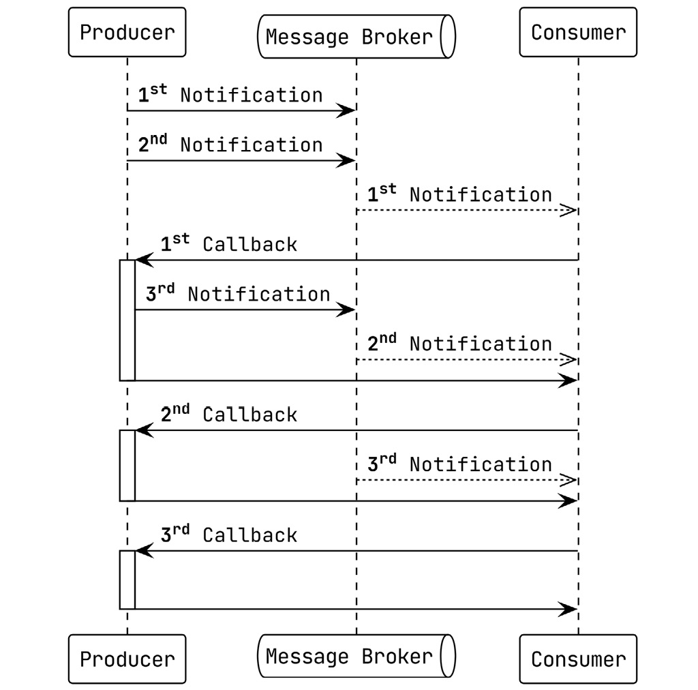

Figure 6.3 – The 2nd and 3rd are unnecessary callbacks resulting from multiple notifications

When the Producer in the preceding sequence diagram sends the second and third notifications, the latency to the Consumer creates a situation where multiple requests are being made for data that the Consumer already possesses. Just as likely, the second or third callbacks could end up being made before a previous one has finished. Solutions such as serializing and debouncing the callbacks could help with this situation.

### Integration with event-carried state transfer

Consumers are much less likely to need to make a request back to the producer for more information when they communicate with event-carried state transfer. State transfer is great for interested consumers to build a local representation of the data so that they may handle future requests independently.

Some uses for event-carried state transfer are presented here:

- Storing shipping addresses for customers in a warehouse service
- Building a history of product purchases for a seller in an independent search component
- Information from multiple producers can be combined to create entirely new resources for the application to support additional functionality

The primary advantage of event-carried state transfer is that consumers are temporally decoupled from the producers. Availability of the producer is no longer a factor in how resilient the consumer will be when it comes to handling requests that it receives.

Stateful events may contain only the data related to the specific change, or they can contain complete old and new representations of the resource, or a delta of a resource that was altered after the change was applied. A trap with stateful events is putting in too much data or trying to include information that is assumed to be useful for specific consumers. Finally, events should never contain information that was received from another domain. For example, an event coming from a sales domain should not include a shipping schedule that it received from the warehouse domain.

A balance on the amount of state is important, and so is the number of events that are being sent. Not every domain event is useful outside of the domain it sprang from. Consider the usefulness of the information and the event before creating a firehose that everyone is expected to consume to get a limited number of events that they are interested in.

Keeping a local copy is not without issues either. Information necessary to complete an operation could be missing because it has not arrived yet or a message was lost. Making a call or publishing a query message to the information owner to retrieve the data could be done to resolve the inconsistency. Putting the message back into the queue and retrying later may also work.

### Eventual consistency

Eventual consistency is constant in distributed applications and especially in event-driven applications. It is a trade-off made for the performance and resiliency gains when choosing to architect a system with asynchronous communication patterns.

Here’s a quick definition of what eventual consistency is: An eventually consistent system that has stopped receiving modifications to an item will eventually return the same last update across the system.

It is a good chance that if you are working with microservices and are using synchronous communication patterns, then you are at least aware of and are somewhat comfortable with eventual consistency. If you are working with a monolith—even a modular monolith such as our little application—you might not be aware or comfortable with it.

Both kinds of integration events can result in an inconsistent system state. When an asynchronous system is operating normally, there can be no noticeable difference when compared to the synchronous equivalent. However, the additional infrastructure and complexity brought into the architecture add more places for errors to occur.

Eventual consistency is not always going to be a problem, or even present itself in catastrophic ways. When adding a new product to a store, the resulting change may take a little time to propagate through the system. If a customer were to call up the catalog for the store before the change arrived, they would not be affected by the inconsistency unless they were specifically aware and looking for the product.

Where eventual consistency can go wrong is when a state change is made and immediately, on returning a successful response to the client, a read is performed that attempts to read that state change, as depicted in the following diagram:

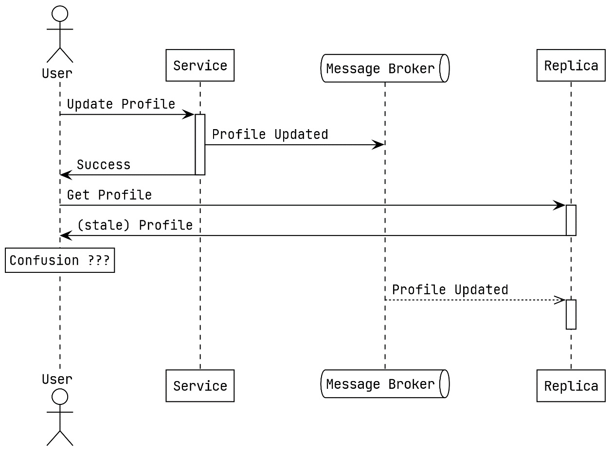

Figure 6.4 – Read-after-write inconsistency while updating the profile for a user

More than likely, the read will be sent to a different location or to a replica of where the write was made initially, and stale data is returned. This is called read-after-write inconsistency, and it has to do with not being able to read the state change or new data immediately after writing it.

One solution for the example from Figure 6.4 would be to read from the primary database when a user requests their own profile. Any other user viewing a profile belonging to another user will not know they are not seeing the absolute latest update when viewing another user’s profile. More solutions might be usable. Using a cache layer that is going to be updated more quickly might work, or the user interface (UI) that the user is using could not make the request for the updated profile at all and instead displays the information the user entered instead.

### Message-delivery guarantees

Event-driven architectures (EDAs) can be built around different levels of delivery guarantees. There are three possible options, and all three may be available depending on the broker or libraries you use.

#### At-most-once message delivery

The Producer does not wait for an acknowledgment from the Message Broker when it publishes a message under the at-most-once delivery model, as depicted in the following diagram:


Figure 6.5 – At-most-once delivery

Message deduplication and idempotency are not a concern. However, the possibility that the message never arrives is very real. In addition to the Producer not confirming that the Message Broker received the message, the broker does not wait for any acknowledgment from the Consumer before it deletes the message. If the Consumer fails to process the message, then the message will be lost.

At-most-once delivery guarantees can be put to good use in several situations, such as the collection of logs and processing messages from Internet of Things (IoT) devices.

### At-least-once message delivery

With at-least-once delivery, the Producer is guaranteed to have published the message to the Message Broker, and then the broker will keep delivering the message to the Consumer until the Message Broker has received an acknowledgment that the message has been received, as depicted in the following diagram:

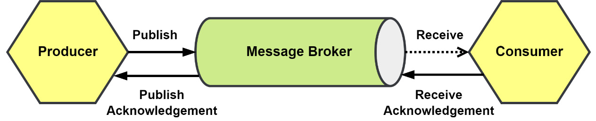

Figure 6.6 – At-least-once delivery

A Consumer may receive the message more than once, and they must be utilizing either message deduplication or have implemented other idempotency measures to ensure that the redelivery of a message does not result in it being processed more than once.

The reasons why a message might be delivered more than once can vary, but it will often be because the Message Broker is waiting a limited amount of time for an acknowledgment from the Consumer. If the Consumer takes too long to send an acknowledgment, then the message is requeued to be sent again.

Systems that can deduplicate messages so that repeated deliveries only result in one processing instance are the ideal use case for at-least-once delivery.

### Exactly-once message delivery

Having a guarantee that a message will arrive exactly once is not so simple. As with the at-least-once delivery guarantee, the Producer will wait for an acknowledgment from the broker. Also, the broker will keep delivering the message until it has received an acknowledgment from the receiver, as depicted in the following diagram:

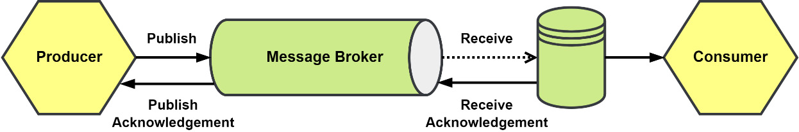

Figure 6.7 – Exactly-once delivery

What is different now is that what received the message was not the Consumer but instead an additional component that holds a copy of the message. The message can then be read, processed, and deleted by the Consumer. That is at least the idea of how exactly-once delivery can be achieved, but network reliability and issues with the Message Broker or with the message store can all still cause the process to fail.

Exactly-once delivery would be ideal for just about any situation, but it is extremely hard or downright impossible to achieve in most cases.

### Idempotent message delivery

Not every application will be able to deploy the infrastructure to have exactly-once message delivery and others will not need it. When most people think of exactly-once delivery, what comes to their mind is exactly-once processing of messages. This goal of exactly-once processing of messages can be achieved by adding deduplication to at-least-once delivery.

The most common technique is to deduplicate the receipt of the message using the identity of the message. Using the messaging library or middleware, the identity for the message is checked against a list of already received and processed message identities. If the identity already exists, then the message is acknowledged and discarded. If the identity is not found, then the request continues to message processing. The process is illustrated in the following diagram:

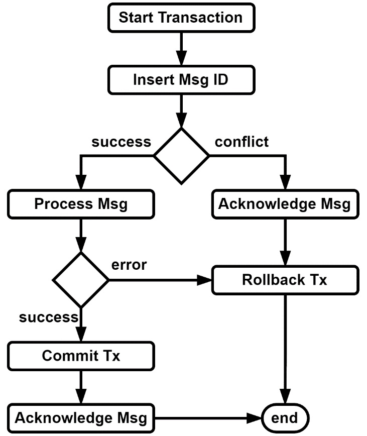

Figure 6.8 – Deduplication of incoming messages using transactions

A database transaction can be used to create a unit of work around the deduplication and the message processing. When the messaging processing fails, the transaction can be rolled back to remove the message identity from the database. When the message processing has succeeded, we make sure to commit the transaction before acknowledging the message with the message broker.

### Ordered message delivery

As with delivery guarantees, the order in which you receive events comes with its own scale of guarantees. You can quickly find yourself in hot water if you listen to your vendor who promises that their product always delivers messages in the order they were published and later learn you are processing `ProductRemoved` events before the corresponding `ProductAdded` event.

The number of consumers you use and how you use them can have a huge impact on ordering.

### Single consumer:

A single consumer subscribed to a First-In, First-Out (FIFO) queue will receive messages in the order that they were published, as depicted in the following diagram:

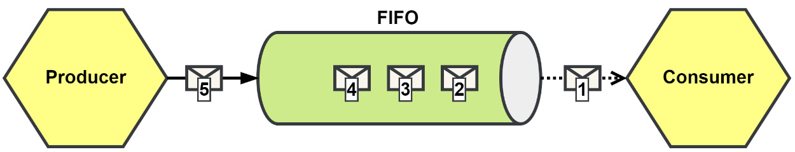

## Figure 6.9 – Single consumer receiving messages in order from a FIFO queue

If our system were to publish messages at or below the rate it consumes them, then a single consumer will keep up and be all that we need. This is often not the case in an event-driven application.

### Multiple consumers:

To handle higher volumes of messages, we can add additional consumers to keep the process rate steady. The additional consumers would be added to share the queue, essentially competing for the next message in the queue, and this is how the **competing consumer pattern** got its name. You can see a depiction of such a situation here:

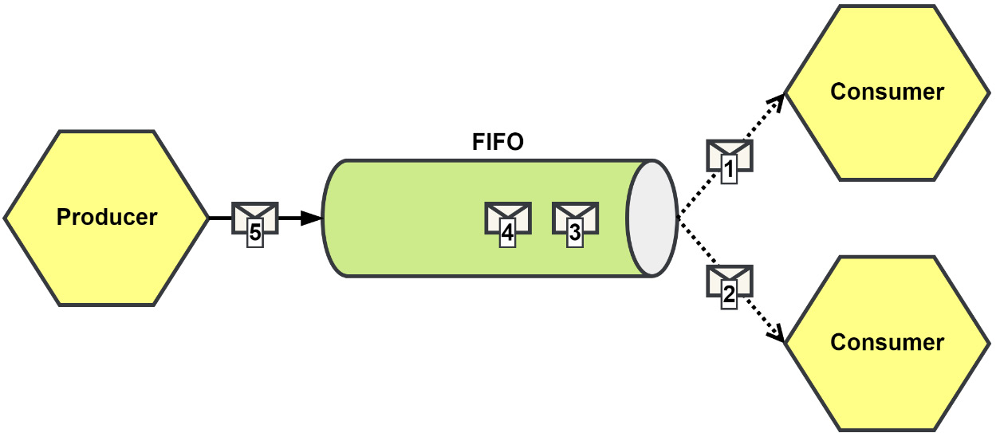

Figure 6.10 – Multiple consumers competing for messages from a FIFO queue

Having additional consumers will help with the rate at which messages can be processed and is a very common pattern. It does, however, create a potential issue with the **order** in which related messages will be processed.

In **Figure 6.10**, both consumers have received messages, and we will assume these messages belong to the same resource somewhere. In the queue, these messages were ordered, but now they are being processed concurrently. We cannot predict which consumer will finish first, and we may run into problems while processing the second message.

### Potential Problems

- **Message Order Loss**: If related messages (e.g., those modifying the same aggregate) are processed by different consumers, there is a risk of processing the messages out of order. This could lead to inconsistent state or unexpected behavior, especially when operations on a resource are interdependent.
- **Deadlocks**: If requeuing messages in the hope of correct processing order is attempted, there is a risk of creating **deadlocks**, where the queue becomes stuck in a loop of unprocessed messages. This would ultimately halt the entire processing system.

### Solutions

1. **Requeuing Messages**:

   - As a simple solution, the second message could be requeued for re-delivery. The hope is that the first message will be processed before the second one is retried.
   - **Risks**: This approach is inherently unreliable and could cause the queue to become stuck, potentially leading to a deadlock if the conditions for correct processing are not met.

2. **Dead-Letter Queue (DLQ)**:

   - If messages cannot be processed after several attempts, they could be sent to a **Dead-Letter Queue (DLQ)**. This allows you to separate problematic messages from the main queue so that the rest of the system can continue processing. The DLQ provides a safety net for undeliverable messages, allowing you to handle them separately, perhaps manually or with specific business logic.

3. **Partitioned Queues**:

   - If the messages are related (e.g., belong to the same aggregate or workflow), using **partitioned queues** is a better solution. With partitioning, each consumer will process messages from a dedicated queue partition, ensuring that related messages are handled by the same consumer. This helps maintain the correct order within those partitions.

   - **Illustration**:
     A **partitioned queue** ensures that messages related to the same entity (e.g., an aggregate like `Product` or `Order`) are always handled by the same consumer, preventing out-of-order processing across different consumers.

Would you like to dive deeper into implementing partitioned queues, or would you prefer a closer look at Dead-Letter Queues (DLQ) and their setup for error handling in a message broker?

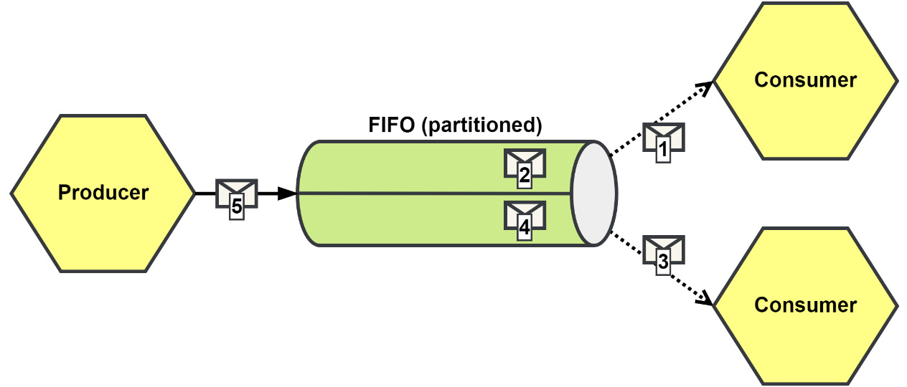

Figure 6.11 – Using partitions to maintain ordered delivery

With a **partitioned queue**, all messages with the same partition key will be delivered in the order they were published for that partition. At most, a single consumer will be subscribed to any partition, and we conceptually return to the single-consumer example. However, now multiple consumers can be subscribed to **different partitions**. This setup allows us to scale horizontally, as each consumer may handle messages from different partitions, but still ensure that messages in each partition are processed in the correct order.

When a queue is partitioned, it might have several partitions (10, 25, or more) to scale the consumers according to the load. Partitioning helps improve the reliability and scalability of the system, as it can accommodate a larger volume of messages while still maintaining message order within individual partitions.

### Picking Your Partition Keys

Choosing the correct **partition key** is critical to ensuring the system's performance. For example:

- If you use customers as your partition key, you wouldn't have a partition per customer, but rather a partition for a subset of customers.
- The **customer identity** can be used to calculate the partition number, so the message broker knows which partition to place the message into.

### Considerations and Risks

Even with partitioned queues, there are potential pitfalls when processing messages asynchronously:

- **Goroutines in Go**: If you're using goroutines for processing and the broker allows multiple messages to be inflight (i.e., multiple messages being processed concurrently), you may run into issues similar to the **competing consumers** pattern.
- **Asynchronous Processing and Inconsistent State**: In some scenarios, processing messages out of order can be acceptable. For instance, events like `ProductPriceIncreased` and `ProductPriceDecreased` that modify a product's price could be processed in any order since they both update the price based on a delta. Eventually, the system will be consistent with the source, regardless of the order.

---

### Implementing Messaging with NATS JetStream

NATS is a lightweight, high-performance messaging system that supports **subject-based messaging** and **pub-sub** patterns. JetStream is NATS' extension for providing **durable streams** and is a replacement for NATS Streaming.

**Core NATS** supports:

- **Subject**: A string that represents where the message is published.
- **Payload**: A byte slice (up to 64MB) that contains the message data.
- **Headers**: A map of string slices, similar to HTTP headers.
- **Reply**: A string used in the Request-Reply pattern (though not supported in JetStream).

### Key Features of NATS JetStream

NATS JetStream offers several advantages over Core NATS:

1. **Durable Streams**: JetStream allows for the persistence of messages in a stream, so consumers can pick up messages they missed or subscribe to older messages.
2. **Message Deduplication**: JetStream can deduplicate messages to ensure that repeated messages are not processed more than once.
3. **Message Replay**: Consumers can replay messages from the stream based on specific timestamps or from a specific position in the stream.
4. **Retention Policies**: You can configure retention policies based on the number of messages, the total size of the stream, or whether consumers are actively subscribed.

### Example of NATS JetStream Flow

Here’s how the **JetStream components** fit into an **asynchronous message flow**:

1. **Producer** publishes messages to a **JetStream-enabled NATS server**.
2. The **NATS server** stores these messages in a **stream**.
3. **Consumers** subscribe to the stream, and messages are delivered to them asynchronously.
4. JetStream provides the ability for consumers to replay or deduplicate messages, ensuring they get the correct state, even if they missed messages or were delayed.

By utilizing JetStream, you gain more robust messaging capabilities, such as message durability, replayability, and the ability to scale horizontally with partitioned queues.

Would you like to proceed with setting up **NATS JetStream** in Go, or explore other messaging patterns like **dead-letter queues (DLQ)** or **message retention strategies**? Let me know how you'd like to continue!

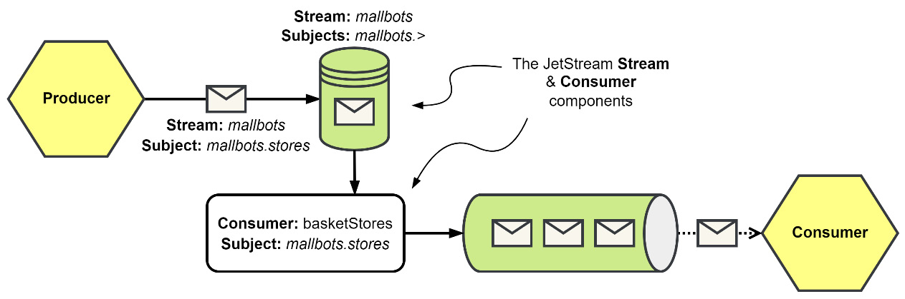

Figure 6.12 – NATS JetStream Stream and Consumer Flow

JetStream provides two components, the **Stream** and the **Consumer**. They are described in more detail here:

### Stream:

This is responsible for storing published messages for several subjects. Subjects may be named explicitly to be included or be included with the use of token wildcards. Message retention—based on duration, size, or interest—is configured independently for each stream. Our MallBots stream could be just one stream configured in JetStream alongside many others.

### Consumer:

This is created as a view on the message store. Each consumer has a cursor that is used to iterate over the messages in a stream or a subset of them based on both a subject filter and replay policy.

We will use two packages to implement asynchronous communication in our application. These new packages will live under `/internal` and are set out here:

1. **The first is the `am` package**. This will provide general asynchronous messaging functionality and interfaces.
2. **The second is the `jetstream` package**. This will provide NATS JetStream-specific functionality.

The way we will use these packages will be similar to how we used the `es` (event-sourcing) package and the `postgres` package in the previous chapter.

## The `am` Package

In the asynchronous package, we start with the message, as depicted here:

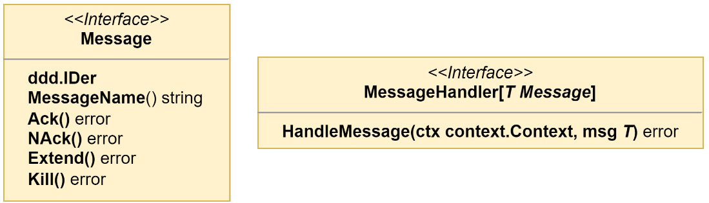

Figure 6.13 – The Message and Message Handler Interfaces

The **Message** interface is kept slim and focused on the management of a message that needs to be sent or received. Yes—event-driven applications communicate with events, but the event will not be the only message we will be communicating with.

The **MessageHandler** interface is defined with a generic `Message` type, so we can avoid having to maintain handlers for every possible kind of message we will be using.

We want to be able to publish anything into a stream, so our **MessagePublisher** interface is going to need to be with a generic `interface{}` or any type, as depicted in the following diagram:

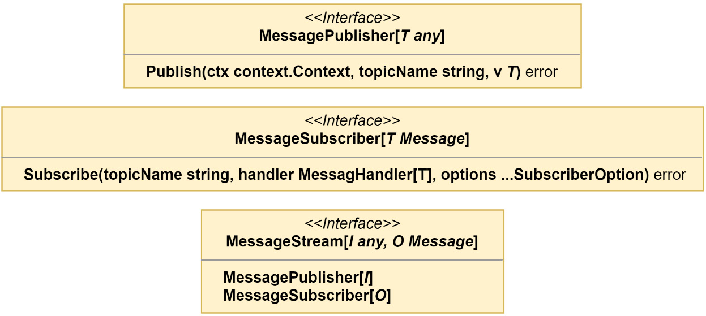

Figure 6.14 – The Message Publisher, Subscriber, and Stream Interfaces

For the **MessageSubscriber** interface, we will be returning a `Message` type of some kind, and so it has been defined to use the previously defined generic **MessageHandler** interface.

Finally, the **MessagePublisher** and **MessageSubscriber** interfaces are brought together into the **MessageStream** interface, which will allow us to create a stream that will let us publish an `Event` type and receive an `EventMessage` type. That is exactly what we do to create the `EventStream` type that we will be adding in this chapter, as illustrated in the following code snippet:

```go
type EventStream = MessageStream[ddd.Event, EventMessage]

```

The **am** package will contain streams for the basic types of messages that we will be using—**event**, **command**, **query**, and **reply**—but the generics used in the interfaces shown earlier would permit even more types of messages should we need them.

For now, we will only be implementing an **event stream**, and the rest will be added in later chapters. For our event stream, we want to publish a `ddd.Event` type and to receive the `EventMessage` type. What we implement will need to serialize and deserialize events into something we can then pass into NATS JetStream, but we do not want to use a format specific for JetStream because that would create a dependency on NATS. The reason this would be bad is that it would then be more difficult to switch to different technologies and to test.

For our intermediary type, we have the **RawMessage** interface and `rawMessage` struct, as depicted in the following diagram:

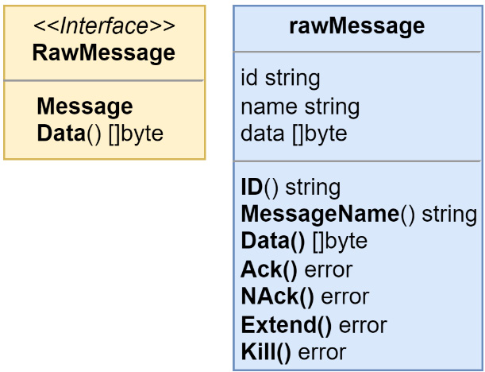

Figure 6.15 – The Raw Message Intermediary Interface and Struct

With those last two components, we have what we need to create an **eventStream** struct that implements the **EventStream** interface, as shown here:

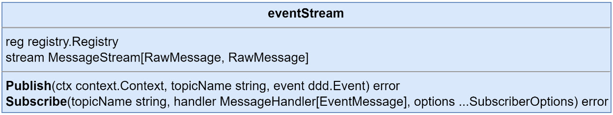

Figure 6.16 – Our Event Stream Implementation

Unpacking what is happening in the `eventStream` implementation, we have a **Publish()** method that accepts only the `ddd.Event` type and a **Subscribe()** method that only accepts handlers that operate on **EventMessages**. We need a registry to process the event payloads, and the event stream implementation will also need a stream that handles the **RawMessage** type for both the published input and the subscribed output types.

Another purpose for having an implementation for a specific message type is so that we can serialize and deserialize the data correctly. We could have also made a general **messageStream** and had the code doing the serialization work be passed in as a dependency. That might still happen, but while we only need a stream that handles events, we can avoid creating additional interfaces and the general implementation if we do not need it at this time.

The event stream **Publish()** method is primarily focused on event serialization work. You can see this in use in the following code snippet:

```go
func (s eventStream) Publish(
    ctx context.Context, topicName string, event ddd.Event
       ) error {
    metadata, err := structpb.NewStruct(event.Metadata())
    if err != nil { return err }
    payload, err := s.reg.Serialize(
        event.EventName(), event.Payload(),
    )
    if err != nil { return err }
    data, err := proto.Marshal(&EventMessageData{
        Payload:    payload,
        OccurredAt: timestamppb.New(event.OccurredAt()),
        Metadata:   metadata,
    })
    if err != nil { return err }
    return s.stream.Publish(ctx, topicName, rawMessage{
        id:   event.ID(),
        name: event.EventName(),
        data: data,
    })
}
```

We use a protocol buffer message as the data container that is then used as the data for the raw message. Here is the protocol buffer message that we use to serialize the event data with:

```proto
message EventMessageData {
  bytes payload = 1;
  google.protobuf.Timestamp occurred_at = 2;
  google.protobuf.Struct metadata = 3;
}

```

We only need to serialize the fields that do not go into the message. The **payload** is going to be taken care of by the registry. The **OccurredAt** and **Metadata** values for an event fit into the `Timestamp` and `Struct` known types respectively.

The **Subscribe()** method does the same steps that the **Publish()** method does but in reverse. The outcome of running those steps in reverse goes into an instance of the `eventMessage` struct that has implemented both the `ddd.Event` and `EventMessage` interfaces. Together, these interfaces create an **EventMessage** interface, as depicted here:

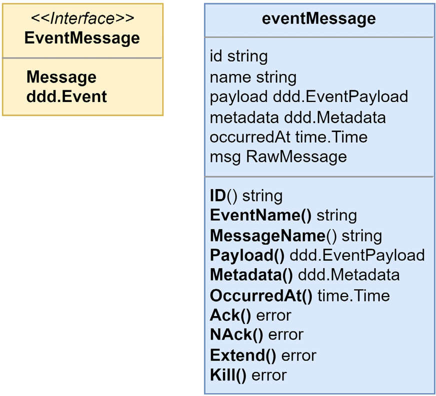

Figure 6.17 – The Event Message Interface and Struct

**Subscribe()** does a little more than just deserializing things. The deserialization work happens inside of a **MessageHandler** interface that it creates and passes into the raw message stream. The method is shown next, but with the already mentioned parts removed for brevity:

```go
func (s eventStream) Subscribe(
    topicName string,
    handler MessageHandler[EventMessage],
    options ...SubscriberOption,
) error {
    fn := func(ctx context.Context, msg RawMessage) error {
        // ... eventMsg deserialization work
        return handler.HandleMessage(ctx, eventMsg)
    }
    return s.stream.Subscribe(
        topicName,
        MessageHandlerFunc[RawMessage](fn),
        options...,
    )
}
```

With the deserialization work removed, we see that the **Subscribe()** method only creates an anonymous function that is used as the **RawMessage** **MessageHandler** interface. The work that the **EventStream** implementation does is all about the serialization and deserialization of an event because we have decided not to combine it with the concerns of integrating with NATS JetStream or try to DRY up the code and use a single stream handler for every possible message type we could imagine. **Event messages** are simple, but a future message-type stream implementation could be much more complex, and prematurely optimizing the implementations we create may not work out how we planned.

## The jetstream Package

As with the **postgres** package, the **jetstream** package holds infrastructure-specific implementations for NATS JetStream. There is only one interface we need to implement, and that is the **RawMessage MessageStream**. The **MessageStream** implementation in the **jetstream** package is not that dissimilar to the **EventStream** implementation we looked at only a few pages back. It’s described in more detail here:

- **Publish()** is going to serialize the **RawMessage** into a NATS message.
- **Subscribe()** again does the opposite within a handler function that is passed into either a **JetStream Subscribe()** or **QueueSubscribe()** method. The **QueueSubscribe()** method is used when you want to create a subscription with competing consumers.

### Why Do We Have a jetstream Package?

We use packages for our infrastructure so that they are easy to swap out, but also so that the nuances of having to deal with a specific infrastructure do not influence the design of our applications. With NATS JetStream, and PostgreSQL too, the work you—the reader—would need to put in to swap NATS out to try a different messaging broker, such as **Apache Kafka** or **RabbitMQ**, is not a heavy lift.

In the next section, we will update the application to begin publishing messages from the **Store Management** module, and you will get a clear idea of what will need to be changed if you wish to experiment with different message brokers.

## Making the Store Management Module Asynchronous

We are going to update the **Store Management** module to publish integration events and will also update the **Shopping Baskets** module to receive messages. The **Shopping Baskets** module will not be doing much more than logging the receipt of the message. Using the data will come in handy in the next chapter when we learn about **event-carried state transfer**.

## Modifying the Monolith Configuration

Starting with a simple configuration for NATS, we need a **Uniform Resource Locator (URL)** to connect to and a name for our stream. Of course, both could be hardcoded or put into variables in the code, but I run the application from a Docker container and without. The stream name is used in a few places, so having it be part of the configuration for the application is the lazy option. The code is illustrated here:

```go
NatsConfig struct {
    URL    string `required:"true"`
    Stream string `default:"mallbots"`
}

```

The preceding code is added to the **AppConfig** with the field name **Nats**. To access the connection URL, we would use `cfg.Nats.URL`. For the Docker Compose environment, NATS will be available at `nats:4222`.

## Updating the Monolith Application

First, we need to update the monolith to prepare things for the modules, as follows:

1. Modify the monolith configuration so that it can accept NATS JetStream settings.
2. Connect to NATS and add a graceful shutdown for the connection.
3. Update the monolith so that it will provide the modules with a **JetStreamContext** value.

In the monolith application, `cmd/mallbots/monolith.go`, we need a field for the NATS connection and another one for the **JetStreamContext** value, as shown here:

```go
type app struct {
    nc      *nats.Conn
    js      nats.JetStreamContext
    // ... other fields
}

```

In the composition root, we will connect to NATS, handle the error, and then create a **JetStreamContext** value. This is added in two parts. The initial connection will be in the monolith composition root, but the context creation will happen in a function, for organizational purposes and no other reason. The code is illustrated here:

```go
m.nc, err = nats.Connect(cfg.Nats.URL)
if err != nil { return err }
defer m.nc.Close()
m.js, err = initJetStream(cfg.Nats, m.nc)
if err != nil { return err }

```

We will encapsulate the setup of the stream context and stream inside of the **initJetStream()** function, like so:

```go
func initJetStream(
    cfg config.NatsConfig, nc *nats.Conn
) (nats.JetStreamContext, error) {
    js, err := nc.JetStream()
    if err != nil { return nil, err }
    _, err = js.AddStream(&nats.StreamConfig{
        Name:     cfg.Stream,
        Subjects: []string{
            fmt.Sprintf("%s.>", cfg.Stream),
        },
    })
    return js, err
}

```

In the first code block, a connection is made to NATS, and since we will not be leaving this function until we shut down the application, we include a deferred **Close()** call. In the **initJetStream()** function, we start by asking for a **JetStreamContext** value. If JetStream is not enabled for the server that we are connected to, then this would fail.

We then make a call to **AddStream()**, which will fail if we try to change the settings that were used for an already existing stream with the same name. The call is otherwise idempotent. However, if you do need to change the settings, then you will need to use **UpdateStream()**; then, be sure those new settings are used here in this call.

## Gracefully Shutting Down the NATS Connection

As much as possible, we should do our best to shut down the application without losing any messages. To help with that, the NATS connection has a **Drain()** method that will unsubscribe all subscriptions and wait for any inflight messages to finish processing or be published before closing the connection. You can see an illustration of this in the following code snippet:

```go
func (a *app) waitForStream(ctx context.Context) error {
    closed := make(chan struct{})
    a.nc.SetClosedHandler(func(*nats.Conn) {
        close(closed)
    })
    group, gCtx := errgroup.WithContext(ctx)
    group.Go(func() error {
        fmt.Println("message stream started")
        defer fmt.Println("message stream stopped")
        <-closed
        return nil
    })
    group.Go(func() error {
        <-gCtx.Done()
        return a.nc.Drain()
    })
    return group.Wait()
}

```

Here is what this method is doing:

1. First, a channel is created that will be used as a semaphore to signal the connection has been fully closed.
2. A handler is added to the NATS connection so that we can close the closed semaphore channel. The handler will be called after all the subscriptions and publishers have finished closing.
3. An error group is created with the context that was provided to the method. The context that was passed into the method will cascade a cancellation or error down to the group context, allowing it to begin shutting down.
4. In the first group function, there is not much going on besides outputting information to the console. The function will not exit on its own until the closed semaphore has been closed.
5. In the second group function, we immediately wait for the group context to be canceled. After it is canceled, we will call **Drain()** on the NATS connection to gracefully shut down and begin closing the subscriptions and publishers.
6. On the last line, the result of waiting for the error group is returned. This call blocks until all the group functions have exited.

## Providing the JetStreamContext to the Modules

The **Monolith** interface in `internal/monolith/monolith.go` is updated with the **JS()** method so that modules can access the context, as illustrated here:

```go
type Monolith interface {
    Config() config.AppConfig
    DB() *sql.DB
    JS() nats.JetStreamContext
    Logger() zerolog.Logger
    Mux() *chi.Mux
    RPC() *grpc.Server
    Waiter() waiter.Waiter
}

```

Then, the monolith application instance in `cmd/mallbots/monolith.go` is updated to implement the new method, like so:

```go
func (a *app) JS() nats.JetStreamContext {
    return a.js
}
```

We may now use NATS JetStream in each module. Adding NATS JetStream to our application did take some work, but I would categorize it as more tedious than difficult.

## Swapping Out Infrastructure

The monolith application modifications are the bits that would need to be altered if you were to swap out NATS for another message broker. The modules would use a different method on the monolith instance for the infrastructure-specific value and reference a different package for the stream implementation that works for the new infrastructure.

## Publishing Messages from the Store Management Module

The integration events we will be publishing from the Store Management module are going to be used by several other modules eventually, but in this chapter, only one module will be updated.

In real-world applications, we may not know how many consumers we have, and that is why integration events must be the most stable kind of event we have in our application. As I have stated before, if the event we are dealing with is only used by us and is never stored, we are free to change that event in any way we wish. So, we will not want to publish our domain events or the events we use for our event-sourced aggregates.

Each module exposes only its protocol buffer API, and that is where we will define all new integration events for the Store Management module.

We are going to follow a few rules on how we will be creating these events, as follows:

1. The events need to be public, so all the events need to be defined in the **storespb** package.
2. The events need to stand alone and not include any requests, responses, or other messages used by the Google Remote Procedure Call (**gRPC**) API.
3. We do not want to expose how our module works, so that means we will not use the **AggregateEvent** type.
4. Each event declaration must contain all the data we want to transport, and that includes identity references back to our models.

## Defining Our Public Events as Protocol Buffer Messages

An **events.proto** file is used to help with organizing our integration events and to keep them separate from the **gRPC** API messages. When defining events you will be publishing, you want to avoid publishing so many events that the rest of the application will not be interested in, but in our little application, to make things easy, we will define an analog to the events we already have defined in the domains.

The **StoreCreated** and **StoreParticipationToggled** events as shown here are examples of how the messages will be constructed:

```protobuf
message StoreCreated {
  string id = 1;
  string name = 2;
  string location = 3;
}

message StoreParticipationToggled {
  string id = 1;
  bool participating = 2;
}
```

These two protocol buffer messages are very similar to the events we have defined in the domain, but it is important that we include a field for the store identity.

## Duplicate Event Names

When we generate the Go code for these events, we will have domain events and integration events with the same name. Only the module that can see both would be aware of the names being duplicated. If using similarly named events seems like a problem, the integration events can of course be named differently.

## Making the Events Registerable

We want to make it easy for the consumers to use our events, and that means we need to add a bit of boilerplate code to the **storespb** package, as follows:

```go
const (
    StoreAggregateChannel = "mallbots.stores.events.Store"
    StoreCreatedEvent = "storesapi.StoreCreated"
    StoreParticipatingToggledEvent =
        "storesapi.StoreParticipatingToggled"
    // ... other constants
)

func Registrations(reg registry.Registry) (err error) {
    serde := serdes.NewProtoSerde(reg)
    err = serde.Register(&StoreCreated{})
    if err != nil { return err }
    err = serde.Register(&StoreParticipationToggled{})
    if err != nil { return err }
    // ... more registrations
    return nil
}
```

The code should define as constants the event keys that each payload uses for registration. The channels, called subjects in NATS, should also be defined as constants. An exported function should also be added so that any module can provide the registry instance it is using to have these events added to the registry.

In the preceding listing, we do the following:

1. We define the channel for the **Store** aggregate event messages.
2. We define the key constants; not shown are the **Key()** implementations.
3. We have an exported **Registrations** function.
4. We register the protocol buffer events with **ProtoSerde**.

## Updating the Module Composition Root

The events we just added will need to be registered with the registry so that we may publish them. The function we added to register the events should be added either before or after domain event registrations.

The next addition we need to make to the composition root will be the code to create an event stream instance, as shown here:

```go
eventStream := am.NewEventStream(
    reg,
    jetstream.NewStream(
        mono.Config().Nats.Stream,
        mono.JS(),
    ),
)
```

We now have an event stream ready to publish events and subscribe to subjects to receive event messages.

## Minimal NATS JetStream Presence

The monolith configuration changes and the method returning the JetStreamContext value will be used only in the composition root. If the message broker was swapped out, this is the only place that would need to be changed in the module.

## The Concern of Where to Publish Integration Events From

We have a choice in front of us. We could pass an instance of the event stream into the application instance to publish the integration events directly from the commands. We could also create domain event handlers to act as a middleman between the application and the publication of the integration events. The trade-off being made is this: publishing directly from the commands may have access to information that will not be available from a domain event. Both approaches are valid, and in a different application, these may not even be the only two options.

## Adding Integration Event Handlers

We will be working with events that are very similar to our domain events so that it will be easier to use handlers. We can always swap out a place or two if we need to—this is not an either/or choice.

Our integration event handlers will receive the event stream as a dependency. When we get a **StoreCreated** domain event, we will publish a new event with the event name and payload coming from the **storespb** package, as follows:

```go
func (h IntegrationEventHandlers[T]) onStoreCreated(
    ctx context.Context, event ddd.AggregateEvent
) error {
    payload := event.Payload().(*domain.StoreCreated)
    return h.publisher.Publish(ctx,
        storespb.StoreAggregateChannel,
        ddd.NewEvent(storespb.StoreCreatedEvent,
            &storespb.StoreCreated{
                Id:       event.ID(),
                Name:     payload.Name,
                Location: payload.Location,
            },
        ),
    )
}
```

Had we chosen to publish from the application, it would be done essentially the same way. The important part is that we are publishing using constants and payload types that are available to the entire application.

## Finishing by Connecting the Handlers with the Domain Dispatcher

Back in the composition root, we can write this up with the logger as we have with the other event handlers, as follows:

```go
integrationEventHandlers :=
  logging.LogEventHandlerAccess[ddd.AggregateEvent](
    application.NewIntegrationEventHandlers(eventStream),
    "IntegrationEvents", mono.Logger(),
)
```

Then, finally, we connect the domain events dispatcher with our new handlers, like so:

```go
func RegisterIntegrationEventHandlers[T ddd.AggregateEvent](
    eventHandlers ddd.EventHandler[T],
    domainSubscriber ddd.EventSubscriber[T],
) {
    domainSubscriber.Subscribe(eventHandlers,
        domain.StoreCreatedEvent,
        domain.StoreParticipationEnabledEvent,
        domain.StoreParticipationDisabledEvent,
        domain.StoreRebrandedEvent,
    )
}
```

The Store Management module is now set up to publish the first integration events. Next up is adding the receiving end in the Shopping Baskets module.

## Receiving Messages in the Shopping Baskets Module

To receive event messages, the initial composition root changes are very much the same, as outlined here:

- We need to register the `storespb` events with our registry
- We need to create an event stream instance

### Adding Store Integration Event Handlers

On the receiving side, we will always be using event handlers. The `EventHandler` instance we need to create is just like the domain and aggregate event handlers we have been working with in the past couple of chapters.

For now, we will log a debug message when we receive an event so that we can verify that we are really communicating with events. On this end, when we get a `StoreCreated` event, the event defined in the `storespb` package, it will have been serialized, sent over, and deserialized back into our event. The code is illustrated in the following snippet:

```go
func (h StoreHandlers[T]) onStoreCreated(
    ctx context.Context, event ddd.Event
) error {
    payload := event.Payload().(*storespb.StoreCreated)
    h.logger.Debug().Msgf(
        `ID: %s, Name: "%s", Location: "%s"`,
        payload.GetId(),
        payload.GetName(),
        payload.GetLocation(),
    )
    return nil
}
```

This `StoreHandlers` handler is not going to be any different from the other handlers in the Shopping Baskets module and can be set up with logging like the rest.

## Subscribing to the Store Aggregate Channel

While we get to treat the integration event handlers on the receiving end no different, we do need to create a subscription a little differently. On the sending side, we subscribed like we have been and created a subscription with the domain dispatcher. Here, on the receiving end, we need to create a subscription on the event stream. It is done a little differently, but there’s nothing complicated, as we can see here:

```go
func RegisterStoreHandlers(
    storeHandlers ddd.EventHandler[ddd.Event],
    stream am.EventSubscriber,
) error {
    evtMsgHandler :=
        am.MessageHandlerFunc[am.EventMessage](
        func(
            ctx context.Context,
            eventMsg am.EventMessage,
        ) error {
            return storeHandlers.HandleEvent(
                ctx,
                eventMsg,
            )
        },
    )
    return stream.Subscribe(
        storespb.StoreAggregateChannel,
        evtMsgHandler,
    )
}
```

### StoreHandlers

`StoreHandlers` is an event handler; it has `HandleEvent` and not `HandleMessage`, and so it does not implement the method we need to receive the `EventMessage` type. The most type-safe way to get around this is to use the `MessageHandlerFunc` helper to wrap our handler so that it can receive the events it expects.

### Verifying We Have Good Communication

Now, when we create a new store in the Store Management module through the Swagger UI, we will see something very much like this logged in the monolith container:

```
INF --> Stores.CreateStore

INF --> Stores.Mall.On(stores.StoreCreated)

INF <-- Stores.Mall.On(stores.StoreCreated)

INF --> Stores.IntegrationEvents.On(stores.StoreCreated)

INF <-- Stores.IntegrationEvents.On(stores.StoreCreated)
```

### Log Messages Interpretation

At the top of the log, we see the application call and then the two domain event handlers—one for the mall read model, with the other one being our new integration event handlers. After that, it shows the event has made its way to another module.

If the order of the log messages does not line up with the previous log, do not be alarmed by this. We are publishing the events asynchronously, in addition to them being asynchronous messages, so the Shopping Baskets module could receive the message before the CreateStore command has been completed in the Store Management module.

### Summary

In this chapter, we have finally achieved asynchronous communication. We covered the types of messages that are used in an event-driven application. We learned that events are messages, but messages are not always events. Messages have different kinds of delivery guarantees, and there are some important traps we need to be aware of when architecting an application with asynchronous communication patterns. NATS JetStream was introduced, and then we implemented an event stream using it as our message broker. We created integration events using protocol buffers and used the familiar event-handler patterns to both publish and receive these new types of events.

Our first asynchronous messages have been delivered from the Store Management module to the Shopping Baskets module.

In the next chapter, we will improve how we send and receive states across modules. We will create local caches of states shared between modules and begin to reduce the amount of coupling that the modules each have.
