# 7 Event-Carried State Transfer

In the previous chapter, we added NATS JetStream to our application as our message broker. We also add the ability to publish messages from the Store Management module and added message consumers to the Shopping Baskets module. For now, we are only logging the messages as they are consumed, and that will be changing in this chapter.

In this chapter, we will be looking at the data that each module shares with other modules; we will evaluate what data should continue to be shared with events and what data can be excluded. We will be adding a new API and taking advantage of the opportunity to refactor some module interactions.

Data from multiple modules will be brought together to create an entirely new read model. The new module will be an advanced order search and will bring together data from customers, stores, products, and, of course, orders.

We will be covering the following topics in this chapter:

- Refactoring to asynchronous communication
- Adding a new order search module
- Building read models from multiple sources

## Technical requirements

You will need to install or have installed the following software to run the application or to try the examples:

- The Go programming language version 1.18+
- Docker

The source code for the version of the application used in this chapter can be found at [GitHub Repository](https://github.com/PacktPublishing/Event-Driven-Architecture-in-Golang/tree/main/Chapter07).

## Refactoring to asynchronous communication

In the last chapter, we published messages from the Store Management module to the Shopping Baskets module. We focused on creating the mechanisms between the modules and had only logged to the console when a message arrived. What we started in that chapter was adding new inputs and outputs to the modules:

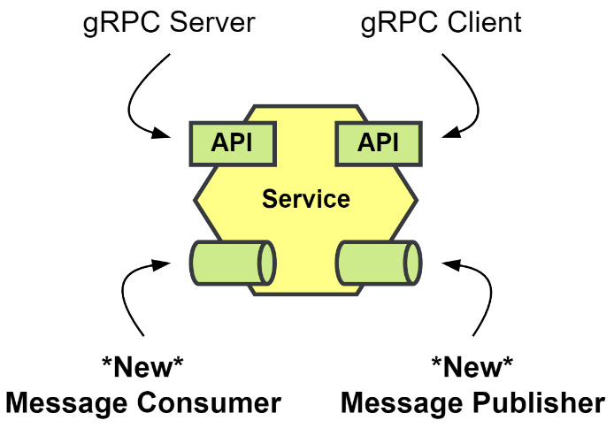

Figure 7.1 – New message inputs and outputs

We will be adding entirely new asynchronous APIs to the modules to implement the sharing of state via events: event-carried state transfer. Also, it would be an excellent time to reflect on the data each module is sharing with its existing gRPC API. We will be trying to determine what data other modules need to know about to function and where that data originates from.

### Store Management state transfer

The Store Management module shares Store and Product information with the other modules. It is the origin of all Store and Product data in our application. However, it is not the only module that shares that data with others. Here are the modules that use stores and products:

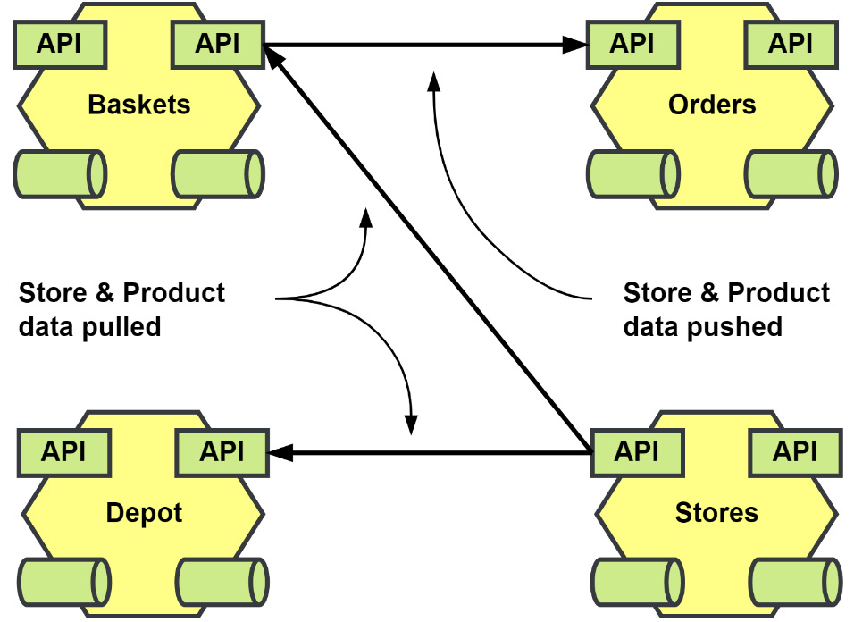

Figure 7.2 – Store Management data usage

The Store and Product data flows out from the Store Management module to the rest of the application. It is sometimes pulled, and sometimes it is pushed:

- Shopping Baskets and the Depot module make calls to pull in Store and Product data.
- Order Processing accepts Store and Product data pushed from the Shopping Baskets module in its CreateOrder endpoint.

The data that is being pulled into the Shopping Baskets and Depot modules could be replaced with local cached copies of the data. The data that is shared with the Order Processing module is secondhand data not owned by the calling module. Stores and products are used in Order Processing only when details about an order are being requested.

We will make the following changes to the Shopping Baskets and Depot modules:

- Update the existing repositories to process data updates for stores and products
- Create new tables that will work as our local cache
- Use the existing gRPC calls as fallbacks when the local cache is missing data
- Update the integration event handlers to use the cache repositories

We will be leaving the CreateOrder call as-is for now, and we will visit that call when we are working on the workflow updates for the Order Processing module in the next chapter.

### Local cache for Stores and Products

The Shopping Baskets and Depot modules already define repository interfaces for Store and Product models that need to be updated to insert new rows and make updates when events come in.

Referring to these repositories as cache repositories may give the wrong impression that these should be temporary copies. Instead, I am intentionally adding the word cache so that for the demonstration it will be clear that this data is not changing owners when it is transferred between the modules. When the structure of either Product or Store changes, we may need to update the code that receives the event, but the rest of our module should remain unaffected. That receiving code will be acting as an anti-corruption layer, protecting our module from the external concerns of the Store Management module.

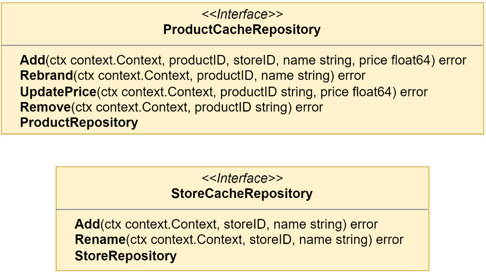

Figure 7.3 – Local cache interfaces for the Shopping Baskets module

The interfaces in Figure 7.3 are similar to the ones we used for the MallRepository and CatalogRepository read models in the Store Management module. There are some minor modifications because we will not be interested in as much data in the local caches. The new cache repository interfaces can be used in place of the current repositories without any changes to any constructor that received them.

### Synchronous state fallbacks

We do not have to have the fallbacks, but since we already have the gRPC endpoints for the Store and Product data, we can choose to use those as fallbacks when we do not locate the requested data locally. This will not help us to determine if our cache is stale, and we will need to be careful about how we handle inserting new rows when they may already exist.

The Postgres implementations of the cache repository interfaces will accept a fallback parameter. When the data cannot be located locally, we will retrieve it from the fallback and then make a cached copy. We will implement the `Find()` method in a way that will use the fallback only if the error we get back from the database signifies that no rows were found:

```go
func (r StoreCacheRepository) Find(
    ctx context.Context, storeID string,
) (*domain.Store, error) {
    const query = "SELECT name FROM %s WHERE id = $1 LIMIT 1"
    store := &domain.Store{
        ID: storeID,
    }
    err := r.db.QueryRowContext(
        ctx, r.table(query), storeID,
    ).Scan(&store.Name)
    if err != nil {
        if !errors.Is(err, sql.ErrNoRows) {
            return nil, errors.Wrap(err, "scanning store")
        }
        store, err = r.fallback.Find(ctx, storeID)
        if err != nil {
            return nil, errors.Wrap(
                err, "store fallback failed"
            )
        }
        return store, r.Add(ctx, store.ID, store.Name)
    }
    return store, nil
}
```

Then, in the `Add()` method we will ignore errors that have to do with unique constraint violations. The reason we ignore these errors is that there may be a race to insert the data from an incoming message and from the gRPC fallback:

```go
func (r StoreCacheRepository) Add(
    ctx context.Context, storeID, name string,
) error {
    const query = "INSERT INTO %s (id, name) VALUES ($1, $2)"
    _, err := r.db.ExecContext(
        ctx, r.table(query), storeID, name,
    )
    if err != nil {
        var pgErr *pgconn.PgError
        if errors.As(err, &pgErr) {
            if pgErr.Code == pgerrcode.UniqueViolation {
                return nil
            }
        }
    }
    return err
}

```

The rest of the methods in the cache repository implementations are very similar to their counterparts in the MallRepository and CatalogRepository implementations from the Store Management module.

In the composition root for the Shopping Baskets module, we will change how the stores and products repositories are instantiated:

```go
stores := postgres.NewStoreCacheRepository(
    "baskets.stores",
    mono.DB(),
    grpc.NewStoreRepository(conn),
)
products := postgres.NewProductCacheRepository(
    "baskets.products",
    mono.DB(),
    grpc.NewProductRepository(conn),
)

```

The new cache repositories should now replace the logging we used in the last chapter for the integration event handlers:

```go
storeHandlers := logging.LogEventHandlerAccess[ddd.Event](
    application.NewStoreHandlers(stores),
    "Store", mono.Logger(),
)
productHandlers := logging.LogEventHandlerAccess[ddd.Event](
    application.NewProductHandlers(products),
    "Product", mono.Logger(),
)

```

The handlers will now use the repositories to add and update the cached data instead of logging the receipt of the various events, for example, when handling the `StoreCreatedEvent`:

```go
func (h StoreHandlers[T]) onStoreCreated(
    ctx context.Context, event ddd.Event,
) error {
    payload := event.Payload().(*storespb.StoreCreated)
    return h.cache.Add(
        ctx, payload.GetId(), payload.GetName(),
    )
}

```

The Shopping Baskets module will now consume the events that the Store Management module is publishing to create a local cache that will make it more independent should either module be broken out of the monolith and made into a standalone microservice.

We can modify the Depot module in the same way to save a local cache of the data that it needs from the Store Management module. When we do implement it for that module, we would again look at what data it specifically needs and customize the cache that is implemented to support the right models:

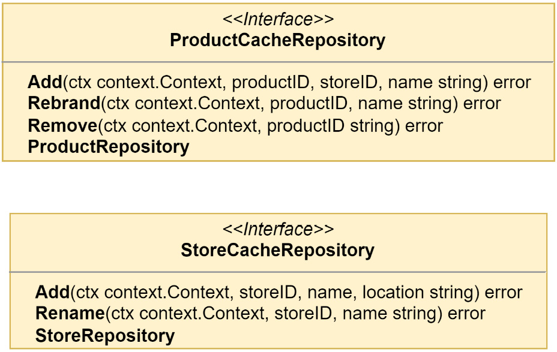

Figure 7.4 – The local cache interfaces for the Depot module

In the Depot module, the price of a product is not important and will not be stored when the product is created, nor will there be a need to record any price changes. In the store cache, the location of a store is important, and it will be cached.

Adding a store with Swagger UI will produce logs such as the following:

```
INF --> Stores.CreateStore

INF --> Stores.Mall.On(stores.StoreCreated)

INF <-- Stores.Mall.On(stores.StoreCreated)

INF --> Stores.IntegrationEvents.On(stores.StoreCreated)

INF <-- Stores.IntegrationEvents.On(stores.StoreCreated)

INF <-- Stores.CreateStore

INF --> Baskets.Store.On(storesapi.StoreCreated)

INF --> Depot.Store.On(storesapi.StoreCreated)

INF <-- Baskets.Store.On(storesapi.StoreCreated)

INF <-- Depot.Store.On(storesapi.StoreCreated)
```

Nothing has changed how the read model for the Mall is being processed: they will still be handled before the `Stores.CreateStore` command completes.

A second in-process handler for the integration events is run, which has asynchronously published the `storesapi.StoreCreated` event. Eventually, the two new consumers will receive the message and process it to create a cached copy of the store data. The order of the last four lines of the log will change depending on the speed at which each consumer can receive and process the message.

## Customer state transfer

The Customer module has not been the focus of much reworking in the past but, like Store Management, it maintains a resource that is of interest to the other modules: the customer data.

### Transferring the state but not the responsibility

A quick word of caution about the customer and other shared state in an event-driven application: when we transfer state with events, we do not transfer domain responsibilities along with it.

If the module or service that owns the customer data is also responsible for authorization or authentication, that responsibility stays with it, and it must continue to be called to perform that function.

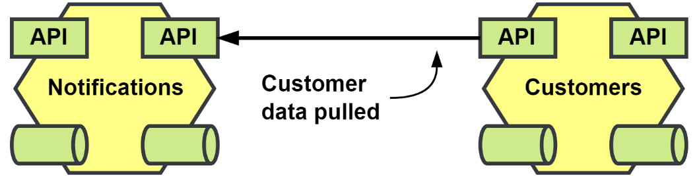

Figure 7.5 – Customer data usage

Right now, as shown in Figure 7.5, only the Notifications module is using customer data. When the Notifications module receives a request to send out a notification, it needs to fetch the SMS number for the customer because the calling service is only able to pass along the customer’s identity.

The following interface is what is used to create a local cache of customer data in the Notifications module:

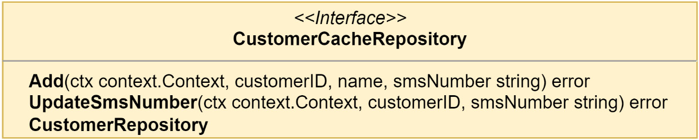

Figure 7.6 – The local cache interface for the Notifications module

The Customers module will need to be updated to become a publisher of integration events, and the steps to accomplish that can be found in the previous chapter in the _Publishing messages from the Store Management module_ section.

Then, the Notifications module will need to be updated to receive those events, and the steps to do that are also described in the previous chapter, in the _Receiving messages in the Shopping Baskets module_ section.

Requesting Swagger UI to create a new customer will produce results such as the following in the monolith logs:

```
INF --> Customers.RegisterCustomer

INF --> Customers.IntegrationEvents.On(customers.CustomerRegistered)

INF <-- Customers.IntegrationEvents.On(customers.CustomerRegistered)

INF <-- Customers.RegisterCustomer

INF --> Notifications.Customer.On(customersapi.CustomerRegistered)

INF <-- Notifications.Customer.On(customersapi.CustomerRegistered)
```

The order in which the logs appear may not be the same because the publishing and processing of the event will be asynchronous. We can see in these logs that the `Customers.RegisterCustomer` command is complete before the Notifications module starts to work on the message. If other modules also consume the messages published by the Customers module, we would not need to involve the team responsible to make it happen.

## Order processing state transfer

In Chapter 4, _Event Foundations_, we refactored the Order Processing module, extracting side effects from the command handlers into domain event handlers. One of those domain event handlers was for the notifications we wanted to send out when specific changes were made to the Order aggregate:

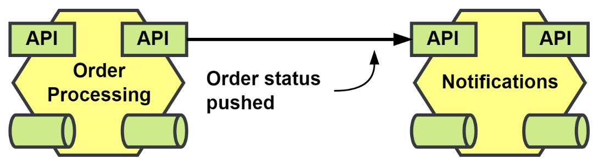

Figure 7.7 – The notification requests sent from the Order Processing module

Replacing the calls from the Order Processing module will not result in us creating a data cache in the Notifications module. What will happen instead is a reaction to the state change resulting in a notification being sent to the customer.

We will replace `NotificationHandlers` in the Order Processing module with a new `IntegrationEventHandlers`. After we do this, we will have completed an event refactoring journey and will have completely decoupled Order Processing from Notifications.

This is the handler for the domain event `OrderReadied`:

```go
func (h IntegrationEventHandlers[T]) onOrderReadied(
    ctx context.Context, event ddd.AggregateEvent,
) error {
    payload := event.Payload().(*domain.OrderReadied)
    return h.publisher.Publish(
        ctx,
        orderingpb.OrderAggregateChannel,
        ddd.NewEvent(
            orderingpb.OrderReadiedEvent,
            &orderingpb.OrderReadied{
                Id:         event.AggregateID(),
                CustomerId: payload.CustomerID,
                PaymentId:  payload.PaymentID,
                Total:      payload.Total,
            },
        ),
    )
}
```

The payload we will be publishing is not as slim as the gRPC request to the Notification module, and that is because we will also want to use this to handle the other side effect that deals with creating invoices in the Payments module.

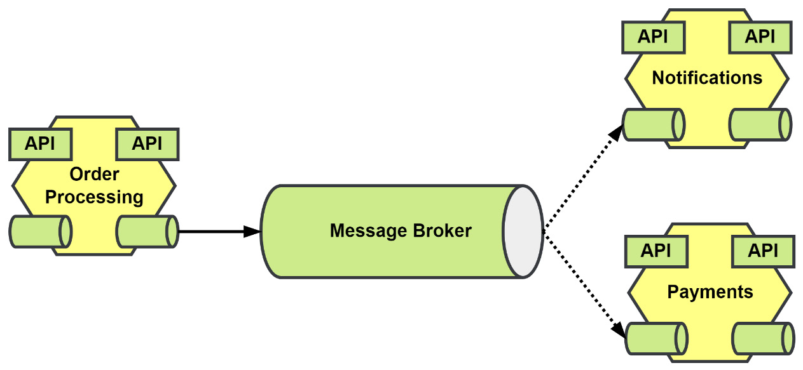

Figure 7.8 – Replacing side effect handlers with asynchronous messaging

After also updating the two modules, we will have removed them both as dependencies for the Order Processing module. There are still other dependencies on other modules, and we will be getting to them in the next chapter, when we update Order Processing to use asynchronous workflows.

### Other refactoring considerations

We may be able to or want to remove or deprecate the gRPC endpoints that were used to send the customer notifications now that we have a new asynchronous messaging alternative. Whether you should or how to handle the removal will be extremely situational and will require at the very least a survey of the API users to see if they can support the switch to the new asynchronous communication methods.

## Payments state transfer

The last state we want to update belongs to the Payments module, and it goes to the Order Processing module. When an invoice is paid, we want to update the order to put it into a final completed state:

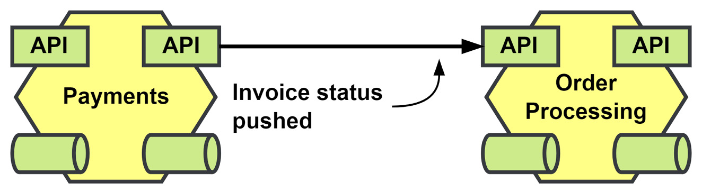

Figure 7.9 – Invoice status is pushed to Order Processing to complete orders

Replacing the call to Order Processing will remove the only dependency Payments had on other modules.

When the Order Processing module consumes the `paymentsapi.InvoicePaid` event, it will kick off the same application task that it had before when the gRPC request was received.

## Documenting the asynchronous API

One of the advantages of building an event-driven application is that there is a decoupling between the producers of the events and the consumers. The only thing that teams need to do in order to get things done is consume the messages that are relevant to them, and they may do this without having to engage with or affect the timeline of the publishing team.

You could take this to mean that consumers who are interested in what you are publishing will be interested enough to crawl through your source code to figure out what is being published so that they can subscribe to it. I cannot speak for others, but when it comes to my plans to integrate components, that has nothing to do with any possible interest I might have.

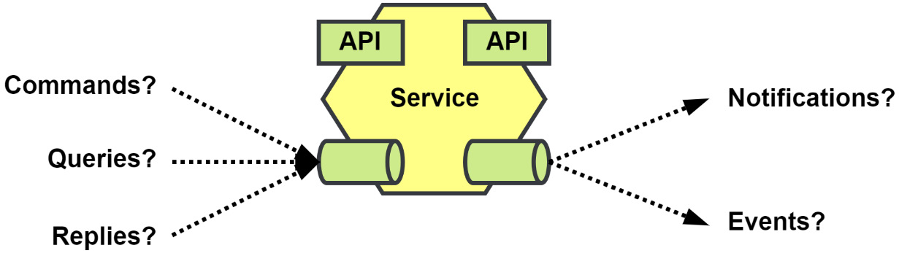

Figure 7.10 – Unknown asynchronous messaging landscape

The alternative is to, of course, maintain documentation for the asynchronous API. The organization could use a shared document or a wiki, but the issue with either of these options is the organization would also need to come up with what and how things need to be documented.

This is not a problem for some, but it does present an additional challenge, and bad documentation is often no better than no documentation.

### AsyncAPI

Providing a structured specification is exactly what AsyncAPI ([https://asyncapi.com](https://asyncapi.com)) is designed to do. It uses a specification schema that is very similar to the OpenAPI specification schema. Where OpenAPI would document the paths or endpoints and verbs that an API provided, AsyncAPI documents the channels and messages that a component would publish or subscribe to.

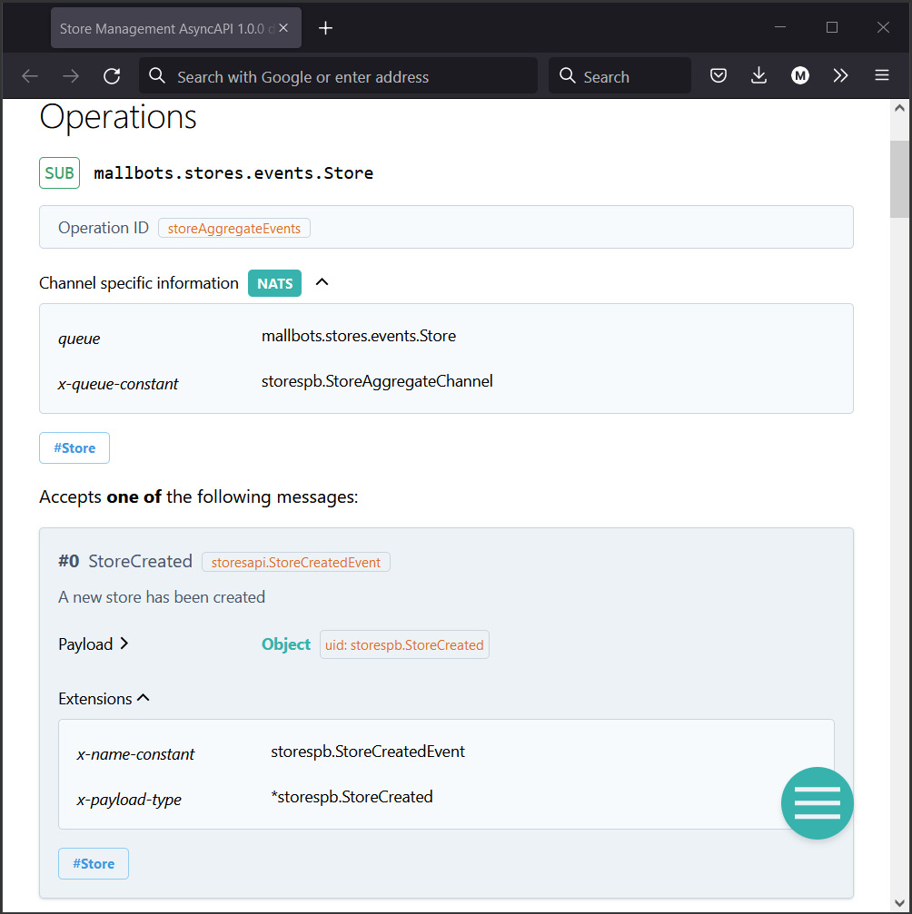

Figure 7.11 – AsyncAPI documentation for the Store Management module

The HTML documentation shown here was created using the AsyncAPI generator tool. The generator can also be used to generate boilerplate code for multiple languages or documentation as a PDF or in Markdown instead of HTML if preferred.

In the documentation generated for the modules, we include references using specification extensions for the constants and types in the Go code to reduce the need to get into the source code, unless they are interested in doing that.

### EventCatalog

Another promising tool is EventCatalog ([https://eventcatalog.dev](https://eventcatalog.dev)), which uses Markdown files and functions just like a static site generator.

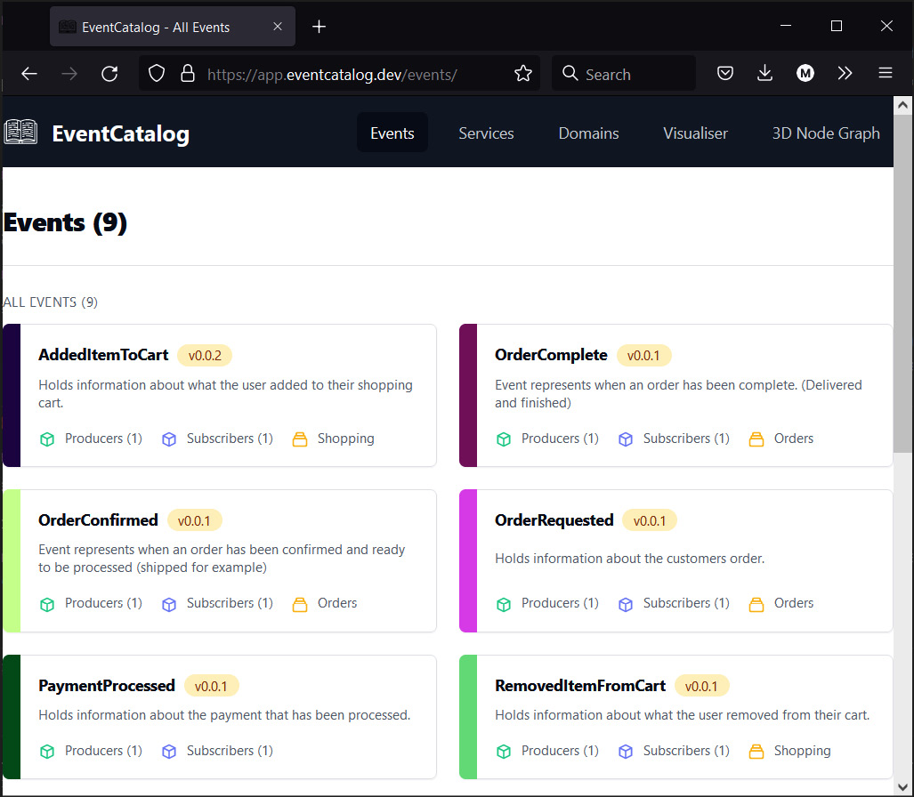

Figure 7.12 – The EventCatalog demo showing the events tab

In addition to being able to define the events and asynchronous APIs, you can also include documentation for the synchronous APIs for services as well. The generated site can provide a visualization of the relationships that services have through their events. The site can even render a 3D node graph of the entire system with animations showing the direction in which state flows.

With the knowledge that there are tools and specifications to document an event-driven application, there is no excuse to not document your asynchronous messaging APIs just like you would a REST or gRPC API.

## Adding a new order search module

Now that we are publishing the application state as it changes, we can consider new functionality that might have been impossible before or would have been too dependent on others to be feasible.

We will be consuming many different sources to keep a local cache to provide greater detail for our search results. Customer, store, and product names will all be stored locally. The new module will be consuming every message that the Order Processing module will be publishing to keep results current. Other data could also be included later, such as the status of the invoice, or the status of the shopping that takes place after the order has been submitted.

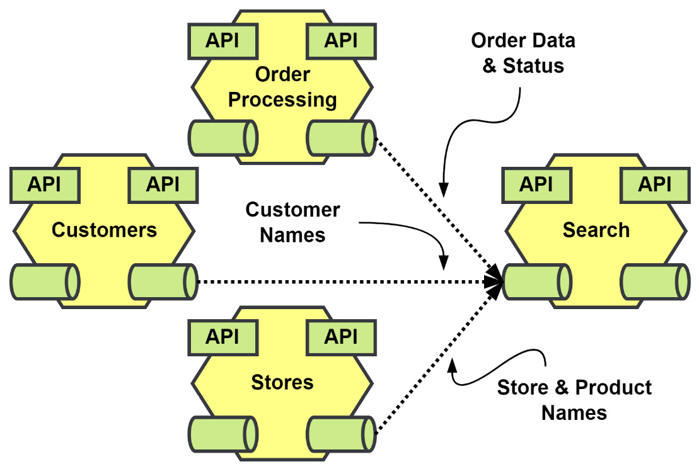

Figure 7.13 – The data that feeds the Search module

We will create the new module in a new directory called `/search`, and in that directory, we will create the `module.go` file exactly like the other modules. This new module will need the following driven adapters in the composition root:

- A data type registry instance
- Events from the Customers, Store Management, and Order Processing modules registered
- An event stream instance
- Several cache repositories with gRPC fallbacks
- The repository for our order read models

The following listing shows the registry instantiated as `reg`. `eventStream` uses the NATS JetStream implementation as the RawMessage source stream. The repositories for customers, stores, products, and orders are implemented using PostgreSQL:

```go
reg := registry.New()
err = orderingpb.Registrations(reg)
if err != nil { return err }
err = customerspb.Registrations(reg)
if err != nil { return err }
err = storespb.Registrations(reg)
if err != nil { return err }
eventStream := am.NewEventStream(
    reg, jetstream.NewStream(
        mono.Config().Nats.Stream, mono.JS(),
    ),
)
conn, _ := grpc.Dial(ctx, mono.Config().Rpc.Address())
customers := postgres.NewCustomerCacheRepository(
    "search.customers_cache",
    mono.DB(),
    grpc.NewCustomerRepository(conn),
)
stores := postgres.NewStoreCacheRepository(
    "search.stores_cache",
    mono.DB(),
    grpc.NewStoreRepository(conn),
)
products := postgres.NewProductCacheRepository(
    "search.products_cache",
    mono.DB(),
    grpc.NewProductRepository(conn),
)
orders := postgres.NewOrderRepository(
    "search.orders",
    mono.DB(),
)
```

## The application components will be as follows:

- An application with some query methods
- Three event handlers will create local caches of customer, store, and product data
- An order event handler to track the changes that are made as they happen

The dependencies from the previous listing are then injected into the application and handlers:

```go
app := logging.LogApplicationAccess(
    application.New(orders),
    mono.Logger(),
)
orderHandlers := logging.LogEventHandlerAccess[ddd.Event](
    application.NewOrderHandlers(
        orders, customers, stores, products,
    ),
    "Order", mono.Logger(),
)
customerHandlers := logging.LogEventHandlerAccess[ddd.Event](
    application.NewCustomerHandlers(customers),
    "Customer", mono.Logger(),
)
storeHandlers := logging.LogEventHandlerAccess[ddd.Event](
    application.NewStoreHandlers(stores),
    "Store", mono.Logger(),
)
productHandlers := logging.LogEventHandlerAccess[ddd.Event](
    application.NewProductHandlers(products),
    "Product", mono.Logger(),
)
```

## Much of the work that this new module will do will all happen inside the handlers. The application has only two methods: `SearchOrders()` and `GetOrder()`. Because the handlers will consume events as the only form of input to produce the read models, the application will only need to have the two methods to perform queries.

For now, the handlers can function independently and work directly with the repositories. It is a design decision to not create application methods that are then used in the handlers, and it can be easily reversed if that would improve the maintainability of the module. The alternative is to add the methods to the application, which would result in our handlers functioning in the same way as the gRPC server methods would. The incoming message would essentially be transformed into application inputs by our handlers, and then they would process any errors that were returned.

Then, into the driver adapters, we inject the driven adapters, application, and handlers from the previous two listings:

```go
err = grpc.RegisterServer(ctx, app, mono.RPC())
if err != nil { return err }
err = rest.RegisterGateway(
    ctx, mono.Mux(), mono.Config().Rpc.Address(),
)
if err != nil { return err }
err = handlers.RegisterOrderHandlers(
    orderHandlers, eventStream,
)
if err != nil { return err }
err = handlers.RegisterCustomerHandlers(
    customerHandlers, eventStream,
)
if err != nil { return err }
err = handlers.RegisterStoreHandlers(
    storeHandlers, eventStream,
)
if err != nil { return err }
err = handlers.RegisterProductHandlers(
    productHandlers, eventStream,
)
if err != nil { return err }
```

## Much of what has gone into the composition root for the Search module is familiar to us at this point. The repositories, gRPC server, and REST gateway are also going to be standard and, aside from some changes to make them work locally, are copies of the ones we would find in the other modules. A large portion of this new module can be found or exists elsewhere in the other modules.

With that said, two questions spring to mind. Why create a new Search module, and why not make it part of the Order Processing module? The duties of handling order life cycles and doing complex searches on orders might have order data in common, but the functionality does not entirely align. In a real-world application, we would not be dealing with such simple components, and adding entirely new functionality could introduce unexpected bugs or have other undesirable issues, such as reduced performance.

To answer the first question, this functionality also does not fit in with any other existing module. Plus, as has been stated many times by now, we can stand up a new component that consumes events in an event-driven application very easily. This new search feature and other functionality like it can be developed and vetted without causing any interruptions to other teams and developers, both in terms of scheduling pull requests to integrate the components and to development schedules.

## Building read models from multiple sources

The new Search module will be returning order data that should not require any additional queries to other services to be useful. We want to be able to return the customer’s name, product name, and store names in the details we return. We also want to be able to locate the orders using more than their identities.

The search goals of this new module are as follows:

- Search for orders belonging to specific customer identities
- Search for orders by store and product identities
- Search for orders created within a date range
- Search for orders that have a total within a range
- Search for orders by their status

The read model that we will be building is not too different from what an order in the Order Processing module looks like:

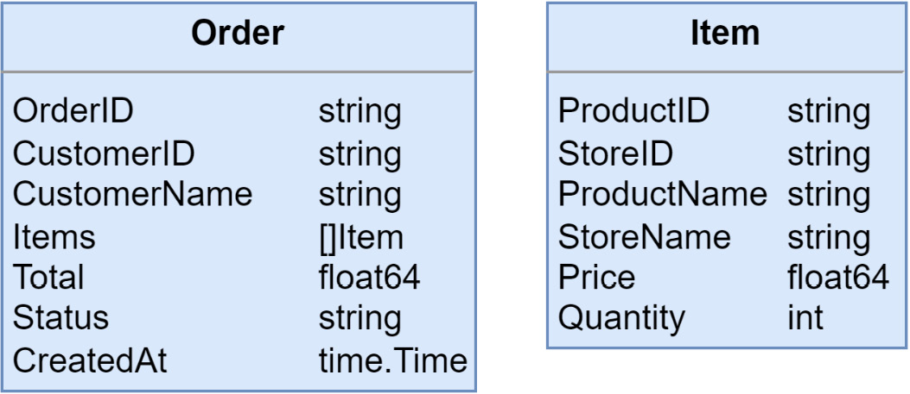

Figure 7.14 – The order read model structures

To support searching using the previously mentioned filters, we will be writing some additional metadata along with the read model data we save. However, instead of making that additional data part of the read model structs, I prefer to have it live either alongside or in the PostgreSQL implementation of the `OrderRepository` interface. This kind of decision can save you a lot of time or headaches down the road if the current choice of database is unable to handle the load or support new methods of filtering.

We will be using PostgreSQL, and we will have the following as our table schema:

```sql
CREATE TABLE search.orders (
  order_id       text NOT NULL,
  customer_id    text NOT NULL,
  customer_name  text NOT NULL,
  payment_id     text NOT NULL,
  items          bytea NOT NULL,
  status         text NOT NULL,
  product_ids    text ARRAY NOT NULL,
  store_ids      text ARRAY NOT NULL,
  created_at     timestamptz NOT NULL DEFAULT NOW(),
  updated_at     timestamptz NOT NULL DEFAULT NOW(),
  PRIMARY KEY (order_id)
);
```

# Product and Store Search Optimization

The `product_ids` and `store_ids` columns will make it easier to perform searches for orders that have been for specific products and stores.

## Column Data Types

For our identifier columns, we could use the PostgreSQL `UUID` type, and for the status column, we could use the `enum` type. As this is a table that will be built using data from external sources, we would need to be careful that changes to the incoming data types do not cause problems. The use of an anti-corruption layer would help with that. The option I have chosen for the demonstration is to use data types for the columns that will have the fewest issues should the incoming data types change.

The rest of the search filters should not be hard, and we can improve performance with indexes. While the metadata and index additions are minimal, they would still be different for a different database.

## Creating a Read Model Record

When the `OrderCreated` event is received, the data from that event is brought together with the data we have been storing with the other handlers. The previously mentioned metadata will be added just before saving the record into the database.

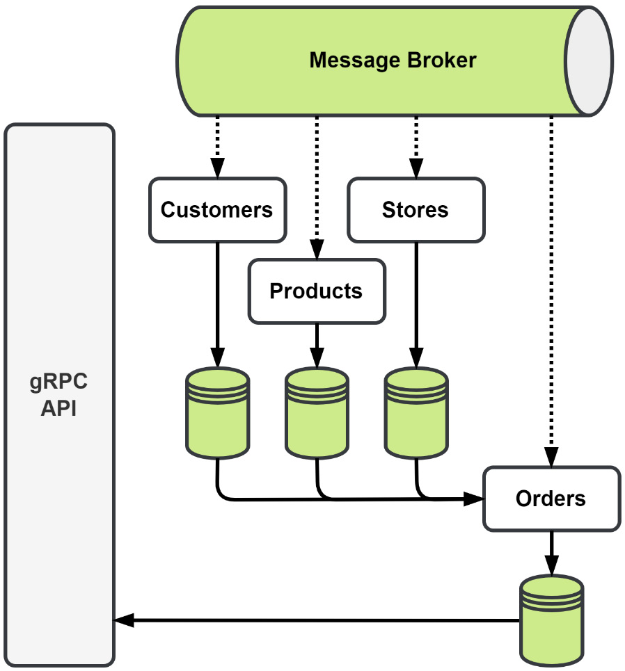

Figure 7.15 – Read Model Data Sources and Creation

Customer, store, and product data will be stored as it comes in. Later, when an order is created, we combine it with the data already stored in the database, creating our rich search model.

After the read model has been created, it will receive additional updates as the status changes. It will eventually be updated with the status. Our read model is going to be eventually consistent, and, under normal conditions, no one may ever notice.

## Summary

In this chapter, we used event-carried state transfer to decouple modules. Modules such as Store Management and Customers were made into event producers to improve the independence of the modules by allowing them to use locally cached data, avoiding a blocking gRPC call to retrieve it. We also expanded the state that is being shared in the application. Asynchronous messaging APIs can and should be documented like synchronous APIs, and we were introduced to a couple of tools that make the task easier.

We also added a new module to add advanced search capabilities to the application. This new module utilized events from several other modules to build a new read model that can be queried in multiple different ways.

We still have some synchronous calls that we did not touch. These calls will be the focus of our next chapter, **Chapter 8: Message Workflows**. In that chapter, we will look at how we can send more than events, and we will send commands to other modules so that they work at our behest. We will also look to address issues regarding lost messages and what can be done to prevent message loss in a busy application.
