# 8. Message Workflows

In the previous chapter, we used events to share information between the modules. In this chapter, we will learn how complex work can be done in a distributed and asynchronous way. We will introduce several different options for performing complex operations across different components. After that, we will implement a new asynchronous workflow for creating orders in the application using one of those techniques.

## In this chapter, we will cover the following topics:

- What is a distributed transaction?
- Comparing various methods of distributed transactions
- Implementing distributed transactions with Sagas
- Converting the order creation process to use a Saga

## Technical Requirements

You will need to install or have installed the following software to run the application or to try the examples in this chapter:

- The Go programming language, version 1.18+
- Docker

The code for this chapter can be found at [GitHub - Chapter 8](https://github.com/PacktPublishing/Event-Driven-Architecture-in-Golang/tree/main/Chapter08).

## What is a Distributed Transaction?

The distributed components of an application will not always be able to complete a task completely isolated. We have already seen how we can use messages to share information between components so that remote components can have the data they need to complete small tasks. Within a simple component, more complex tasks could utilize a transaction to ensure that the entire operation completes atomically.

Let’s talk about local transactions for a moment and why we would want to emulate them as distributed transactions. We use transactions for the atomicity, consistency, isolation, and durability (ACID) guarantees they provide us:

- **Atomicity**: The atomicity guarantee ensures that the group of queries is treated as a single unit – that is, a single interaction with the database – and that they all either succeed together or fail together.
- **Consistency**: The consistency guarantee ensures that the queries transition the state in the database while abiding by all rules, constraints, and triggers that exist in the database.
- **Isolation**: The isolation guarantee ensures that no other concurrent interactions with the database will affect this interaction with the database.
- **Durability**: The durability guarantee ensures that once the transaction has been committed, any state changes made by the transaction will survive a system crash.

Within a monolithic application, we may start a local transaction in the database so that all the interactions with the database use a singular view. We can also insert new data that will be atomically written together. Hypothetically, the following diagram shows what the create order process for MallBots would look like without modules and a single database:

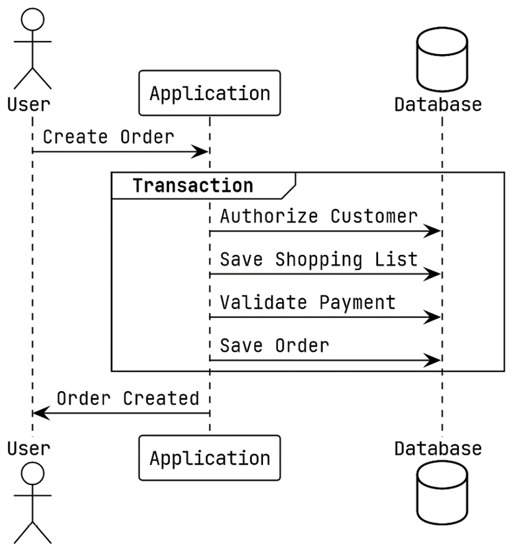

Figure 8.1 – Using a Local Transaction to Create a New Order

We are looking for the same ACID guarantees in the processes we use for distributed transactions. A distributed transaction should provide all or most of the guarantees that a local transaction would.

The only component necessary for a local transaction to be executed is either a relational database management system (RDBMS) or a non-relational (NoSQL) database that complies with ACID standards. Whereas a distributed transaction may include the entire system and perhaps several different kinds of databases, it is not limited to just one. Even a third-party service can be part of a distributed transaction.

This brings us to another distinction between a local transaction and a distributed one: a distributed transaction has the potential to be run over a longer period. Also, some distributed transaction choices do not maintain the isolation guarantee so that resources are not blocked and are not fully ACID compliant.

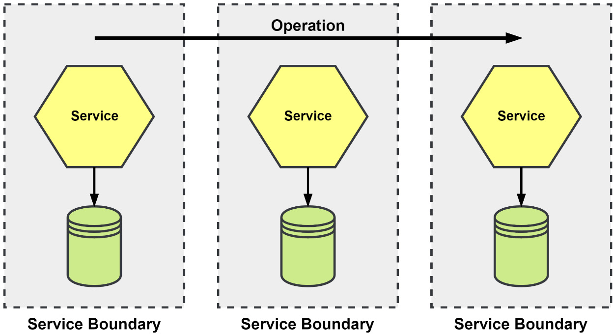

Figure 8.2 – An Operation that Runs Across Several Services

An oversimplified example would be transferring money between two accounts. In one account, the money needs to be deducted, while in the other, the money is deposited. This operation can only be considered complete if both modifications are successful. If one of them fails, the modification must be undone on the other account.

## Why Do We Need Distributed Transactions?

Complex applications will inevitably have complex operations that cannot be contained to a simple component. Having that operation span the application without any way to keep the system consistent would be foolish at best.

Using **Figure 8.2** for another example, we have an operation that requires involvement from three different services. If we were to blindly pass on the operation to the second and third operations without any way to roll back a change in the previous services, our system as a whole could experience any number of issues. For example, the inventory could vanish, rooms could be reserved but left unbilled, or worse, the payment could have been accepted but the room was never confirmed as reserved, so the room was rebooked.

Distributed transactions provide a way to spread the work across the appropriate components instead of trying to shoehorn everything into some omnibus component that duplicates functionality found elsewhere across the system.

## Comparing Various Methods of Distributed Transactions

In this section, we will look at three ways to handle consistency across a distributed system. The first will be the **Two-Phase Commit (2PC)**, which can offer the strongest consistency but has some large drawbacks. The other two are the **Choreographed Saga** and the **Orchestrated Saga**, which still offer a good consistency model and are excellent options when 2PCs are not an option.

### The 2PC

At the center of a 2PC is a coordinator that sends the Prepare and Commit messages to all the participants. During the Prepare phase, each participant may respond positively to signify they have started a local transaction and are ready to proceed. If all the participants have responded positively, then the coordinator will send a **COMMIT** message to all of the participants and the distributed transaction will be complete. On the other hand, if any participant responds negatively during the Prepare phase, then the coordinator will send an **ABORT** message to inform the other participants to roll back their local transaction; again, the distributed transaction will be complete.

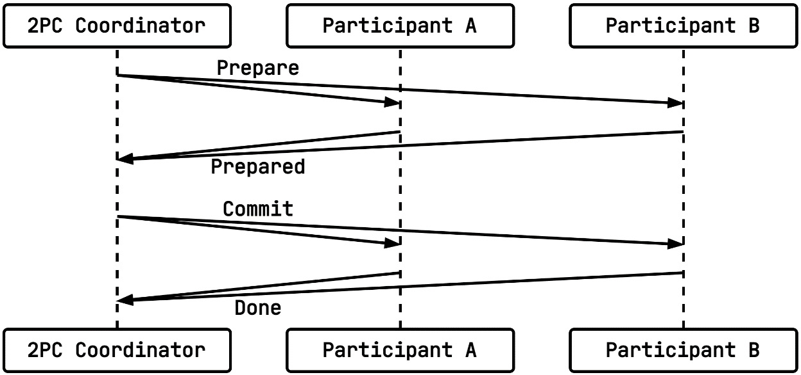

Figure 8.3 – A 2PC Distributed Transaction with Two Participants

What this method has going for it is that it is a widely known method and has a well-documented protocol for implementations to follow. When it is implemented correctly and used in a preferably very well-tested system, it can offer very strong consistency as it has all ACID guarantees.

During the **Prepare** phase, a participant would execute the following transaction in PostgreSQL:

```sql
BEGIN;
-- execute queries, updates, inserts, deletes …
PREPARE TRANSACTION 'bfa1c57a-d99d-4d74-87a9-3aaabcc754ee';
```

Then, during the **Commit** phase, either a **COMMIT** or **ABORT** message would be received by each participant. Now, either a commit or a rollback of that prepared transaction would take place.

What the 2PC has going against it is big. During the **Prepare** phase, the participants all create prepared transactions that will consume resources until the coordinator gets around to sending the message for the **Commit** phase. If that never arrives for whatever reason, then the participants may end up holding open a transaction much longer than they should or may never resolve the transactions. Another possibility is that a participant may fail to properly commit the transaction, leaving the system in an inconsistent state. Holding onto transactions limits the scalability of this method for larger distributed transactions.

# The Saga

A saga is a sequence of steps that define the actions and compensating actions for the system components that are involved, also known as the saga participants. In contrast to 2PCs, each participant is not expected to use a prepared transaction. Not relying on prepared transactions opens the possibility of using NoSQL or another database that does not support prepared transactions. Sagas drop support for the isolation guarantee, making them **ACD** transactions. The saga steps may use a local **ACID** transaction, but any changes that are made will be visible to concurrent operations while the other steps are being run.

Another reason to choose a saga for your distributed transaction is that a saga can be long-lived. Since there are no resources tied up in a database blocking other work, we can build a saga that could have a lifetime of several seconds, minutes, or even longer.

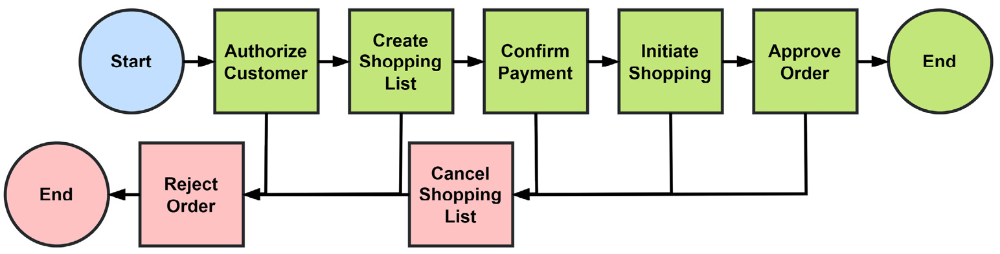

Figure 8.4 – A Saga Representing the Create Order Process

In the preceding diagram, we have a saga representing the process of creating a new order. Along the top row are the actions we want to take to create the order. Along the bottom are the compensating actions that would be executed to roll back any changes to the system to bring it back to a consistent state.

A saga may be a collaborative effort between participants and be choreographed; alternatively, there can be a saga execution coordinator that orchestrates the entire process.

Now, let’s take a look at both types of sagas and how we might use either to handle creating new orders in the MallBots application.

## The Choreographed Saga

In a choreographed saga, each participant knows the role they play. With no coordinator to tell them what to do, each participant listens for the events that signal their turn. The coordination logic is spread out across the components and is not centralized.

Our example from **Figure 8.4** could be accomplished by publishing the following events into the message broker:

1. The **Order Processing** module would publish an `OrderCreated` event after creating a new order in the pending state.
2. The **Customers** module listens for `OrderCreated` events and publishes a `CustomerApproved` event after confirming the customer on the order.
3. The **Depot** module also listens for the `OrderCreated` event and uses the order information to create a shopping list for the bots and publishes a `ShoppingListCreated` event.
4. The **Payments** module listens for the `OrderCreated` and `CustomerApproved` events and will verify the authorized payment for the order and customer before publishing the `PaymentValidated` event.
5. The **Depot** module will listen for the `PaymentValidated` event to hand the shopping list to a bot before publishing the `ShoppingInitiated` event.
6. The **Order Processing** module will be listening for `ShoppingInitiated` to update the order state to “approved.” Then, it will publish a final `OrderApproved` event.

These events and interactions, when mapped out, would look like this:

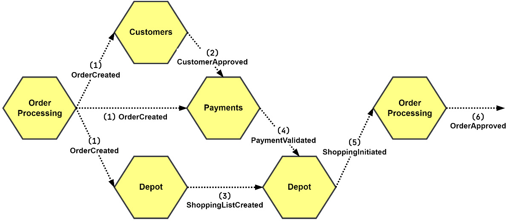

Figure 8.5 – The Create Order Process Using a Choreographed Saga

Compensation is initiated by participants listening to the events representing failures or other events representing undoing actions. If the attempt to validate the authorized payment for the order were to fail, then all the steps that modified any state would need to be rolled back.

1. The **Payments** module publishes an `UnauthorizedPayment` event after failing to validate the authorized payment with the information provided.
2. The **Depot** module is listening for the `UnauthorizedPayment` event and will cancel the shopping list before publishing the `ShoppingListCanceled` event.
3. The **Order Processing** module is also listening for the `UnauthorizedPayment` event and will reject the order, effectively canceling it in the process, before publishing the `OrderRejected` event.
4. The **Customers** module is not listening for the `UnauthorizedPayment` event because it has no way to react to the condition. It may also not be listening because the event was overlooked. Choreographed compensations can be tricky this way.

If the order approval (**6**), or shopping initiation (**5**), tasks were expected to fail, then the **Payments** module would need to listen for the events that would result from those failures so it could publish a compensation event. This way, the rest of the compensation would remain as-is. This would require coordination by the developers; miscommunication could be the source of saga failures.

Using a choreographed saga is a good choice when the number of participants is low, and the coordination logic is easy to follow. Choreography makes use of the events that participants already publish and subscribe to and does not need any extra services or processes to be deployed.

## The Orchestrated Saga

An orchestrated saga does not rely on individual components publishing events. Instead, it uses a saga execution coordinator (SEC) to send commands to the components. This centralizes the orchestration of the components into one location. When the coordinator receives a failed reply, it switches over to begin compensating and sending any compensation commands required to roll back the operation:

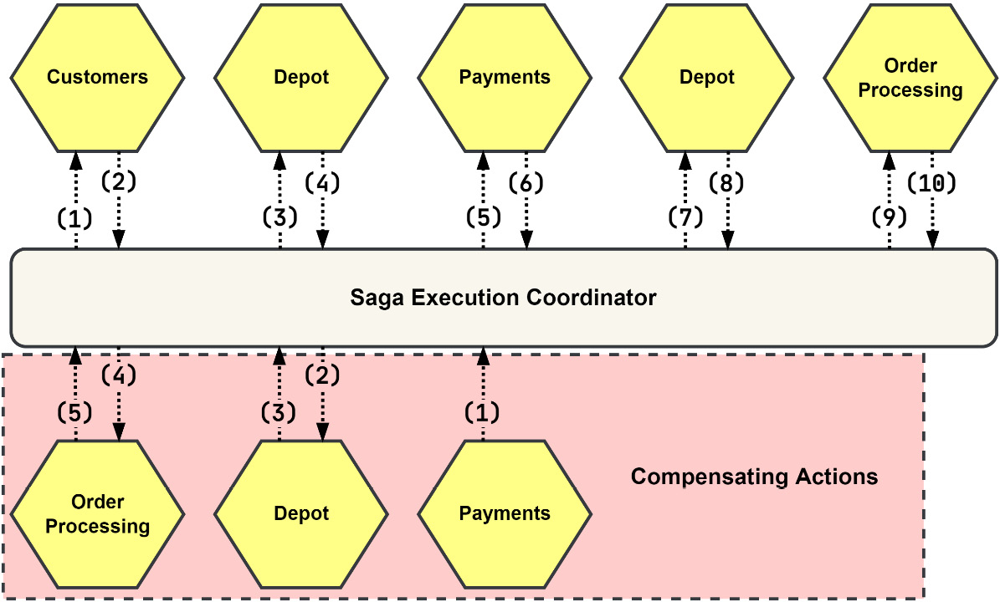

Figure 8.6 – SEC Orchestrating the Create Order Process

As shown in the preceding diagram, this operation would work with a saga orchestrated by an **SEC**, like so:

1. The coordinator sends the **AuthorizeCustomer** command to the **Customers** module.
2. The **Customers** module responds with a generic **Success** message.
3. The coordinator sends the **CreateShoppingList** command to the **Depot** module.
4. The **Depot** module responds with a **CreatedShoppingList** message.
5. The coordinator sends the **ConfirmPayment** command to the **Payments** module.
6. The **Payments** module responds with a generic **Success** message.
7. The coordinator sends the **InitiateShopping** command to the **Depot** module.
8. The **Depot** module responds with a generic **Success** message.
9. The coordinator sends the **ApproveOrder** command to the **Order Processing** module.
10. The **Order Processing** module responds with a generic **Success** message.

The first time the SEC receives a response from the **Depot** module, the response is a specific **Depot** message – the **CreatedShoppingList** reply. This message contains the identity of the shopping list that was just created. The SEC adds that identity to the context of the saga so that it can be used later in the second call to **Depot** to initiate the shopping.

## Handling Compensation within an SEC

Compensation within an SEC is kicked off by any of the participants responding with a **Failure** message.

Starting again with a failure in the **Payments** module, the following must take place to compensate the saga:

1. The **Payments** module would respond with a generic **Failure** message.
2. The coordinator would begin the compensation process and send the **CancelShoppingList** command to the **Depot** module.
3. The **Depot** module would respond with a generic **Success** message.
4. The coordinator would send **RejectOrder** to the **Order Processing** module.
5. The **Order Processing** module would respond with a generic **Success** message.

After the SEC receives the first **Failure** message, it expects each compensating action to complete successfully and responds with a **Success** message. The same would be true for the choreographed saga – each compensating action must complete without any issues.

The process of creating a new order is more than a couple of steps and more than one step is involved in compensating the transaction. So, in this case, it would be better to implement this process using an orchestrator than relying on choreography among the modules. To do that, we will need to add the supporting functionality to the application first.

# Implementing Distributed Transactions with Sagas

To organize the order creation process as a saga, we will be introducing additional functionality in the form of an **SEC**. These are the items we will be building or modifying to accomplish this task:

- We will update the `ddd` and `am` packages so that they include the new **Command** and **Reply** message types.
- We will create a new `sec` package that will be the home for an orchestrator and saga definitions and implementations.

Now, let’s dive into the existing packages to add those new types of messages.

## Adding Support for the Command and Reply Messages

The **Command** and **Reply** additions to the `ddd` package are nearly exact copies of the **Event** definitions and implementations that we can expand on later. Here are the interfaces and implementations for **Reply**:

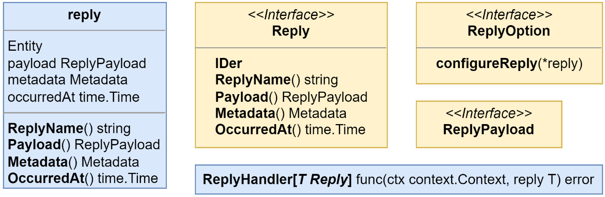

Figure 8.7 – The New Reply Definitions in the `ddd` Package

The ones for the **Command** message will be like the **Event** and **Reply** definitions shown in Figure 8.7, with one small difference – the **CommandHandler** returns a **Reply**, along with an error:

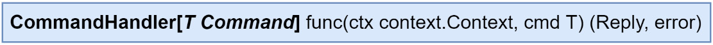

Figure 8.8 – CommandHandler Returns a Reply and an Error

The additions to the **am** package are like the ones in the **ddd** package. The additions for **CommandMessages** will also be modified to return the replies, along with the errors:

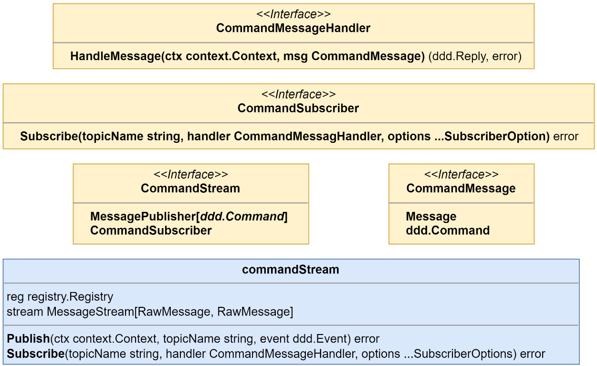

Figure 8.9 – The New CommandMessage Definitions in the `am` Package

When a **Command** message is handled, the expectation is that we will be responding with a **Reply** message. Instead of returning the result of handling the **Command**, as we did in the **EventStream** implementation, we want to publish a reply. Before we do that, we need to determine if the overall outcome of the **Command** was a success or a failure. We can determine that based on whether an error was returned. Finally, the **Command** handler might not have returned any reply, so a generic **Success** and **Failure** reply will be built and used in that case.

This is how that is implemented:

```go
reply, err = handler.HandleMessage(ctx, commandMsg)
if err != nil {
    return s.publishReply(ctx, destination,
        s.failure(reply, commandMsg),
    )
}
return s.publishReply(ctx, destination,
    s.success(reply, commandMsg),
)

```

A **CommandMessage** includes a special header that specifies where replies should be sent; that is how we get the **destination** value in the previous listing. Another special header is added to replies so that we can easily determine the outcome of a command. The following code shows how it can be added for successful outcomes:

```go
func (s commandStream) success(
    reply ddd.Reply, cmd ddd.Command,
) ddd.Reply {
    if reply == nil {
        reply = ddd.NewReply(SuccessReply, nil)
    }
    reply.Metadata().Set(ReplyOutcomeHdr, OutcomeSuccess)
    return s.applyCorrelationHeaders(reply, cmd)
}

```

In the preceding code, we’re handling the cases where no reply was returned by the command handler and creating a generic **Success** reply with no payload. The commands we handle may also include other headers that help relate the action to specific aggregates, or in our case, a running saga. So, we can also add those correlation headers from **Command** to **Reply**, as shown here:

```go
func (s commandStream) applyCorrelationHeaders(
    reply ddd.Reply, cmd ddd.Command,
) ddd.Reply {
    for key, value := range cmd.Metadata() {
        if strings.HasPrefix(key, CommandHdrPrefix) {
            hdr := ReplyHdrPrefix + key[len
                (CommandHdrPrefix):]
            reply.Metadata().Set(hdr, value)
        }
    }
    return reply
}

```

New protocol buffer message declarations have also been added for **CommandMessageData** and **ReplyMessageData**. For simplicity, they are the same as the **EventMessageData** type.

That’s all of the updates we need to make to the **am** package. Now, let’s look at creating the new **sec** package.

## Adding an SEC Package

The **SEC** is made of a few parts:

- An **Orchestrator**, which uses a saga for logic and connects it with a repository and publisher
- A **Saga Definition**, which holds all the metadata and the sequence of steps
- The **steps** that contain the logic for the actions, the **Reply** handlers, and their compensating counterparts

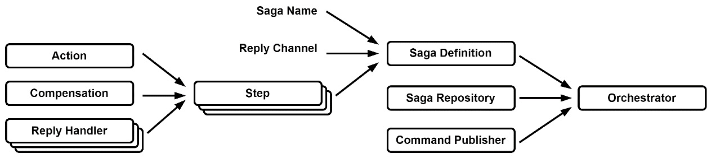

Figure 8.10 – How the SEC Components Come Together

Much of this might seem novel or new if you are not very familiar with this pattern, so let’s take a closer look at the three main parts of this implementation.

## Using Generics in the SEC

The implementations in the **sec** package make use of **generics** to allow the saga data payload to be used with ease in the actions and the **Reply** handlers that will need to be maintained in the application.

## The Orchestrator

The primary job of our **Orchestrator** implementation is to handle the incoming replies so that it can determine which step to execute, as well as when to fail over and begin compensating.

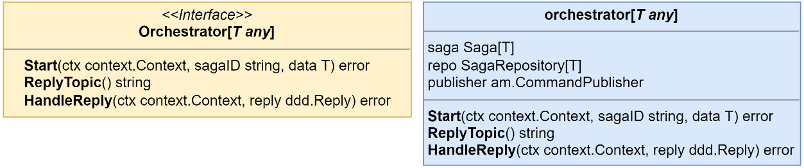

Figure 8.11 – The Orchestrator Interface and Struct Definition

The **Orchestrator** has two modes of operation – a **manual start** and being **reactive** to the incoming replies that it receives. When a reply comes in, the outcome is looked at before determining which kind of action is executed on the current or next possible step. After executing the action, if a **Command** is returned, the **Orchestrator** will publish this **Command** to its destination.

## The Saga Definition

The purpose of the **Saga** definition is to provide a single location for all of the logic on how the saga should operate.

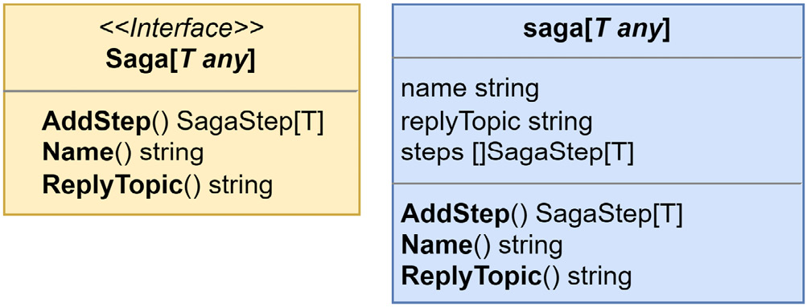

Figure 8.12 – The Saga Interface and Definition

Our **Saga** exists to hold the specifics and logic of the operation that needs to be distributed across the application. Each **Saga** that is running in the application will have a unique name and reply channel. Likewise, the sequence of steps will be unique to the saga definition, but the individual steps might not be.

## The Steps

**Steps** are where all the logic of a **Saga** is contained. They generate the **Command** messages that are sent to participants and can modify the data for the associated saga.

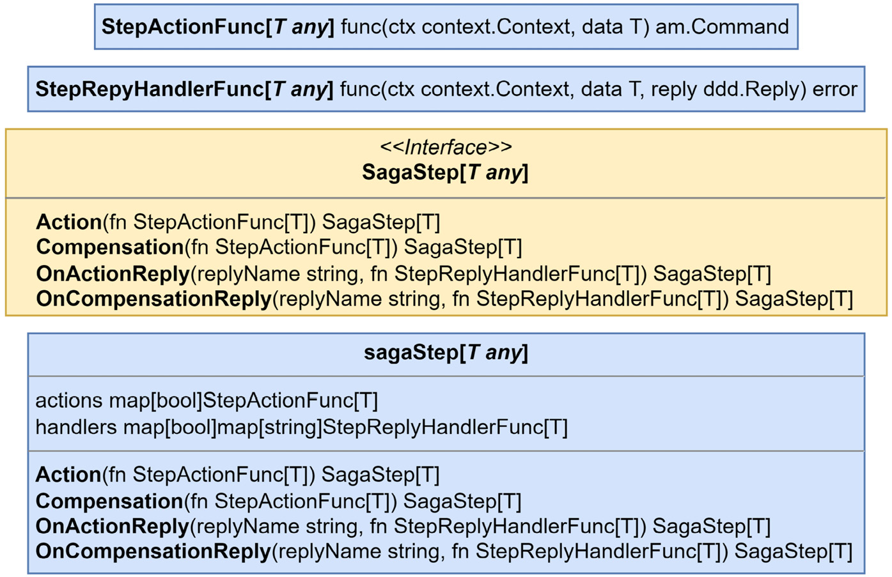

Figure 8.13 – The Saga Steps Interface and Definitions

Each **Step** has, at a minimum, either an **action** or **compensating action** defined, though a **Step** may also have both defined as well. **Steps** may add optional handlers for the **replies** that are being sent back by the participants to apply custom logic to them.

After the **Orchestrator** is started or has processed a **Reply**, it will look for the next **Step** in the sequence that has defined an action for the given direction. **Steps** without any compensation actions will be skipped until either one is found or there are no more steps.

With that, we have the necessary functionality to convert the order creation process into an orchestrated saga. Let’s take a look.

# Converting the Order Creation Process to Use a Saga

In this section, we will be implementing the **create order** process described earlier in this chapter as an orchestrated saga method. To do so, we will use the **SEC** from the previous section. We will be doing the following to accomplish this task:

- Updating the modules identified as participants to add new streams, handlers, and commands
- Creating a new module called **cosec**, short for **Create-Order-Saga-Execution-Coordinator**, that will be responsible for orchestrating the process of creating new orders

Let’s begin by learning how to add commands.

## Adding Commands to the Saga Participants

The existing **CreateOrder** command for the application in the **Order Processing** module looks like this:

# Example: Order Creation Command Handling

The following is an example of handling the **CreateOrder** command in the **Order Processing** module. This logic orchestrates the creation of a new order by interacting with other modules like **Customers**, **Payments**, and **Shopping**. The individual steps of the order creation process are outlined below:

```go
order, err := h.orders.Load(ctx, cmd.ID)

// 1. authorizeCustomer
err = h.customers.Authorize(ctx, cmd.CustomerID)
if err != nil { return err }

// 2. validatePayment
err = h.payments.Confirm(ctx, cmd.PaymentID)
if err != nil { return err }

// 3. scheduleShopping
shoppingID, err = h.shopping.Create(ctx, cmd.ID, cmd.Items)
if err != nil { return err }

// 4. orderCreation
err = order.CreateOrder(
    cmd.ID, cmd.CustomerID, cmd.PaymentID,
    shoppingID, cmd.Items,
)
if err != nil { return err }

return h.orders.Save(ctx, order)
```

# Reimplementing Order Creation as a Saga

We will use the sequence of steps from the **orchestrated saga** discussed earlier to reimplement the previous listing as a **Saga**. The goal is to manage the creation of a new order using distributed transactions with sagas.

## Participants and Commands

To create a new order, we need to introduce new **Command** messages for each participant module:

- **Customers module**: Implement the `AuthorizeCustomer` command.
- **Depot module**: Implement the `CreateShoppingList`, `CancelShoppingList`, `InitiateShopping` commands, along with the reply from `CreatedShoppingList`.
- **Order Processing module**: Implement the `ApproveOrder` and `RejectOrder` commands.
- **Payments module**: Implement the `ConfirmPayment` command.

Many of these commands already have existing gRPC equivalents, so we can reuse the current application instances in each module to implement them.

### The Customers Module

The **Customers module** only requires one command, which is the `AuthorizeCustomer` command. We need to define a new protocol buffer message for it:

```protobuf
message AuthorizeCustomer {
  string id = 1;
}
```

### Adding Constants for the Customers Module

Just like we did for events, we will define a constant for the `AuthorizeCustomerCommand`. This constant will hold the unique name for the command and be used in its `Key()` method to register the type in the command registry.

Along with the constant for the command name, we also need to define a constant for the **command channel** for this module:

```go
// Define the command name constant
const AuthorizeCustomerCommand = "mallbots.customers.commands.AuthorizeCustomer"

// Define the command channel constant
const CommandChannel = "mallbots.customers.commands"
```

# Command Channel for Each Module

We will only need one Command channel for each module compared to the many possible channels that we created for the aggregates we published events to.

Our command handler will reside in the `commands.go` file in the `customers/internal/handlers` directory and will implement `ddd.CommandHandler[ddd.Command]`. It will also take advantage of the existing application command to authorize a customer.

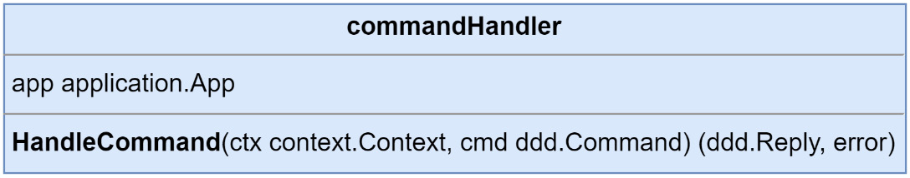

Figure 8.14 – The Customers Module’s Command Handler Definition

We can handle the incoming commands in much the same way as we handled the event handlers in the previous chapters:

```go
func (h commandHandlers) HandleCommand(
    ctx context.Context, cmd ddd.Command,
) (ddd.Reply, error) {
    switch cmd.CommandName() {
    case customerspb.AuthorizeCustomerCommand:
        return h.doAuthorizeCustomer(ctx, cmd)
    }
    return nil, nil
}

func (h commandHandlers) doAuthorizeCustomer(
    ctx context.Context, cmd ddd.Command,
) (ddd.Reply, error) {
    payload := cmd.Payload()
        .(*customerspb.AuthorizeCustomer)
    return nil, h.app.AuthorizeCustomer(
        ctx,
        application.AuthorizeCustomer{
            ID: payload.GetId(),
        },
    )
}
```

# doAuthorizeCustomer() Method and Command Handler Registration

The `doAuthorizeCustomer()` method does not return any specific replies—only the generic `Success` and `Failure` ones. In the highlighted section of code, `nil` is being returned as the `Reply` value, and the result returned from `AuthorizeCustomer()` will be used to determine the outcome of handling the message. When that result is an error, a `Failure` reply will be generated and returned.

In the same file, to make using the handlers easier, we can add a constructor and a function to register them:

```go
func NewCommandHandlers(
    app application.App,
) ddd.CommandHandler[ddd.Command] {
    return commandHandlers{
        app: app,
    }
}

func RegisterCommandHandlers(
    subscriber am.CommandSubscriber,
    handlers ddd.CommandHandler[ddd.Command],
) error {
    cmdMsgHandler := am.CommandMessageHandlerFunc(
        func(
            ctx context.Context,
            cmdMsg am.IncomingCommandMessage,
        ) (ddd.Reply, error) {
            return handlers.HandleCommand(ctx, cmdMsg)
        })
    return subscriber.Subscribe(
        customerspb.CommandChannel,
        cmdMsgHandler,
        am.MessageFilter{
            customerspb.AuthorizeCustomerCommand,
        },
        am.GroupName("customer-commands"),
    )
}

```

# Command Handler Usage and Module Setup

This command handler can be used for any commands and is not limited to only handling the commands coming from the create order saga. The `Customers` module remains uncoupled from the `Order Processing` module because we do not have any explicit ties to the `Order Processing` module in this handler. If we had other unrelated commands, we would also have them handled here in this command handler.

In the `module.go` file located at the root of the `Customers` module, we need to create a new Command stream, an instance of the Command handlers, and register the two together:

```go
// setup Driven adapters
stream := jetstream.NewStream(mono.Config().Nats.Stream,
    mono.JS(), mono.Logger())
commandStream := am.NewCommandStream(reg, stream)

// setup application
commandHandlers := logging.LogCommandHandlerAccess[
    ddd.Command](
    handlers.NewCommandHandlers(app),
    "Commands", mono.Logger(),
)

// setup Driver adapters
err = handlers.RegisterCommandHandlers(
    commandStream, commandHandlers,
)

```

# One Module Down, Three to Go!

Thankfully, the work is going to be roughly the same for the remaining three modules:

1. Define the commands, along with a constant containing the command channel for the module.
2. Create a command handler for the commands.
3. Wire up all the new things together in the composition root for the module.

Now, let’s look at the Depot module.

## The Depot Module

The Depot module has three commands and a reply that we need to define. `CreateShoppingList` is a slightly interesting protocol buffer message:

```protobuf
message CreateShoppingList {
    message Item {
        string product_id = 1;
        string store_id = 2;
        int32 quantity = 3;
    }
    string order_id = 1;
    repeated Item items = 2;
}

```

# The Depot Module - CreateShoppingList Command

What is interesting is that it is not a copy of the `OrderCreated` event from the Order Processing module. First, we do not have a `ShoppingId` that can be added yet. Second, we don’t need to be generic and include requirements for data we don’t need for a command in the Depot module. Something that’s maybe not all that interesting but worth pointing out is that we did not copy and paste this message, forcing us to do unnecessary work.

The `CreateShoppingList` command, when successfully handled, will return a `Reply` with the identity of the newly created shopping list:

```protobuf
message CreatedShoppingList {
    string id = 1;
}

```

# Handling the CreateShoppingList Command

Since this Command returns a specific `Reply`, this means we do not handle it as we did in the `Customers` module for `AuthorizeCustomer`:

```go
func (h commandHandlers) doCreateShoppingList(
    ctx context.Context, cmd ddd.Command,
) (ddd.Reply, error) {
    payload := cmd.Payload().(*depotpb.CreateShoppingList)
    id := uuid.New().String()
    // snip build items ...
    err := h.app.CreateShoppingList(
        ctx,
        commands.CreateShoppingList{
            ID:      id,
            OrderID: payload.GetOrderId(),
            Items:   items,
        },
    )
    return ddd.NewReply(
        depotpb.CreatedShoppingListReply,
        &depotpb.CreatedShoppingList{Id: id},
    ), err
}

```

This time, we return `CreatedShoppingListReply` and a possible error. Admittedly, this is another shortcut, but if there was an error, then the `Reply` message we send will not be handled unless there is also a handler for it that was added to the compensating side.

## The Order Processing Module

The two commands that we are using in the `Order Processing` module do not have existing gRPC or application command implementations, so we will need to add them to the application.

For the `ApproveOrder` command, we will be receiving `ShoppingID` from the Depot module, which it sends back in its `CreatedShoppingList` Reply message. For `RejectOrder`, the content is simply the identity of the order that was being created and now needs to be rejected.

If you have forgotten how we implemented application commands for the `Order Processing` module, here is a quick refresher by way of the `ApproveOrder` command in the `ordering/internal/application/commands` directory:

```go
type ApproveOrder struct {
    ID         string
    ShoppingID string
}

type ApproveOrderHandler struct {
    orders   domain.OrderRepository
    publisher ddd.EventPublisher[ddd.Event]
}

func NewApproveOrderHandler(
    orders domain.OrderRepository,
    publisher ddd.EventPublisher[ddd.Event],
) ApproveOrderHandler {
    return ApproveOrderHandler{
        orders:   orders,
        publisher: publisher,
    }
}

func (h ApproveOrderHandler) ApproveOrder(
    ctx context.Context, cmd ApproveOrder,
) error {
    order, err := h.orders.Load(ctx, cmd.ID)
    event, err := order.Approve(cmd.ShoppingID)
    err = h.orders.Save(ctx, order)
    return h.publisher.Publish(ctx, event)
}
```

This command handler is plugged into the `application.Commands` interface and the `application.appCommands` struct with initialization in the `Application` constructor. This makes it available to the command message handler, as well as to the gRPC server if we decide to add it there as well.

We can add the parts that handle the command messages by completing the same steps we did for the last two modules. Here, we must define the commands and handlers and update the composition root to bring it all together.

## The Payments Module

There is nothing noteworthy about adding command message handlers to the `Payments` module since I covered all the unusual cases in the previous three module sections.

I will close out this section with a checklist for adding command handlers to a module:

1. Add Command and Reply protocol buffer message declarations.
2. Create name constants for each Command and Reply.
3. Create the `Key()` methods for each Command and Reply.
4. Include each Command and Reply in the `Registrations()` function.
5. Create new application commands if they are not already implemented.
6. Create a command message handler and handle each command.
7. Update the composition root to create a command stream.
8. Update the composition root to create an instance of the command handlers.
9. Update the composition root to register the handlers with the stream.

After the `Payments` module has been updated to handle commands, we are ready to orchestrate the modules together to create our orders.

## Implementing the Create Order Saga Execution Coordinator

Creating an order in the `Order Processing` module is triggered by the `BasketCheckOut` event. We can continue to do that in `Order Processing`. In this section, we will be implementing the saga in a new module called `cosec` that will be reactive to the `OrderCreated` event from the `Order Processing` module.

### Why Not Trigger the Saga Off the BasketCheckedOut Event?

We could have, and it would work mostly the same with maybe an additional step or alternate action or two. I will leave reimplementing the Saga that way as an exercise for you.

## Registering All the External Types

The saga will be sending commands and receiving replies from a handful of modules. So, in the composition root in the Driven adapters section, after the registry has been created, we have the following:

```go
err = orderingpb.Registrations(reg)
if err != nil { return }
err = customerspb.Registrations(reg)
if err != nil { return }
err = depotpb.Registrations(reg)
if err != nil { return }
err = paymentspb.Registrations(reg)
if err != nil { return }
```

Each module that participates in the saga can be seen in the preceding code. This makes all the commands and replies available to use. If we were implementing a choreographed saga, then these external module registrations would need to be included in all the correct places, which could potentially be a bit of a maintenance nightmare.

## Defining the Saga Data Model

Our saga will need to keep track of the order and other related facts. Below is the definition of the data model that our saga will use.

### `CreateOrderData`

This struct represents the data associated with creating an order, including the unique identifiers for various related entities and other important information like the items being ordered and the total price.

```go
type CreateOrderData struct {
    OrderID    string  // Unique identifier for the order
    CustomerID string  // Unique identifier for the customer
    PaymentID  string  // Unique identifier for the payment
    ShoppingID string  // Unique identifier for the shopping process
    Items      []Item  // List of items being ordered
    Total      float64 // Total cost of the order
}

type Item struct {
    ProductID string  // Unique identifier for the product
    StoreID   string  // Unique identifier for the store
    Price     float64 // Price of the item
    Quantity  int     // Quantity of the item in the order
}
```

The CreateOrderData struct will be used in all those places where generics were used in the sec package.

### Adding the saga repository

The saga repository works a little like AggregateRepository, where there is an infrastructure-specific store implementation that we will use to read and write the data:

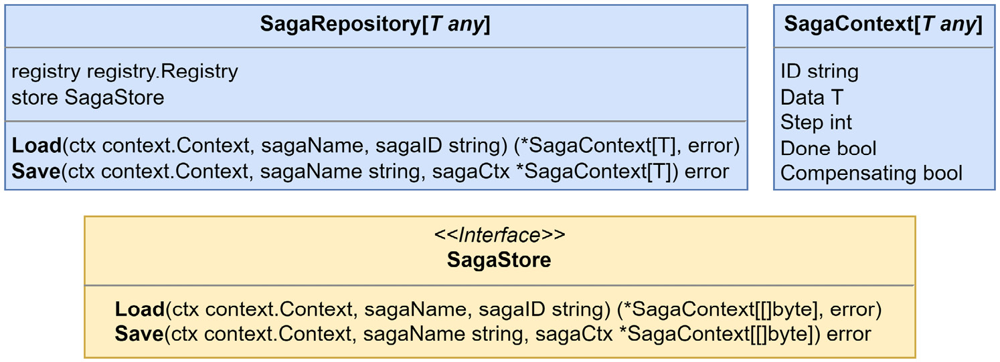

Figure 8.15 – The saga repository definition, store interface, and context model

For PostgreSQL, we are using the following table schema:

```sql
CREATE TABLE cosec.sagas (
 id           text    NOT NULL,
 name         text    NOT NULL,
 data         bytea   NOT NULL,
 step         int     NOT NULL,
 done         bool    NOT NULL,
 compensating bool    NOT NULL,
 updated_at   timestamptz NOT NULL DEFAULT
  CURRENT_TIMESTAMP, PRIMARY KEY (id, name)
);
```

We must use the following few lines to create the store and repository in our composition root:

```go
sagaStore := pg.NewSagaStore("cosec.sagas", mono.DB(), reg)
sagaRepo := sec.NewSagaRepository[*models.CreateOrderData](
    reg, sagaStore,
)

```

The saga data generic is defined with a pointer so that it can be modified by the functions we will be adding to the saga steps.

### Defining the saga

To define the saga, we need to set the saga name, the saga reply channel, and the steps that are involved with the operation we want to run. Without showing the steps and related methods, this is how the saga is created:

```go
const CreateOrderSagaName     = "cosec.CreateOrder"
const CreateOrderReplyChannel = "mallbots.cosec.replies"

type createOrderSaga struct {
    sec.Saga[*models.CreateOrderData]
}

func NewCreateOrderSaga() sec.Saga[*models.CreateOrderData] {
    saga := createOrderSaga{
        Saga: sec.NewSaga[*models.CreateOrderData](
            CreateOrderSagaName,
            CreateOrderReplyChannel,
        ),
    }
    // steps go here
    return saga
}

```

We can define the saga using the Builder pattern ([refactoring.guru - Builder](https://refactoring.guru/design-patterns/builder/go/example)). This would look something like this in an extreme case:

```go
saga.AddStep().
    Action(actionCommandFn).
    ActionReply("some.Reply", onSomeReplyFn).
    ActionReply("other.Reply", onOtherReplyFn).
    Compensation(compensationCommandFn).
    CompensationReply("nope.Reply", onNopeReply)

```

The preceding example demonstrates each possible modification that can be made to a step. Steps may have many reply handlers:

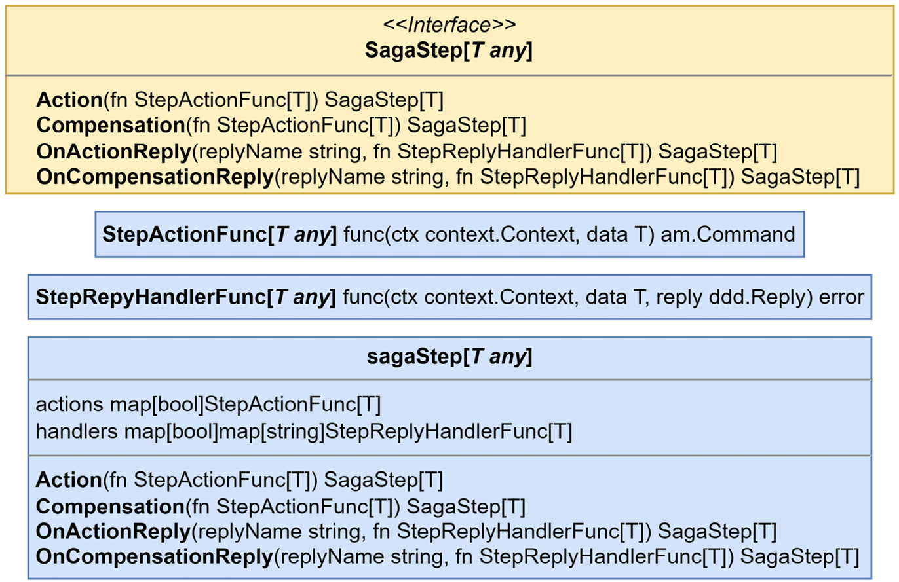

Figure 8.16 – The SagaStep interface and related types

For the create order saga, the following steps must be defined:

```go
// 0. -RejectOrder
saga.AddStep().
    Compensation(saga.rejectOrder)
// 1. AuthorizeCustomer
saga.AddStep().
    Action(saga.authorizeCustomer)
// 2. CreateShoppingList, -CancelShoppingList
saga.AddStep().
    Action(saga.createShoppingList).
    OnActionReply(
        depotpb.CreatedShoppingListReply,
        saga.onCreatedShoppingListReply,
    ).
    Compensation(saga.cancelShoppingList)
// 3. ConfirmPayment
saga.AddStep().
    Action(saga.confirmPayment)
// 4. InitiateShopping
saga.AddStep().
    Action(saga.initiateShopping)
// 5. ApproveOrder
saga.AddStep().
    Action(saga.approveOrder)
```

We can use the methods defined on the saga so that our data is typed for us properly, as shown in the following `onCreatedShoppingListReply` method:

```go
func (s createOrderSaga) onCreatedShoppingListReply(
    ctx context.Context,
    data *models.CreateOrderData,
    reply ddd.Reply,
) error {
    p := reply.Payload().(*depotpb.CreatedShoppingList)
    data.ShoppingID = p.GetId()
    return nil
}

```

The Reply payloads will still need to be cast to the correct types before you can work with them.

The methods provided to `Action()` and `Compensation()` generate the commands that our saga participants must carry out for us. For an example of an action, we can look at the `confirmPayment()` method that is used to generate and send the command to confirm that the payment was authorized properly:

```go
func (s createOrderSaga) confirmPayment(
    ctx context.Context, data *models.CreateOrderData,
) am.Command {
    return am.NewCommand(
        paymentspb.ConfirmPaymentCommand, // command name
        paymentspb.CommandChannel, // command destination
        &paymentspb.ConfirmPayment{ // command payload
            Id:   data.PaymentID,
            Amount: data.Total,
        },
    )
}

```

The `ConfirmPaymentCommand` command in the preceding code is intended for the Payments module. It is defined in that module because our orchestrator does not own the commands that it publishes. A module’s commands and replies should be documented alongside its published and subscribed events.

### Creating the message handlers

As I said at the start of this section, we will be listening for the `OrderCreated` integration event from the Order Processing module as our trigger. The design of the actual handler itself is just like the others, but we start a saga instead of creating a data cache or executing some application command:

```go
func (h integrationHandlers[T]) onOrderCreated(
    ctx context.Context, event ddd.Event,
) error {
    payload := event.Payload().(*orderingpb.OrderCreated)
    // compute items and total
    data := &models.CreateOrderData{
        OrderID:  payload.GetId(),
        CustomerID: payload.GetCustomerId(),
        PaymentID: payload.GetPaymentId(),
        Items:   items,
        Total:   total,
    }
    return h.orchestrator.Start(ctx, event.ID(), data)
}

```

The preceding code starts the saga, which as its first action will locate the next step it should execute and then run it. The orchestrator does not keep the sagas running or in memory. After each interaction, the orchestrator will write the saga context into the database and return it to the reply message handler; as I mentioned earlier, they are reactive.

This is made clear with the following code, which registers the orchestrator as a reply message handler:

```go
func RegisterReplyHandlers(
    subscriber am.ReplySubscriber,
    o sec.Orchestrator[*models.CreateOrderData],
) error {
    h := am.MessageHandlerFunc[am.IncomingReplyMessage](
        func(
            ctx context.Context,
            replyMsg am.IncomingReplyMessage,
        ) error {
            return o.HandleReply(ctx, replyMsg)
        },
    )
    return subscriber.Subscribe(
        o.ReplyTopic(),
        h,
        am.GroupName("cosec-replies"),
    )
}

```

The orchestrator handler replies directly, so it is not necessary to create another reply handler intermediary in the module’s composition root. We only need a handler for the reply message that calls the orchestrator to handle the reply.

### Updating the composition root

Back in the composition root, we need to create streams for all the messages we intend to receive, including events, commands, and replies:

```go
stream := jetstream.NewStream(
    mono.Config().Nats.Stream, mono.JS(), mono.Logger(),
)
eventStream := am.NewEventStream(reg, stream)
commandStream := am.NewCommandStream(reg, stream)
replyStream := am.NewReplyStream(reg, stream)

```

This module will not have an application like the rest of the existing modules, but we must still create the necessary handlers:

```go
orchestrator := logging.LogReplyHandlerAccess[
    *models.CreateOrderData](
    sec.NewOrchestrator[*models.CreateOrderData](
        internal.NewCreateOrderSaga(),
        sagaRepo,
        commandStream,
    ),
    "CreateOrderSaga", mono.Logger(),
)

integrationEventHandlers := logging.LogEventHandlerAccess[
    ddd.Event](
    handlers.NewIntegrationEventHandlers(orchestrator),
    "IntegrationEvents", mono.Logger(),
)

```

Now, these handlers need to be wired up with the streams that will be driving them:

```go
err = handlers.RegisterIntegrationEventHandlers(
    eventStream, integrationEventHandlers,
)
if err != nil { return err }

err = handlers.RegisterReplyHandlers(
    replyStream, orchestrator,
)
if err != nil { return err }

```

That’s it – we have a working orchestrator and saga that will coordinate the creation of new orders. Here, we created a new module that will have an orchestrator running that will take care of the distributed operation that creates new orders.

This orchestrator did not need to have its own module – it would work just the same had it been built inside the Order Processing module. I simply chose to implement it in a module on its own so that the demonstration was clearer, and so that no details got lost in the other details of the existing module.

The existing `CreateOrderHandler.CreateOrder()` method in the Order Processing module still needs to be updated. When executing its tasks, it should no longer make any calls to external systems. This can be seen in the following code with error handling removed:

```go
func (h CreateOrderHandler) CreateOrder(ctx
    context.Context, cmd CreateOrder) error {
    order, _ := h.orders.Load(ctx, cmd.ID)
    event, _ := order.CreateOrder(
        cmd.ID, cmd.CustomerID, cmd.PaymentID, cmd.Items,
    )
    _ = h.orders.Save(ctx, order)
    return h.publisher.Publish(ctx, event)
}

```

Now, without any calls to external services, creating an order is much more resilient. The saga is also more resilient, which means it will not be bothered by a service being down; so long as it eventually comes back up, the saga will also eventually get back to executing the steps it needs to.

### Summary

In this chapter, we learned about the challenges that you may face when working with distributed systems and dealing with work or operations that cannot be accomplished by a single component and must also be distributed. We looked at three methods and how their distributed workflows can be implemented – 2PCs, choreographed sagas, and orchestrated sagas. Finally, we implemented the existing create order operation using an orchestrated saga, which resulted in a more resilient process.

In the next chapter, we will learn how to improve resiliency for the entire system. To do so, we will learn about the different transactional boundaries that exist in distributed systems and more.
