# 9. Transactional Messaging

In this book, we have transformed an application into an asynchronous one, which removes a lot of issues that arose from the tightly coupled and temporally bound nature of synchronous communication. Nearly all communication in the application is now made with a message brokered through NATS JetStream, providing loose coupling for the application components. However, despite all the advances we have made, we still face issues that all distributed systems suffer from.

In this chapter, we are going to discuss the following main topics:

- Identifying problems faced by distributed applications
- Exploring transactional boundaries
- Using an Inbox and Outbox for messages
- Technical requirements

You will need to install or have installed the following software to run the application or to try the examples:

- The Go programming language, version 1.18+
- Docker

The code for this chapter can be found at [GitHub Repository](https://github.com/PacktPublishing/Event-Driven-Architecture-in-Golang/tree/main/Chapter09).

## Identifying problems faced by distributed applications

In every distributed application, there are going to be places where interactions take place between components that reside in different bounded contexts or domains. These interactions come in many forms and can be synchronous or asynchronous. A distributed application could not function without a method of communication existing between the components.

In the previous chapter, we looked at some different ways, such as using sagas, to improve the overall reliability of complex operations that involve multiple components. The reliability we added is at the operation level and spans multiple components, but it does not address reliability issues that happen at the component level.

Let’s take a look at what affects reliability in synchronous and asynchronous distributed applications and what can be done to address the problem.

### Identifying problems in synchronous applications

In the first version of the MallBots application from much earlier in the book, we only had synchronous communication between the components, and that looked something like this:

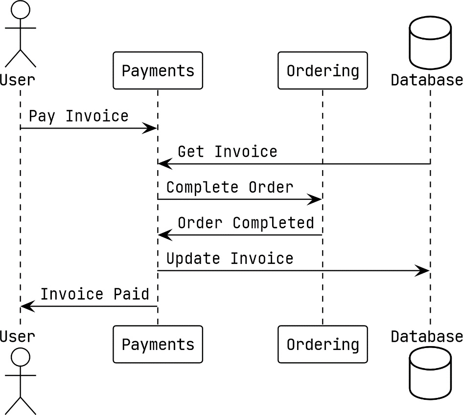

Figure 9.1 – Synchronous interaction between the Payments and Ordering modules

In the preceding example, the Payments module receives a request for an invoice to be marked as paid. When an invoice is to be paid, a synchronous call is made to the Ordering module to also update the order status to Completed. Before returning to the user, the updated invoice is saved back into the database.

### Identifying problems in asynchronous applications

After fully updating the application to use asynchronous communication, we see that the same action now looks like this:

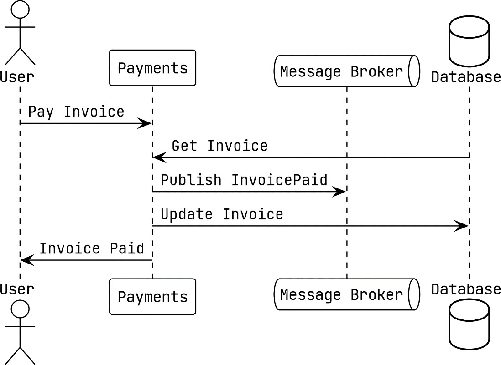

Figure 9.2 – Asynchronous interactions of the Payment module

In the updated version of the Pay Invoice action, we publish the `InvoicePaid` event instead of calling the Ordering module directly. The Ordering module is listening for this event, and when it receives the event, it will take the same action as before.

In both implementations, we can run into problems if the updated invoice data is not saved in the database. Also, for both implementations, you might think that a solution such as making a second call to the Ordering module or publishing an event to revert the change might help. However, there are a number of things that would make that solution improbable:

- The Ordering module has made or triggered irreversible modifications
- The second call or published event could also fail
- The failure is exceptional and there is no opportunity to take any corrective action

Adopting an asynchronous event-driven approach has not necessarily made the situation any better. In fact, things might be worse off now. When we publish the `InvoicePaid` event, we no longer directly know who has consumed the event and which other changes have happened as a result.

This is called a **dual write problem**, and it will exist everywhere we make a change in the application state that requires the change to be split in two or more places. When a write fails while multiple writes are being made, the application can be left in an inconsistent state that can be difficult to detect.

### Examining potential ways to address the problem

Sagas provide distributed transaction-like support for applications, and when an error occurs, they can be compensated. Using a small two-step saga might help here, but sagas are an operation consistency solution and not a component consistency solution. They cannot help with recovering a missing message or missing write in the database. That would be like using a sledgehammer to swat a fly.

Reordering the writes so that the more likely-to-fail write happens first does leave the more reliable ones to follow, but swapping the order of the writes will not help because the second write to whichever destination it is can always fail. Unless the action that is reordered to happen first is of little to no consequence, reordering the actions is not going to really be of any help.

Writing everything into the database while using a transaction could help if everything we were writing was in the database. However, in both of our examples, we are dealing with either a gRPC call or the publishing of a message. If we could convert all of our writes into ones that could be directed at our database, this approach would hold some promise.

### The singular write solution

If writing into multiple destinations is the problem, then it is reasonable to think that writing to a single destination could be a solution. Even more important than having a single write is that we need to have a single transactional boundary around what we will be writing.

We need a mechanism to make sure that the messages we publish must be added to the database in addition to or instead of being sent to NATS JetStream. We also need a way to create a single transaction boundary for this write to take place in. This means that for our application, we must create a transaction in PostgreSQL, into which we will put our writes in order to combine them into a single write operation.

This is called the **Transactional Outbox pattern**, or sometimes just the **Outbox pattern**. With it, we will be writing the messages we publish into a database alongside all of our other changes. We will be using a transaction so that the existing database changes that we would normally be making, and the messages, are written atomically. To do this, we will need to make the following changes to the modules:

- Setting up a single database connection and transaction that is used for the lifetime of an entire request
- Intercepting and redirecting all outgoing messages into the database

With these two items, we have our plan. First up, we will look at the implementation of a transactional boundary around each request, followed by the implementation of a transactional outbox.

### Exploring transactional boundaries

Starting with the more important part first, we will tackle how to create a new transaction for each request into our modules, whether these come in as messages, a gRPC call, or the handling of a domain event side effect. As we are using grpc-gateway, all of the HTTP requests are proxied to our gRPC server and will not need any special attention.

Creating a transaction is not the difficult part. The challenge will be ensuring the same transaction is used for every database interaction for the entire life of the request. With Go, our best option is going to involve using the **context** to propagate the transaction through the request. Before going into what that option might look like, we should also have a look at some of the other possible solutions:

1. We can toss out the option of using a global variable right away. Beyond being a nightmare to test, they will also become a problem to maintain or refactor as the application evolves.
2. A new parameter could be added to every method and function to pass the transaction along so that it can eventually be passed into the repositories and stores. This option, in my opinion, is completely out of the question because the application would become coupled to the database. It also would go against the clean architecture design we are using and make future updates more difficult.
3. A less ideal way to use a context with a transaction value within it would be to modify each of our database implementations to look for a transaction in the provided context. This would require us to update every repository or store and require all new implementations to look for a transaction. Another potential problem with this is we cannot drop in any third-party database code because it will not know to look for our transaction value.
4. A more ideal way to use the context, in my opinion, is to create a repository and store instances when we need them and to pass in the transaction using a new interface in place of the `*sql.DB` struct we are using now. Using a new interface will be easy and will result in very minimal changes to the affected implementations. Getting the repository instances created with the transactions will be handled by a new **dependency injection (DI)** package that we will be adding. The approach I am going to take will require a couple of minor type changes in the application code with the rest of the changes all made to the composition roots and entry points.

### How the implementation will work

A new DI package will be created so that we can create either singleton instances for the lifetime of the application or scoped instances that will exist only for the lifetime of a request. We will be using a number of scoped instances for each request so that the transactions we use can be isolated from other requests.

Before jumping further into how this implementation works, I should mention that this approach is not without a couple of downsides. The first is from the jump in complexity that using a DI package brings to the table. We will also be making use of a lot of type assertions because the container will be unaware of the actual types it will be asked to deliver.

Most of the updates will be made to the composition roots, which I believe softens the impact of those downsides somewhat.

Our implementation is going to require a new DI package. We will want the package to provide some basic features such as the management of scoped resources so that we can create our transactional boundaries.

# The di package

The `internal/di` package will provide a container that will be used to register factory functions for singletons and scoped values, as illustrated in the following screenshot:

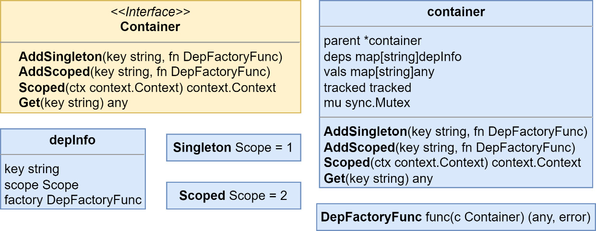

Figure 9.3 – The container type, interface, and dependencies

At the center of the `di` package is the container, which is accessed everywhere using the exported interface of the same name. In the composition roots, we will initialize a new container and then use the `AddSingleton()` and `AddScoped()` methods with factories for every dependency we will require.

In the handler code, we will be using the `Scoped()` function, which takes in a context and returns a new context with the container added as a value. It will be these contexts that will enable us to call upon resources created on a per-request basis.

There is also a `di.Get()` function that is used to fetch values from the container inside the contexts:

```go
Get(ctx context.Context, key string) any
```

# The `di` Package: Container Setup and Usage

The values returned by either `Get()` will need to be typecast before they are used. Both the `di.Get()` function and the `Get()` method on the container will panic if the key provided has not been registered. The reason the two will panic is that this is essentially the same as the startup code, which should halt the application to keep it from running in an invalid state.

Now that we are aware of what the `di` package will offer, we can learn more about the purposes of each part, starting with the containers.

## Setting up a Container

To set up a new container, we use the `di.New()` function to create one and then use either `AddSingleton()` or `AddScoped()` to add our dependencies:

```go
container := di.New()
container.AddSingleton("db",
    func(c di.Container) (any, error) {
        return mono.DB(), nil
    },
)
container.AddScoped("tx",
    func(c di.Container) (any, error) {
        db := c.Get("db").(*sql.DB)
        return db.Begin()
    },
)
```

# Setting the Lifetime of Dependencies

I am choosing to use the short type assertion syntax when I use `Get()` here. I skip the type assertion checks since they are used so often that simple test runs would reveal problems if the wrong types were used.

## Registering Dependencies

To register a dependency, you will use either `AddSingleton()` or `AddScoped()` with a string for the key or dependency name, and a factory function that returns either the dependency or an error. You can continue to build dependencies as a graph using the container value that is passed in. Here’s an example of building a repository instance using the database:

```go
repo := container.AddScoped("some-repo",
    func(c di.Container) (any, error) {
        db := c.Get("db").(*sql.DB)
        return postgres.NewSomeRepo(db), nil
    },
)
```

# Dependency Groups: Singleton vs Scoped

Dependencies are grouped into two buckets:

- **Singleton instances** that are created once for the lifetime of the application. The same instance will be provided to each call for that dependency.
- **Scoped instances** that will be recreated the first time they are called up for each new scope. When the scope is no longer needed, the scoped instances will be available for garbage collection.

Here is a look at how the singleton and scoped instances along with the container will be used in the composition root after we are done transforming it:

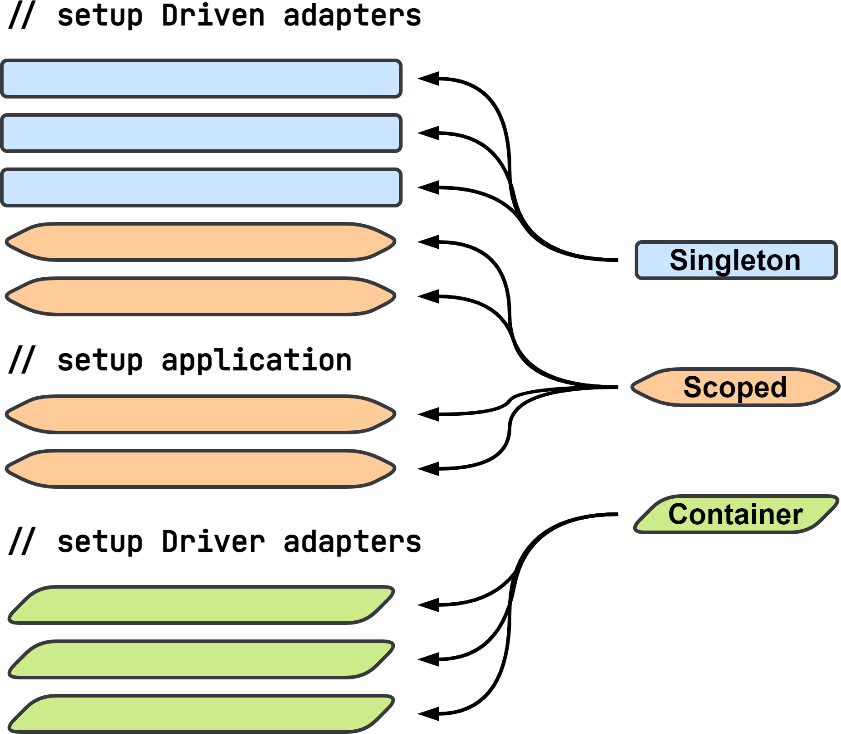

Figure 9.4 – Dependency and Container Usage in the Composition Root

When we are done updating the composition root, the driven adapters section will be a mix of singletons and scoped dependencies. The application section will be entirely made up of scoped dependencies, and the driver adapters section will be updated to use the container instead of any dependencies directly.

## Using Scoped Containers

We will use the `Scoped()` method to create a new child container that is then added as a value to the context provided to `Scoped()`. The current container is added to the child container as its parent container. The parent container will be used to locate singleton dependencies. The returned context should be passed into everything to propagate the container throughout the request. The code is illustrated in the following snippet:

```go
container := di.New()
container.AddSingleton("db", dbFn)
container.AddScoped("tx", txFn)

db1 := container.Get("db")
tx1 := container.Get("tx")

ctx := container.Scoped(context.Background())

db2 := di.Get(ctx, "db") // same instance as db1
tx2 := di.Get(ctx, "tx") // entirely new instance
```

# Dependencies: Singleton vs Scoped Behavior

Dependencies that we have declared as **singletons** will always return the same instance for every call. **Scoped** dependencies will return a new instance for each scope they are needed in. A second call for a scoped dependency—for example, the `tx` dependency—from the same scoped container will return the same instance as the first call.

## Updating the Depot Module with Dependency Containers

Using the `di` package in each of the modules is going to be the same, but for the examples of what needs to be updated, I am going to use the Depot module. I have chosen the Depot module because it uses every kind of event and message handler.

We first create a new container at the start of the composition root `Startup()` method, like so:

```go
func (Module) Startup(
    ctx context.Context, mono monolith.Monolith
) (err error) {
    container := di.New()
    // Further setup code...
}
```

# Updating the Composition Root: Three Key Parts

In the composition root, we will tackle the changes in three parts:

1. The **driven adapters** need to be divided up into singleton and scoped dependencies.
2. The **application** and **handlers** need to be made into dependencies.
3. Finally, we will update the **servers** or **handler registration** functions to use the container to create new instances of the application as needed for each request.

Let us explore this further.

## Driven Adapters

The factories we use for dependencies, such as the registry, will include the initialization code so that we continue to only execute it the one time, as shown here:

```go
container.AddSingleton("registry",
    func(c di.Container) (any, error) {
        reg := registry.New()
        err := storespb.Registrations(reg)
        if err != nil { return nil, err }
        err = depotpb.Registrations(reg)
        if err != nil { return nil, err }
        return reg, nil
    },
)
```

# Driven Adapters: Turning Adapters into Singleton Dependencies

We can go down the line of adapters, turning each one into a singleton dependency until we reach the point where we need to create a `shoppingLists` dependency:

```go
shoppingLists := postgres.NewShoppingListRepository(
    "depot.shopping_lists",
    mono.DB(),
)
```

# Scoped Dependencies: Handling Transactions

We want to use a transaction for this table and for all the others, but we cannot simply replace the database connection with a transaction. The following factory would not work out how we’d expect it to:

```go
container.AddScoped("shoppingLists",
    func(c di.Container) (any, error) {
        return postgres.NewShoppingListRepository(
            "depot.shopping_lists",
            mono.DB().Begin(),
        ), nil
    },
)
```

# Scoped Dependencies: Correctly Using Transactions

Granted, the prior listing would create a new transaction every time we created this dependency for the scope. However, only the `shoppingLists` dependency would be using the transaction. All other database interactions would not be part of that transaction. We need to instead define a new scoped dependency for the transaction itself:

```go
container.AddScoped("tx",
    func(c di.Container) (any, error) {
        return mono.DB().Begin()
    },
)
```

# Scoped Dependencies: Correctly Using Transactions

Granted, the prior listing would create a new transaction every time we created this dependency for the scope. However, only the `shoppingLists` dependency would be using the transaction. All other database interactions would not be part of that transaction. We need to instead define a new scoped dependency for the transaction itself:

```go
container.AddScoped("tx",
    func(c di.Container) (any, error) {
        return mono.DB().Begin()
    },
)
```

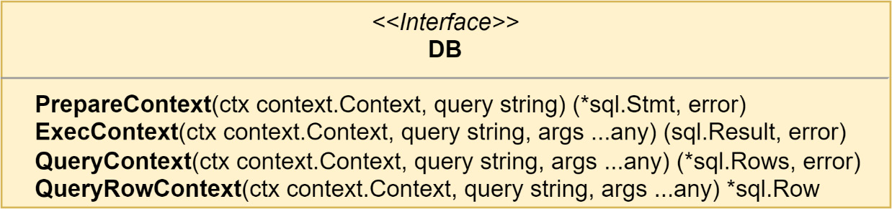

Figure 9.5 – The New DB Interface that Replaces *sql.DB and *sql.Tx

The new DB interface can be used to replace every usage of `*sql.DB` in our repository and store implementations so that we can use either a database connection or a transaction. We can now correctly create a `shoppingLists` dependency:

```go
container.AddScoped("shoppingLists",
    func(c di.Container) (any, error) {
        return postgres.NewShoppingListRepository(
            "depot.shopping_lists",
            c.Get("tx").(*sql.Tx),
        ), nil
    },
)
```

# Updating Stores to Use the New DB Interface

Stores such as `EventStore` and `SnapshotStore` are also updated to use the new DB interface in place of the `*sql.DB` type—for example, from the DI updates made to the Ordering module:

```go
container.AddScoped("aggregateStore",
    func(c di.Container) (any, error) {
        tx := c.Get("tx").(*sql.Tx)
        reg := c.Get("registry").(registry.Registry)
        return es.AggregateStoreWithMiddleware(
            pg.NewEventStore(
                "ordering.events",
                tx, reg,
            ),
            pg.NewSnapshotStore(
                "ordering.snapshots",
                tx, reg,
            ),
        ), nil
    },
)
```

# Application and Handlers: Turning Dependencies into Scoped

There will be no surprises in turning the application and each handler into a scoped dependency. For example, for `CommandHandlers`, we do the following:

```go
container.AddScoped(
    "commandHandlers",
    func(c di.Container) (any, error) {
        return logging.
            LogCommandHandlerAccess[ddd.Command](
            handlers.NewCommandHandlers(
                c.Get("app").(application.App),
            ),
            "Commands",
            c.Get("logger").(zerolog.Logger),
        ), nil
    },
)
```

# Driver Adapters: Updating to Use the Container

The application and each handler will need to be specified as a scoped dependency because we need to be able to create new instances for every request the module receives.

That leaves the driver adapters as the last part of the composition root that needs to be updated.

## Driver Adapters

The driver adapters had been using the various variables we had created in the first two sections, but those variables no longer exist. Every driver needs to be updated to accept the container instead.

We will leave the existing driver functions alone and will create new functions that take the container instead. For example, the `RegisterDomainEventHandlers()` function will be replaced with a new function with the following signature:

```go
func RegisterDomainEventHandlersTx(container di.Container)
```

# Updating the gRPC Server

The gRPC server and the three handlers will each need to be updated to make use of the container and to start a new scoped request.

## Updating the gRPC Server

The new function to register our gRPC server will have the following signature, which swaps out the `application.App` parameter for the container:

```go
func Register(
    container di.Container,
    registrar grpc.ServiceRegistrar,
) error
```

This function will create a new server called `serverTx` that is built with the container instead of the application instance. Like the existing server, it will implement `depotpb.DepotServiceServer`, but it will proxy all calls into instances of the server that are created for each request:

```go
func (s serverTx) CreateShoppingList(
    ctx context.Context,
    request *depotpb.CreateShoppingListRequest
) (resp *depotpb.CreateShoppingListResponse, err error) {
    ctx = s.c.Scoped(ctx)
    defer func(tx *sql.Tx) {
        err = s.closeTx(tx, err)
    }(di.Get(ctx, "tx").(*sql.Tx))

    next := server{
        app: di.Get(ctx, "app").(application.App),
    }
    return next.CreateShoppingList(ctx, request)
}
```

Each of the other methods in `serverTx` work the same way:

1. Create a new scoped container in a new context.
2. Use a deferred function to commit or roll back the transaction from the scoped container.
3. Create a new server instance with a new scoped application from the container within the context.
4. Return as normal after calling the instanced server method with the context containing the scoped container from step 1.

The `CreateShoppingList` method makes use of named return values, used so that our transaction can be closed and committed or rolled back with this relatively simple method:

```go
func (s serverTx) closeTx(tx *sql.Tx, err error) error {
    if p := recover(); p != nil {
        _ = tx.Rollback()
        panic(p)
    } else if err != nil {
        _ = tx.Rollback()
        return err
    } else {
        return tx.Commit()
    }
}
```

The transaction will be rolled back if there was a panic or an error was returned. We are not intending to catch panics here, so we will re-panic so that it can be recovered elsewhere up the stack. Otherwise, the transaction will be committed, and any error from that attempt will be returned as a new error. It is not happening here, but errors that result from rolling back the transaction could be logged.

## Updating the Domain Event Handlers

The domain event handlers are a unique situation compared to the other handlers. They will be called on during requests that have been started by the gRPC server or other handlers. That means a scoped container will already exist in the context that the handlers function receives. Creating a new scoped container within the domain event handlers would mean we would also be creating and using all new instances of our dependencies.

You can see an illustration of the process here:

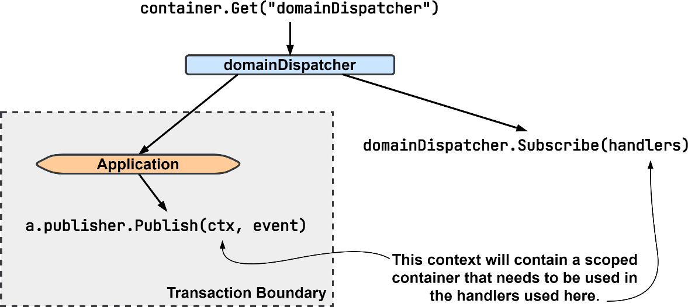

Figure 9.6 – Updating the Domain Dispatcher to Use a Scoped Container

To make the preceding process work, `domainDispatcher` is registered as a singleton dependency. That way, the instance that is returned by any container will be the same instance regardless of scope. It also means we will be calling `Publish()` on the same instance that we had previously called `Subscribe()` on.

Then, in the `RegisterDomainEventHandlersTx()` function, we will need to use an anonymous function as our handler so that we can fetch an instance of `domainEventHandlers` for the current scope:

```go
func RegisterDomainEventHandlersTx(
    container di.Container,
) {
    handlers := ddd.EventHandlerFunc[ddd.AggregateEvent](
        func(
            ctx context.Context,
            event ddd.AggregateEvent,
        ) error {
        domainHandlers := di.
            Get(ctx, "domainEventHandlers").
            (ddd.EventHandler[ddd.AggregateEvent])
        return domainHandlers.HandleEvent(ctx, event)
    })
    subscriber := container.
        Get("domainDispatcher").
        (*ddd.EventDispatcher[ddd.AggregateEvent])
    RegisterDomainEventHandlers(subscriber, handlers)
}
```

Inside the handler’s anonymous function that we define, we do not use the container that was passed into `RegisterDomainEventHandlersTx()` or create a new scoped container. Instead, we use the `di.Get()` function to fetch a value from an already scoped container.

Later, when we implement the Outbox pattern, we will not need to revisit this function.

## Updating the Integration Event and Command Handlers

Our updates to the integration event and command handlers will be like the gRPC `serverTx` updates. We want to define a transactional boundary and will need to start a new scope and transaction. Into a function named `RegisterIntegrationEventHandlersTx()`, we put the following updated event message handler:

```go
evtMsgHandler := am.MessageHandlerFunc
    [am.IncomingEventMessage](
    func(
        ctx context.Context, msg am.IncomingEventMessage,
    ) error {
        ctx = container.Scoped(ctx)
        defer func(tx *sql.Tx) {
            // rollback or commit like in serverTx...
        }(di.Get(ctx, "tx").(*sql.Tx))
        evtHandlers := di.
            Get(ctx, "integrationEventHandlers").
            (ddd.EventHandler[ddd.Event])
        return evtHandlers.HandleEvent(ctx, msg)
    },
)
```

The command handlers work exactly like the integration event handlers, and the same updates can be applied there as well. A new anonymous function should be created that creates a new scope and fetches a scoped instance of `commandHandlers`.

At this point, the composition root has been updated to register all of the dependencies, and the application and handlers into a DI container. Then, the gRPC server and each handler receive some updates so that we have each request running within its own transactional boundary and with its own database transaction. Use of `di.Container` added a good deal of new complexity to the composition root in regard to managing our dependencies, but functionally, the application remained the same.

## Runs Like Normal

After making those changes, if you run the application now, there will be no noticeable change. There are no new logging messages to look for, and the Depot module will handle requests just as it did before, except now, with each request, a lot of new instances will be created to handle the requests that are then discarded when the request is done. Every query and insert will be made within a single transaction, effectively turning multiple writes into one. It will not matter which tables we interact with; the same transaction surrounds all interactions for each and every request now.

While we have made significant changes to the application and kept the observable functionality the same, the dual write problem has not been solved. Next, the Inbox and Outbox tables will be covered and then implemented to address the dual writes that exist in our application.

## Using an Inbox and Outbox for Messages

We have now updated the Depot module so that we can work with a single database connection and transaction. We want to now use that to make our database interactions and message publishing atomic.

When we make the publishing and handling of the messages atomic alongside the other changes that are saved into our database, we gain the following benefits:

- **Idempotent message processing:** We can be sure that the message that we are processing will only be processed a single time.
- **No application state fragmentation:** When state changes occur in our application, they will be saved as a single unit or not at all.

With the majority of the work behind us to set up the transactions, we can now implement the inboxes and outboxes for our messages.

## Implementing a Messages Inbox

Back in Chapter 6, in the **Idempotent message delivery** section, I presented a way in which we could ensure that no matter how many times a message was received, it would only be handled one time.

The method presented was to use a table where the incoming message identity is saved, and if there is a conflict inserting the identity, then the message is not processed and simply acknowledged. When there is no conflict, the message is processed, and the identity of the message will be committed into the database along with the rest of the changes.

### Inbox Table Schema

We begin by looking at the table schema in which incoming messages will be recorded:

```sql
CREATE TABLE depot.inbox (
  id          text NOT NULL,
  name        text NOT NULL,
  subject     text NOT NULL,
  data        bytea NOT NULL,
  received_at timestamptz NOT NULL,
  PRIMARY KEY (id)
);

```

This table will hold every incoming `RawMessage` instance that the Depot module receives. In addition to being used for deduplication, it could also be used to replay messages. More advanced schemas could include aggregate versions or the publication timestamp to be used for better ordering of messages as they are processed. It could also include the aggregate ID or the metadata in a searchable format, so that the messages can be partitioned to scale message processing in the future. As it stands, this schema will be sufficient for our needs.

## Inbox Middleware

Saving incoming messages will be handled with a middleware that will attempt to insert the message into the table as part of the deduplication process, as illustrated here:

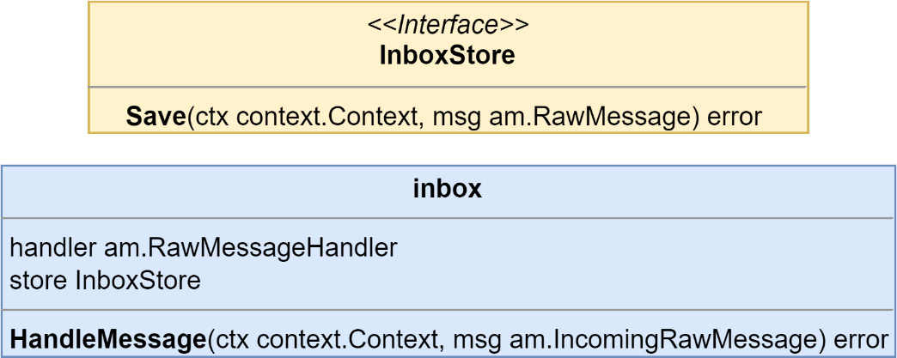

Figure 9.7 – The InboxStore Interface and Inbox Middleware Type

A factory for the inbox middleware is added to the container so that it can be injected into the handlers, as follows:

```go
container.AddScoped("inboxMiddleware",
    func(c di.Container) (any, error) {
        tx := c.Get("tx").(*sql.Tx)
        inboxStore := pg.NewInboxStore("depot.inbox", tx)
        mw := tm.NewInboxHandlerMiddleware(inboxStore)
        return mw, nil
    },
)
```

We are now introducing a table into the message handling, and that means inboxMiddleware must become a scoped dependency. This dependency must be injected by every handler that subscribes to messages.

# Updating the Handlers

The inbox middleware works with `IncomingRawMessages`, which our current streams, command, event, and reply do not handle. We will need to create new message handlers, which will work out because those streams are not scoped and because their subscribe sides cannot be scoped.

We can create a new `EventMessageHandler` instance, which does the work of the `EventStream Subscribe()` method but works with `RawMessages` instead:

```go
type eventMsgHandler struct {
    reg     registry.Registry
    handler ddd.EventHandler[ddd.Event]
}

func NewEventMessageHandler(
    reg registry.Registry,
    handler ddd.EventHandler[ddd.Event],
) RawMessageHandler {
    return eventMsgHandler{
        reg:     reg,
        handler: handler,
    }
}

func (h eventMsgHandler) HandleMessage(
    ctx context.Context, msg IncomingRawMessage,
) error {
    var eventData EventMessageData
    err := proto.Unmarshal(msg.Data(), &eventData)
    if err != nil { return err }

    eventName := msg.MessageName()
    payload, err := h.reg.Deserialize(
        eventName, eventData.GetPayload(),
    )
    if err != nil { return err }

    eventMsg := eventMessage{
        id:         msg.ID(),
        name:       eventName,
        payload:    payload,
        metadata:   eventData.GetMetadata().AsMap(),
        occurredAt: eventData.GetOccurredAt().AsTime(),
        msg:        msg,
    }

    return h.handler.HandleEvent(ctx, eventMsg)
}

```

The new event message handler is brought together with other dependencies in an updated anonymous function inside of the `RegisterIntegrationEventHandlersTx()` function:

```go
evtMsgHandler := am.RawMessageHandlerFunc(func(
    ctx context.Context,
    msg am.IncomingRawMessage,
) (err error) {
    ctx = container.Scoped(ctx)
    // existing rollback or commit code snipped...

    evtHandlers := am.RawMessageHandlerWithMiddleware(
        am.NewEventMessageHandler(
            di.Get(ctx, "registry").
                (registry.Registry),
            di.Get(ctx, "integrationEventHandlers").
                (ddd.EventHandler[ddd.Event]),
        ),
        di.Get(ctx, "inboxMiddleware").
            (am.RawMessageHandlerMiddleware),
    )
    return evtHandlers.HandleMessage(ctx, msg)
})
```

Let’s note a few points about the new function:

1. **Type Change:**  
   It is now a `RawMessageHandlerFunc` type and is no longer an `EventMessageHandlerFunc` type.

2. **Middleware:**  
   A middleware function is used to apply `inboxMiddleware`, which works exactly like `AggregateStoreWithMiddleware`, used previously to add domain publishers and snapshot support.

3. **Handler Implementation:**  
   `evtHandlers` implements `RawMessageHandler` and not `EventHandler[Event]` now.

4. **Subscriber Change:**  
   The subscriber that the subscriptions are made on will now be the stream and not an event stream or command stream, as shown here. This is because our inbox middleware is not message-type aware:

```go
subscriber := container.Get("stream").(am.RawMessageStream)

```

To implement the **Transactional Outbox** pattern, we will be splitting the existing publishing action into two parts. The first part will consist of saving the outgoing message into the database, and the second part will be implemented as a new processor that will receive or check for records that are written into the database so that it can publish them to where they need to go.

The first part of the **Transactional Outbox** pattern is shown in **Figure 9.8**. The transaction that we are creating for each request will be used so that all changes from whatever work we have done, and messages, are saved atomically:

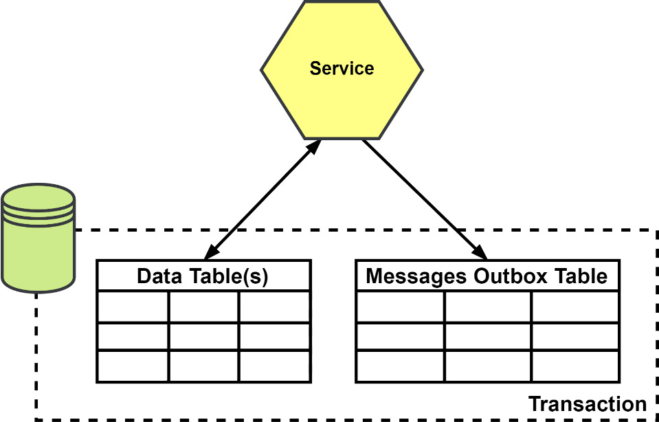

Figure 9.8 – Saving messages into an outbox table

Starting the same way with the outbox as we did with the inbox, let’s take a look at the table schema:

```sql
CREATE TABLE depot.outbox(
  id           text NOT NULL,
  name         text NOT NULL,
  subject      text NOT NULL,
  data         bytea NOT NULL,
  published_at timestamptz,
  PRIMARY KEY (id)
);

CREATE INDEX depot_unpublished_idx
  ON depot.outbox (published_at)
  WHERE published_at IS NULL;
```

This table is very similar to the `depot.inbox` table, with only a couple of differences:

1. The `received_at` column is renamed `published_at`, and it also allows null values.
2. We add an index to the `published_at` column to make finding unpublished records easier.

This table could also be updated to include more advanced columns such as aggregate information, which could be used for ordering or partitioning.

## Outbox Middleware

A middleware is created to catch outgoing messages to save them into the outbox table, as illustrated here:

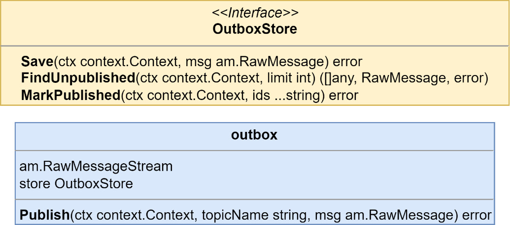

Figure 9.9 – The OutboxStore interface and outbox middleware type

The middleware this time will be for a `RawMessageStream` instance, and it will be used on a stream and not used on the handlers. A new scoped stream dependency is created to be used with the different types of streams that are being used:

```go
container.AddScoped("txStream",
    func(c di.Container) (any, error) {
        tx := c.Get("tx").(*sql.Tx)
        outboxStore := pg.NewOutboxStore(
            "depot.outbox", tx,
        )
        return am.RawMessageStreamWithMiddleware(
            c.Get("stream").
                (am.RawMessageStream),
            tm.NewOutboxStreamMiddleware(outboxStore),
        ), nil
    },
)
```

This new dependency will be used by each message-type stream in place of the original stream dependency. Here’s an example for `eventStream`:

```go
container.AddScoped("eventStream",
    func(c di.Container) (any, error) {
        return am.NewEventStream(
            c.Get("registry").(registry.Registry),
            c.Get("txStream").(am.RawMessageStream),
        ), nil
    },
)
```

The streams must now become scoped dependencies because they depend on other scoped dependencies. Outside of the change to their scope, they are still used the same as before.

## The Outbox Message Processor

Running the application now, you would find that everything quickly comes to a halt. Messages are no longer going to be making their way to the interested parties because they are not being safely stored inside a local table for each module that has been updated to use the outbox table.

We have only implemented one side of the pattern; to get the messages flowing once more, we will need to add a second side—a message processor.

### Implementing the Outbox Message Processor

Our implementation of the outbox message processor will use polling, but a more performant option would be to read the PostgreSQL write-ahead log (WAL), the write-ahead-log, as this method will not cause additional queries to be constantly run against the tables.

### Diagram

The following diagram illustrates the process:

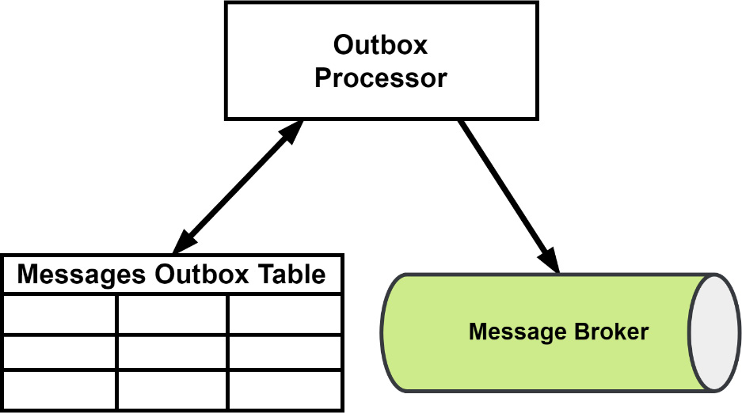

Figure 9.10 – Processing outbox messages

Our processor will fetch a block of messages, publish each of them, and then update the table to mark them as actually having been published. The processor itself suffers from a dual-write problem, but when it fails, the result will be that one or more messages are published more than once. We already have deduplication in place thanks to our implementation of the inbox, so the modules will be protected from any processor failures.

As with the saga orchestrator, an Outbox message processor is a process that can live just about anywhere. It can have its own services that are designed to scale horizontally, making use of whatever partitioning logic is necessary.

In our application, the processors will be run as another process within all of the existing modules, as illustrated here:

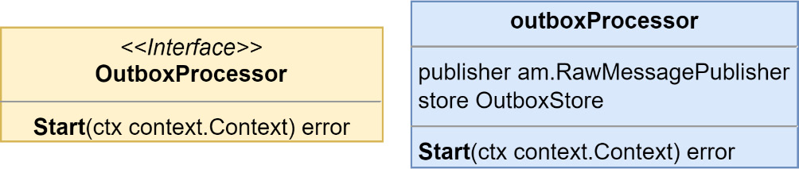

Figure 9.11 – The outbox processor interface and struct

Each processor is given singleton streams and database connections, as shown in the following code snippet. We do not want to use transactions because this will be running continuously:

```go
container.AddSingleton("outboxProcessor",
    func(c di.Container) (any, error) {
        return tm.NewOutboxProcessor(
            c.Get("stream").(am.RawMessageStream),
            pg.NewOutboxStore(
                "depot.outbox",
                c.Get("db").(*sql.DB),
            ),
        ), nil
    },
)
```

This new dependency is used in a goroutine so that it runs alongside all the other servers and handlers:

```go
func startOutboxProcessor(
    ctx context.Context, container di.Container,
) {
    outboxProcessor := container.
        Get("outboxProcessor").
          (tm.OutboxProcessor)
    logger := container.Get("logger").(zerolog.Logger)
    go func() {
        err := outboxProcessor.Start(ctx)
        if err != nil {
            logger.Error().
                Err(err).
                Msg("depot outbox processor encountered an error")
        }
    }()
}
```

For our application and for demonstration purposes, the processor will fetch up to 50 messages at a time to publish and will wait for half a second in between queries looking for messages that need to be published. It does not wait at all to fetch new messages if it just published some. A more robust outbox processor would allow the number of messages and the time to wait before looking for messages to be configurable.

### Summary

In this chapter, we made more changes to the composition roots than ever. We used a small DI package to store value factories and to fetch new instances as needed. We are also able to fetch instances that are scoped to each message or request our application receives. We also implemented a message deduplication strategy using an inbox table.

The Transactional Outbox pattern was also implemented along with local processes to publish the messages stored in an outbox table. As a result of these updates, the reliability of messages arriving at their destinations when they should and the risk of making incorrect updates as a result of reprocessing a message has been reduced a considerable amount. The event-driven version of MallBots has become a very reliable application that is much more resilient to problems springing up compared to the original synchronous version of the application.

In the next chapter, we will cover testing. We will develop a testing strategy that includes unit testing, integration testing, and E2E testing. I will also introduce you to contract testing, a relatively unknown form of testing that combines the speed of unit tests with the test confidence of large-scope integration testing. We will also discuss additional test topics such as table-driven testing, using test suites, and more.
